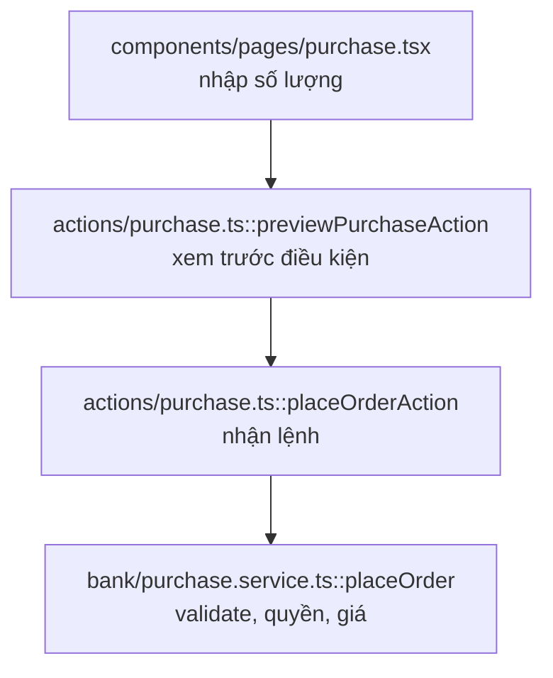

# MC-01 — Make Control: design

## 1. Quy ước marker điểm cắm

### QĐ-1: Một dòng, ba thông tin, máy đọc được

```ts
// @pending FE-05 | previewPurchase đã sẵn: 4 phép kiểm + blockers[] + kiểu PurchasePreview
export async function previewPurchaseAction(input: unknown) { ... }
```

Cú pháp: `@pending <MÃ-TASK> | <đã sẵn những gì>`

- **`@pending`** là từ khóa duy nhất, không dùng biến thể `@waiting`, `@blocked`, `@todo`.
- **Mã task** theo đúng mã trong kế hoạch: `FE-05`, `BE-06`, `SC-02`, `AU-01`, `MC-02`.
- **Phần sau dấu gạch** là mô tả cho người đọc, tự do nhưng phải nói rõ **đã sẵn gì**, không phải "chờ làm".

Marker đặt **ngay trên khai báo** mà nó nói về, để lúc xóa marker thì thấy ngay code liên quan.

### QĐ-2: Phân biệt hai loại chờ

| Loại | Marker | Ý nghĩa |
|---|---|---|
| Chờ người khác cắm vào | `@pending FE-05 \| ...` | Code **đã chạy được**, chỉ chưa ai gọi |
| Chờ phụ thuộc mới làm được | `@blocked SC-02 \| ...` | Code **chưa chạy được**, đang ném lỗi |

Hai loại này khác nhau về hành động: `@pending` thì task sau chỉ cần gọi, `@blocked` thì phải chờ mới làm tiếp được. 10 method trong `evm.adapter` là `@blocked SC-02`; 4 server action trong `actions/purchase.ts` là `@pending FE-05`.

### QĐ-3: Nguồn duy nhất cho danh sách task đã hoàn thành

Test chống marker lạc hậu cần biết task nào đã xong. Không khai trong test, không khai trong tài liệu. Dùng **một tệp dữ liệu duy nhất**:

```
.kiro/task-status.json
{
  "done": ["FE-01", "FE-02", "BE-01", "BE-02", "BE-08", "BE-09"],
  "inProgress": ["MC-01"]
}
```

Lý do dùng tệp riêng thay vì đọc từ `tech-report.md`: tài liệu là văn bản tự do, phân tích được nhưng dễ vỡ. Tệp dữ liệu thì máy đọc chắc chắn, và người cập nhật thấy rõ mình đang sửa trạng thái task.

Ai cập nhật: Kiro, trong commit cuối của mỗi task, cùng lúc với cập nhật `tech-report`.

## 2. Script quét

```
scripts/scan-pending.mjs
```

Quét `app/src`, `packages/*/src`, `app/test`, tìm mọi dòng khớp `@pending` hoặc `@blocked`.

Ba chế độ:

| Lệnh | Dùng khi |
|---|---|
| `node scripts/scan-pending.mjs` | in bảng cho người đọc |
| `node scripts/scan-pending.mjs --json` | cho test và cho script sinh tài liệu |
| `node scripts/scan-pending.mjs --check` | mã thoát khác 0 nếu có marker sai định dạng hoặc lạc hậu |

Bảng in ra:

```
ĐIỂM CẮM ĐANG CHỜ

FE-05  (3 điểm cắm)
  actions/purchase.ts:12       previewPurchase đã sẵn: 4 phép kiểm + blockers[]
  actions/purchase.ts:28       placeOrderAction đã sẵn: kiểm điều kiện trước khi tạo lệnh
  lib/bank/schemas.ts:44       purchaseInputSchema dùng chung FE và BE

SC-02  (10 điểm chặn)
  lib/ledger/evm.adapter.ts    mintInitialSupply chờ contract phát hành một lần
  ...
```

`run-local-all.sh` gọi chế độ `--check`, và in bảng ở cuối phần tổng kết.

**Quan trọng:** còn điểm cắm là bình thường, không làm đỏ. Chỉ đỏ khi marker sai định dạng, mã task không tồn tại trong kế hoạch, hoặc marker chờ task đã có trong danh sách `done`.

## 3. Test chống marker lạc hậu

```
app/test/pending-markers.test.ts
```

Bốn ca:

| Ca | Kiểm |
|---|---|
| 1 | Mọi marker đúng cú pháp `@pending|@blocked <MÃ> | <mô tả>` |
| 2 | Mã task trong marker tồn tại trong `.kiro/task-status.json` hoặc kế hoạch |
| 3 | Không marker nào chờ task nằm trong `done` |
| 4 | Mô tả không rỗng và không phải câu chung chung |

Ca 3 là cái quan trọng nhất. Nó biến việc dọn marker thành **việc bắt buộc** khi hoàn thành task, thay vì việc nhớ được thì làm.

Dự án đã có tiền lệ đúng kiểu này là `abi-contract-sync.test.ts`, kiểm mô tả giao diện hợp đồng khớp với contract. Viết theo cùng tinh thần.

## 4. Hợp nhất nguồn giá phát hành

Hiện trạng hai nguồn:

```
lib/bank/issuance.ts      WPT_ISSUE_PRICE_VND = 100_000     (dùng cho hiển thị và quy đổi)
lib/ledger/mock.adapter.ts DEFAULT_WPT_PRICE_VND = 100_000n  (dùng cho quotePurchase khi chạy mock)
```

Hai hằng số độc lập, cùng ý nghĩa. Đổi một chỗ thì giá hiển thị trên màn nhà đầu tư lệch giá thật lúc khớp lệnh, mà test vẫn xanh.

Cách hợp nhất: `mock.adapter` **nhập** từ `issuance.ts`, không khai lại.

```ts
// mock.adapter.ts
import { WPT_ISSUE_PRICE_VND } from '@/lib/bank/issuance';
const DEFAULT_WPT_PRICE_VND = BigInt(WPT_ISSUE_PRICE_VND);
```

Kiểm chiều phụ thuộc: `lib/ledger` nhập từ `lib/bank` có ngược tầng không? Về nguyên tắc tầng dưới không nên phụ thuộc tầng trên. Nếu thấy ngược, đặt hằng số ở chỗ trung lập hơn, ví dụ `packages/shared` hoặc `lib/config`, rồi cả hai cùng nhập. **Ghi rõ lựa chọn vào checkpoint.**

Thêm một test chống lệch: đọc giá từ `issuance.ts`, gọi `quotePurchase` trên mock, xác nhận bằng nhau.

Lưu ý cho BE-04: sau khi giá vào cơ sở dữ liệu thì hằng số này thành **giá mặc định khi chưa cấu hình**. Hợp nhất trước ở MC-01 làm BE-04 chỉ phải đổi một chỗ.

## 5. Nền cho sơ đồ luồng thực thi

### QĐ-4: Marker luồng đặt ở tầng nghiệp vụ và tầng vận chuyển

```ts
// @flow purchase:3 | nhận lệnh từ giao diện, chuyển tiếp sang service
export async function placeOrderAction(input: unknown) { ... }

// @flow purchase:4 | validate, kiểm quyền, tính giá, lưu lệnh PLACED
export async function placeOrder(input: unknown) { ... }
```

Cú pháp: `@flow <tên-luồng>:<số bước> | <việc của bước này>`

Tên luồng dùng mã ngắn, thống nhất: `purchase`, `issue`, `distribute`, `settle`, `onboard`.

### QĐ-5: Sinh sơ đồ từ marker, không vẽ tay

```
scripts/gen-flow-diagram.mjs purchase
```

Đọc mọi marker `@flow purchase:*`, sắp theo số bước, sinh Mermaid:



Ghi ra `docs/flows/purchase.md`. Script sinh lại được bất cứ lúc nào, nên sơ đồ **không bao giờ lạc hậu so với mã**.

### QĐ-6: Vì sao chọn marker thay vì phân tích tự động

Phân tích cây gọi hàm tự động nghe hấp dẫn nhưng hỏng ở dự án này: luồng đi qua biên máy chủ và trình duyệt, qua factory chọn adapter theo cấu hình, nên không có cạnh gọi tĩnh nào nối được `getLedger(chain)` với `evm.adapter`. Marker là thứ con người khai, máy chỉ sắp xếp, nên đúng cả ở những chỗ phân tích tĩnh bó tay.

Đổi lại, marker có thể lệch mã. Vì vậy phải có ca kiểm: **số bước không được trùng và không được nhảy cách** trong cùng một luồng. Thiếu bước 3 mà có bước 4 là dấu hiệu ai đó xóa hàm mà quên sửa marker.

### QĐ-7: Làm mẫu một luồng, không gắn hết

Task này gắn `@flow` cho **luồng mua WPT** vì nó đã hoàn thành đầu cuối ở tầng BE. Các luồng khác gắn dần khi làm task tương ứng, và `tech-report-maintenance.md` bổ sung quy tắc này.

## 6. Phân loại 27 export

Supervisor đã quét ra 27 export chỉ xuất hiện trong chính tệp nó. Phân loại dự kiến, Kiro phải xác minh từng cái:

| Nhóm | Ví dụ | Xử lý |
|---|---|---|
| Điểm cắm chờ FE | `placeOrderAction`, `executeOrderAction`, `listOrdersAction`, `expireStaleOrdersAction` | `@pending FE-05` hoặc `FE-06` |
| Điểm cắm chờ BE | `getDistributionStore`, `getKeeperStore`, `getSettlementStore` | `@pending BE-06`, `BE-07`, `BE-05` |
| Dùng trong test | `resetSignerCache`, `resetChainRegistryCache`, `resetKycProviderCache` | xác minh test có gọi; nếu có thì để nguyên, không cần marker |
| Giữ chỗ dựng ảnh | 12 export trong `src/empty.ts` | xử lý theo R7 |
| Dùng nội bộ, không cần export | `amountSchema`, `orderIdSchema` nếu chỉ dùng trong cùng tệp | bỏ từ khóa `export` |
| Mã chết thật | `UnsupportedChainError`, `evmTestnet`, `hardhatLocal`, `getSigner` nếu không ai dùng | **xóa** |

Nhóm cuối cần cẩn thận: `evmTestnet` và `hardhatLocal` trong `wagmi.ts` có thể là định nghĩa chuỗi đang dùng gián tiếp qua mảng cấu hình. Xác minh bằng cách xóa thử rồi chạy `npm run build`.

## 7. Tệp thay đổi

```
.kiro/steering/make-control.md         (mới)  — quy ước marker và sơ đồ luồng
.kiro/task-status.json                 (mới)  — nguồn duy nhất trạng thái task
scripts/scan-pending.mjs               (mới)  — quét marker
scripts/gen-flow-diagram.mjs           (mới)  — sinh sơ đồ Mermaid
scripts/run-local-all.sh               (sửa)  — gọi scan-pending --check
scripts/verify-arch-rules.sh           (sửa)  — loại trừ docs khỏi phép quét ký hiệu cũ
app/test/pending-markers.test.ts       (mới)  — 4 ca chống marker lạc hậu
app/test/issue-price-single-source.test.ts (mới) — chống lệch hai nguồn giá
app/src/lib/ledger/mock.adapter.ts     (sửa)  — nhập giá thay vì khai lại
app/src/empty.ts                       (sửa hoặc xóa)
app/next.config.ts                     (có thể sửa)  — gỡ alias không cần
app/package.json                       (sửa)  — gỡ gói không dùng
docs/flows/purchase.md                 (sinh)  — sơ đồ mẫu
docs/tech-report.md                    (sửa)  — mục điểm cắm sinh tự động
docs/tech-report-maintenance.md        (sửa)  — quy tắc dọn marker
+ khoảng 33 tệp gắn marker theo quy ước mới
```

## 8. Điểm cần chú ý

- **Không đổi hành vi hệ thống.** Task này dọn dẹp và dựng cơ chế. Nếu buộc phải sửa logic để gỡ mã chết, ghi rõ vào checkpoint.
- Gỡ gói khỏi `package.json` thì phải chạy `npm run build`, không chỉ chạy test. Có gói chỉ cần lúc dựng.
- `react-dom` **không được gỡ** dù grep không thấy: nó là phụ thuộc bắt buộc của React.
- `src/empty.ts` là chữa cháy cho việc dựng ảnh Cloudflare. Trước khi gỡ, kiểm xem nhánh `fix/cloudflare-opennext-build` có còn cần nó không.
- Marker `@blocked SC-02` trong `evm.adapter` hiện đã nằm trong thông báo lỗi `LedgerNotImplementedError`. Giữ cả hai: thông báo lỗi cho người chạy vào, marker cho script quét.
- Số bước `@flow` nên cách nhau 1, bắt đầu từ 1. Nếu cần chèn bước giữa thì đánh số lại cả luồng, đừng dùng số thập phân.
