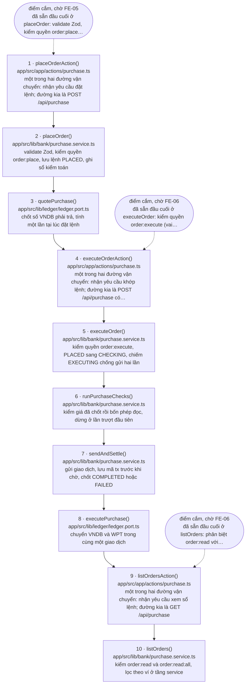

# Báo cáo bàn giao — MC-01: Make Control (điểm cắm, dọn rác, nền cho sơ đồ luồng)

| | |
|---|---|
| Task | MC-01 (Make Control, P0, 8 điểm) |
| Nhánh | `mc/01-make-control`, tạo **từ `dev`** (`71932bb`) |
| Spec | `docs/mc-01-make-control/{requirements,design,tasks}.md` + bản ở `.kiro/specs/mc-01-make-control/` (xem sai lệch SL-1 ở mục 10) |
| Tiến độ | **Bước 1–10/10 xong.** Chờ Supervisor nghiệm thu — Kiro **không** merge vào `dev` |
| Phạm vi | Không đổi hành vi hệ thống, **trừ một ngoại lệ Owner đã chốt** (D-7 ở mục 9). Mọi test đang xanh phải xanh nguyên |

`dev` đã kiểm lành trước khi tạo nhánh, theo `branching.md` §5:

```
$ git ls-tree -r --name-only dev | grep -c '^packages/'           → 73   (phải > 0)
$ git ls-tree -r --name-only dev | grep -c '^app/src/lib/ledger'  → 6    (phải > 0)
$ git ls-tree -r --name-only dev | grep -c AssetRegistry          → 0    (phải = 0)
```

Nền của nhánh đúng là `dev`, không lấy từ nhánh phụ:

```
$ git merge-base dev HEAD
71932bbbcd27811b202e98487cc55b7bf6878619
$ git merge-base --is-ancestor dev HEAD   → 0 (HEAD chứa toàn bộ dev)
```

---

## 0. Đọc trước — hai bảng để nghiệm thu

### 0.1 Đối chiếu 12 "Điều kiện hoàn thành" của `requirements.md` mục 5

Lấy đúng 12 dòng checkbox ở `.kiro/specs/mc-01-make-control/requirements.md` mục 5, không thêm
không bớt. Cột bằng chứng ghi **số mục của checkpoint này** để tra được ngay, không ghi "đã làm".

| # | Điều kiện (nguyên văn, rút gọn) | | Bằng chứng ở mục |
|---|---|---|---|
| 1 | Quy ước marker có trong `.kiro/steering/`, đủ ba thông tin ở R1.2 | ✅ | 1 (Bước 1) · 2 (DoD 1.1, 1.3) |
| 2 | Toàn bộ marker tự do trong 33 tệp đã chuyển sang quy ước mới hoặc bị bỏ | ✅ | 1 (Bước 3) · 3.4 (bảng) · 3.5 (4 phép kiểm) · **10 SL-3** — con số 33 của spec sai, số thật là **13 chỗ / 2 tệp**, có phép đo |
| 3 | Script quét chạy được, có trong `run-local-all.sh`, sinh bảng nhóm theo task | ✅ | 3.4 (bảng script in ra) · 3.12.a (lần chạy chốt, mục `LỚP 3 - ĐIỂM CẮM`) |
| 4 | Test chống marker lạc hậu hoạt động: đánh dấu một task đã xong phải **đỏ** | ✅ | **5** (đột biến 3 của Bước 4 — `@pending BE-02` → đỏ ở ca 3 `STALE_TASK`, đúng tệp:dòng) |
| 5 | 27 export đã phân loại xong; mã chết thật đã xóa; điểm cắm đã gắn marker | ✅ | **4** (bảng đủ **115** dòng) · 4.2 (13 chỗ / 7 tệp) · **10 SL-7** — số thật 115, không phải 27 |
| 6 | Giá phát hành còn **một** nguồn, có test chống lệch | ✅ | **6** (chỗ đặt + bằng chứng chiều phụ thuộc) · **5** (3 đột biến, gồm 2b) · 3.8 |
| 7 | Gói không dùng đã gỡ; `npm run build` và test vẫn xanh | ✅ | 1 (Bước 7) · 3.9 (4 lần build) · 3.12.b (build chốt: 16 route) · 3.12.c (309 test) |
| 8 | `src/empty.ts` đã làm rõ: gỡ **hoặc** gắn marker kèm điều kiện xóa | 🔶 | **7** (10 mục con) · **9 D-8**. Đã làm rõ và thu gọn 12 export → **1**, có **điều kiện xóa đo được bằng một lệnh**; nhưng **không gỡ được** (bỏ ra thì build FAIL 8 lỗi) và **không gắn được marker** — nó chờ bên thứ ba, không chờ task nào trong `.kiro/task-status.json`. Ghi 🔶 vì chữ của điều kiện là "gỡ hoặc gắn marker", và Kiro làm **cả hai vế đều không đúng chữ** dù đạt tinh thần. Xin Supervisor chốt |
| 9 | `verify-arch-rules.sh` cho **0 FAIL** trên `dev` | ✅ | 3.10.b (20 PASS / 0 FAIL / 6 WARN, từng WARN có kết luận) · 3.12.e. Đo trên nhánh; phép quét ký hiệu token cũng cho **0** khi đo thẳng vào `dev`: `git grep -nE "\bSPT\b\|tVND" dev -- app/src app/e2e app/test packages` → **0 dòng** |
| 10 | Sinh được sơ đồ Mermaid cho luồng mua WPT từ mã nguồn | ✅ | **8** (sơ đồ + 4 mục con đối chiếu) · `docs/flows/purchase.md` · 3.11 |
| 11 | `tech-report.md` có mục điểm cắm sinh tự động | ✅ | 1 (Bước 10) · 3.12.d · **5** (đột biến Bước 10: sửa tay khối sinh tự động → `--check-report` đỏ) |
| 12 | `bash scripts/run-local-all.sh` xanh toàn bộ | ✅ | **3.12.a** — 7 PASS / **0 FAIL** |

**11 ✅ · 1 🔶 · 0 ❌.** Món 🔶 duy nhất là món 8, và nó 🔶 vì **chữ của điều kiện không có nhánh
nào khớp hiện thực**, không phải vì việc chưa làm.

### 0.2 Tự kiểm trước khi mở PR — `branching.md` §11

Nhánh này có thay đổi mã (`app/src`, `packages/`, `scripts/`), nên dùng **bản đầy đủ** 7 dòng.

| Dòng của §11 | | Bằng chứng chạy được |
|---|---|---|
| Nhánh tạo từ `dev`, không phải từ nhánh phụ | ✅ | `git merge-base dev HEAD` → `71932bb` = `git rev-parse dev` → `71932bb`. Trước khi tạo nhánh đã kiểm `dev` lành theo §5 — ba lệnh ở đầu tệp này |
| Đã rebase về `dev` mới nhất | ✅ **không cần rebase** | `git fetch origin && git rev-parse origin/dev` → `71932bb`, **trùng** merge-base. `dev` không đi trước một commit nào kể từ lúc tạo nhánh, nên rebase sẽ là phép không-làm-gì. Kiro **không** tự rebase (ràng buộc của Owner cho vòng này) |
| `bash scripts/run-local-all.sh` xanh toàn bộ | ✅ | 3.12.a — **7 PASS / 0 FAIL**, 6 WARN đều đã đối chiếu ở 3.10.b |
| Có spec trong `.kiro/specs/<tên>/` đủ 3 file | ✅ | `git ls-files .kiro/specs/mc-01-make-control/` → `design.md`, `requirements.md`, `tasks.md`. `tasks.meta.json` **cố ý** không vào git (Owner chốt ở Q2): `git check-ignore -v` chỉ đúng `.gitignore:39` |
| Có checkpoint và đã được nghiệm thu PASS | 🔶 **chờ** | Checkpoint là tệp này. Nghiệm thu là việc của Supervisor, chưa diễn ra — nên dòng này **chưa** đạt, và đó là lý do Kiro không merge |
| `docs/tech-report.md` đã cập nhật theo `tech-report-maintenance.md` | ✅ | Commit `5bbcb52` (8 nhóm thay đổi, mọi con số đo lại bằng lệnh) + mục **3.10** sinh tự động, `--check-report` → `exit=0` (3.12.d) |
| Nhánh chỉ giải quyết một mục tiêu | ✅ | 37 commit, **toàn bộ** mang phạm vi `(mc)` và thuộc 10 bước của `tasks.md` — danh sách đủ ở 3.12.g. Một lần đổi hành vi duy nhất (D-7) do **Owner chốt** trong chính task này, không phải việc lạc đề |

Hai dòng còn lại của §11 không áp dụng cho nhánh mã: bản gọn dành cho nhánh `docs/`.

---

## 1. Đã làm

### Bước 1 — Chốt quy ước và nguồn trạng thái task ✅

Ba commit, chia theo đơn vị mục tiêu:

| Commit | Nội dung |
|---|---|
| `350fdfb` | `docs(mc): spec MC-01 make control (requirements, design, tasks)` — đưa spec vào lịch sử nhánh, cả `docs/` và `.kiro/specs/` |
| `cefc895` | `feat(mc): quy ước marker điểm cắm và nguồn trạng thái task` — steering + JSON trạng thái |
| *(commit này)* | `docs(mc): khung checkpoint MC-01` |

Tệp tạo mới:

| Tệp | Vai trò |
|---|---|
| `docs/mc-01-make-control/{requirements,design,tasks}.md` | Spec, bản đọc cho người |
| `.kiro/specs/mc-01-make-control/{requirements,design,tasks}.md` | Spec, bản Kiro nạp |
| `.kiro/steering/make-control.md` | Quy ước `@pending` / `@blocked` / `@flow`, `inclusion: always` |
| `.kiro/task-status.json` | Nguồn duy nhất trạng thái task + tập mã task hợp lệ |
| `docs/CHECKPOINT_MC01.md` | Tệp này |

Nội dung steering trả lời ba câu bắt buộc: marker viết thế nào (mục 1, 2, 4), ai cập nhật
`task-status.json` (mục 7 — Kiro), cập nhật lúc nào (mục 7 — commit cuối của mỗi task, cùng lúc
với `docs/tech-report.md`).

### Bước 2 — Script quét marker ✅

Ba commit, chia theo đơn vị mục tiêu:

| Commit | Nội dung |
|---|---|
| `c84ec7f` | `chore(mc): thêm mã task SC-04 và bỏ tasks.meta.json khỏi git` — thi hành hai quyết định của Owner (xem mục 11, Q1 và Q2) |
| `609deb8` | `feat(mc): script quét điểm cắm` — `scripts/scan-pending.mjs`, ba chế độ |
| *(commit này)* | `feat(mc): run-local-all gọi scan-pending --check` — cắm vào kiểm chứng cục bộ + checkpoint |

Tệp tạo mới / sửa:

| Tệp | Vai trò |
|---|---|
| `scripts/scan-pending.mjs` | Quét marker. Ba chế độ: bảng cho người đọc, `--json`, `--check` |
| `scripts/run-local-all.sh` | Thêm mục `LỚP 3 - ĐIỂM CẮM (marker)`; in bảng ở phần TỔNG KẾT |
| `.kiro/task-status.json` | Thêm `SC-04` vào `planned` → 26 mã task hợp lệ |
| `.gitignore` | Bỏ `.kiro/specs/*/tasks.meta.json` khỏi git |

Script là **nơi duy nhất** khai cú pháp marker và phép kiểm số bước luồng. Cả hai được
`export` để Bước 4 (`app/test/pending-markers.test.ts`) và Bước 9
(`scripts/gen-flow-diagram.mjs`) nhập vào dùng lại, không viết lại biểu thức chính quy.

`SC-04` (mới thêm) = *hợp đồng cờ tất toán + giá NAV*: quyết định cờ "đang tất toán" nằm ở
contract nào và `navRate` nối vào đâu. Bước 2 **chỉ thêm mã vào JSON**, chưa gắn marker —
việc gắn `@blocked SC-04` cho bốn method `setSettlementMode` / `isSettlementMode` /
`setNavRate` / `navRate` thuộc Bước 3.

### Bước 3 — Chuyển marker tự do sang quy ước mới ✅

Hai commit mã nguồn, chia theo **vùng**:

| Commit | Nội dung |
|---|---|
| `4e20eae` | `refactor(mc): marker điểm chặn cho 11 method chưa nối được ở lib/ledger` — 11 `@blocked` chia **bốn** nhóm (SC-02 ×3, SC-03 ×3, BE-06 ×1, SC-04 ×4) |
| `d1d5c13` | `refactor(mc): marker điểm cắm expireStaleOrders, dọn ghi chú lạc hậu ở lib/bank` — 1 `@pending BE-07` + 1 ghi chú nhóm D viết lại |
| *(commit này)* | `docs(mc): chốt số đo Bước 3 và bảng điểm cắm vào checkpoint` |

Tệp sửa — **ba** tệp, và **chỉ bình luận**:

| Tệp | Sửa gì |
|---|---|
| `app/src/lib/ledger/evm.adapter.ts` | 11 marker `@blocked`; khối chú thích đầu tệp thôi liệt kê mã task |
| `app/src/lib/bank/purchase.service.ts` | 1 marker `@pending BE-07` trên `expireStaleOrders` |
| `app/src/lib/bank/portfolio.service.ts` | Viết lại ghi chú lạc hậu trong `PortfolioView` (nhóm D) |

**Điều bất ngờ nhất của Bước 3: số chỗ phải gắn marker ít hơn nhiều so với mọi con số
trong tài liệu.** Spec nói 33 tệp, Bước 1 đo 43 tệp / 115 dòng, thực tế phải gắn marker
**13 chỗ trên 2 tệp**. Số đo và cách phân loại ở mục 10, SL-3.

### Bước 4 — Test chống marker lạc hậu ✅

Ba commit, chia theo đơn vị mục tiêu:

| Commit | Nội dung |
|---|---|
| `1bcd62b` | `feat(mc): phép kiểm mô tả marker chung chung (VAGUE_NOTE)` — mã lỗi thứ 8 + `@typedef` cho cấu trúc báo cáo |
| `49768e1` | `test(mc): chống marker lạc hậu và sai định dạng` — `app/test/pending-markers.test.ts`, hai tầng |
| `b65c077` | `test(mc): kiểm "điểm cắm không phải lỗi" trên repo giả thay vì repo thật` — sửa một khẳng định rỗng ruột do chính `49768e1` thêm vào, xem SL-6 |

Tệp tạo mới / sửa:

| Tệp | Sửa gì |
|---|---|
| `app/test/pending-markers.test.ts` | **Mới.** 13 ca, hai tầng. 272 → 285 test, 11 → 12 tệp test |
| `scripts/scan-pending.mjs` | Mã lỗi `VAGUE_NOTE` + `vagueNoteReason()` + `@typedef` `Marker` / `FlowStep` / `MarkerError` / `ScanReport` |

**Không** sửa test cũ nào, **không** sửa marker thật nào để test dễ xanh. Bằng chứng: 12 marker
hiện có vẫn qua `--check` với `exit=0` sau khi thêm `VAGUE_NOTE` (mục 3.6), và `git diff` trên
`app/src` giữa `dd0fac0` và HEAD là **rỗng**.

#### Vì sao phải hai tầng, không phải một

| Tầng | Kiểm gì | Trả lời câu hỏi nào |
|---|---|---|
| **1** | `scan()` trên **repo thật**: 4 ca theo `design.md` mục 3, thêm một chốt chặn bắt mọi mã lỗi còn lại | *Repo hiện tại có marker sai không?* — đây là cái **chặn thật** |
| **2** | `scan(repoGia)` trên **repo giả** dựng trong `mkdtemp`: mỗi ca một đột biến, xác nhận đúng mã lỗi | *Phép kiểm ở tầng 1 có răng không?* |

Tầng 1 hiện **xanh**. Một test luôn xanh thì không phân biệt được "cơ chế đúng" với "cơ chế
không chạy" — nó xanh trong cả hai trường hợp. Tầng 2 dựng dữ liệu sai rồi đòi `scan()` phải
báo đúng mã lỗi, nên nó xanh **chỉ khi** phép kiểm thật sự hoạt động.

Tầng 1 còn một phép kiểm chống rỗng ruột riêng: *phạm vi quét đọc được mã nguồn thật, không
rỗng*. Không có nó thì `SCAN_ROOTS` lệch đường dẫn sẽ làm cả bốn ca xanh mà không kiểm gì — kiểu
hỏng tệ nhất, vì nó trông y như "repo sạch".

#### Cách test đọc `scripts/scan-pending.mjs`: `import` trực tiếp

Tài liệu giao việc lường hai đường: `import` trực tiếp, hoặc `spawnSync('node', [...'--json'])`
nếu Vite chặn tệp ngoài `app/`. **Đã chọn `import` trực tiếp**, vì đo thật thì Vite không chặn:

```
$ cd app && npx vitest --run test/__probe-import.test.ts     # tệp thăm dò, đã xóa
 ✓ test/__probe-import.test.ts (1 test) 21ms
```

`app/vitest.config.ts` không đặt `server.fs.allow`, và `scan-pending.mjs` là ESM thuần không phụ
thuộc gói ngoài nên Vite nạp được nguyên trạng. Chọn `import` hơn `spawnSync` vì ba lẽ:

1. `scan(repoRoot)` nhận tham số gốc repo, nên tầng 2 gọi thẳng vào hàm với repo giả. Qua CLI thì
   không có cờ nào truyền gốc repo — muốn dùng `spawnSync` phải **thêm cờ mới vào CLI chỉ để phục
   vụ test**, tức đổi giao diện công cụ vì lý do kiểm thử.
2. Lỗi hiện ra là lỗi JavaScript có vết gọi, không phải một chuỗi stdout phải tự phân tích.
3. `MIN_NOTE_CHARS` và `VAGUE_PHRASES` nhập được vào **thông báo lỗi của test**, nên hướng dẫn sửa
   trong test luôn khớp ngưỡng thật. Qua `spawnSync` thì phải gõ lại ngưỡng vào test — đúng cái
   bẫy "hai bản quy ước lệch nhau" mà tài liệu giao việc cấm.

Không sao chép một biểu thức chính quy nào sang test. Toàn bộ những gì test nhập:
`scan`, `listScannedFiles`, `MIN_NOTE_CHARS`, `VAGUE_PHRASES`.

#### `VAGUE_NOTE` — định nghĩa "chung chung", và vì sao đặt trong script

Phép kiểm nằm trong `scripts/scan-pending.mjs` dưới mã lỗi `VAGUE_NOTE`, **không** nằm riêng
trong test: `--check` trong `run-local-all.sh` phải chặn được luôn, và quy ước chỉ được khai một
nơi.

Hai điều kiện, đủ một là đỏ:

| | Điều kiện | Ngưỡng |
|---|---|---|
| (a) | Mô tả (sau `trim`) ngắn hơn mức tối thiểu | `MIN_NOTE_CHARS = 15` |
| (b) | Bỏ cụm vô nghĩa + từ đệm + mã task đi thì phần còn lại quá ngắn | `MIN_INFORMATIVE_CHARS = 8` |

Điều kiện (b) là chỗ **tinh chỉnh so với đề xuất trong tài liệu giao việc**. Đề xuất gốc là "khớp
danh sách cụm vô nghĩa, chỉ khi mô tả gần như chỉ có cụm đó" nhưng không nói "gần như" là bao
nhiêu — để mơ hồ thì mỗi người cài một kiểu. Định nghĩa đã chốt: *bỏ cụm vô nghĩa đi, phần còn
lại phải còn ≥ 8 ký tự chữ-và-số.* Nhờ vậy câu dài có chứa cụm vô nghĩa ở giữa **không** bị bắt
oan:

```
$ node --input-type=module -e "import {vagueNoteReason} from '\$PWD/scripts/scan-pending.mjs'; ..."
VAGUE "chờ làm"                → mô tả chỉ 7 ký tự, dưới mức tối thiểu 15
VAGUE "chờ làm sau nhé"        → mô tả gần như chỉ gồm cụm vô nghĩa "chờ làm", "làm sau"
VAGUE "chờ task FE-05 làm sau" → mô tả gần như chỉ gồm cụm vô nghĩa "làm sau", "chờ task"
VAGUE "TBD"                    → mô tả chỉ 3 ký tự, dưới mức tối thiểu 15
VAGUE "đã sẵn hết"             → mô tả chỉ 10 ký tự, dưới mức tối thiểu 15
OK    "đã sẵn: validate Zod + kiểm quyền + ghi sổ kiểm toán"
OK    "expireStaleOrders đã sẵn validate + kiểm quyền, BE-07 sẽ làm phần gọi theo lịch"
OK    "thiếu hợp đồng phát hành một lần: chưa contract nào lưu cờ"
```

Dòng thứ bảy là ca quan trọng nhất: nó chứa "sẽ làm" mà **không** bị bắt, vì bỏ cụm đó ra thì
vẫn còn đủ nội dung. Bắt oan nó thì người viết sẽ học cách tránh từ ngữ thay vì viết mô tả tốt.

Mã task cũng bị trừ khỏi phần "còn lại": mã đã nằm ở đầu marker, nhắc lại trong mô tả không thêm
thông tin nào. Nhờ vậy `"chờ task FE-05 làm sau"` (22 ký tự, quá ngưỡng (a)) vẫn bị bắt.

**Ngưỡng có làm marker thật đỏ không: KHÔNG.** 12 marker hiện có đều qua, `--check` vẫn `exit=0`
(mục 3.6). Nên không phải nới ngưỡng, và cũng không phải kết luận marker nào tệ.

**Một khác biệt có chủ đích: `@flow` chỉ áp điều kiện (b), không áp (a).** Mô tả `@flow` là nhãn
một ô trên sơ đồ, đứng cạnh tên tệp và tên hàm nên ngắn là đúng — chính `design.md` QĐ-5 dùng
nhãn `"nhập số lượng"` (13 ký tự). Một ngưỡng bác bỏ ví dụ của chính quy ước thì ngưỡng đó sai,
không phải ví dụ sai. Cụm vô nghĩa thì vẫn bị bắt ở cả hai loại marker:

```
--- @flow (checkLength: false) ---
OK    "nhập số lượng"
VAGUE "xem sau"          → mô tả gần như chỉ gồm cụm vô nghĩa "xem sau"
OK    "nhận lệnh từ giao diện"
```

#### Chừa chỗ cho task 9.5, không phải viết lại

Task 9.5 thêm ca "số bước trong cùng luồng không trùng, không nhảy cách" (`BAD_FLOW_STEP`). Test
đã dựng để việc đó là **thêm**, không phải sửa:

- Tầng 1: phép kiểm *chốt chặn — không còn loại lỗi marker nào khác* đã bao `BAD_FLOW_STEP` ngay
  từ giờ. Mã lỗi mới thêm vào script **không** lặng lẽ nằm ngoài tầm test.
- Tầng 2: các đột biến nằm trong một **bảng dữ liệu** (`DOT_BIEN`); thêm ca = thêm một dòng.

Bước 4 **không** gắn `@flow` nào (việc của Bước 9) và **không** viết ca `BAD_FLOW_STEP` (việc của
9.5).

### Bước 5 — Phân loại export ✅

Ba commit mã nguồn, chia theo **mục tiêu** (không theo tệp):

| Commit | Nội dung |
|---|---|
| `3cdac3a` | `refactor(mc): marker điểm cắm cho server action và cổng lưu trữ` — 7 `@pending`, chỉ thêm bình luận |
| `6930b9a` | `refactor(mc): thu hẹp phạm vi export chỉ dùng nội bộ` — 4 ký hiệu bỏ `export` |
| `9ab73d5` | `refactor(mc): xóa mã chết đã xác minh bằng build` — 2 hàm bọc bị xóa |
| *(commit này)* | `docs(mc): bảng phân loại export vào checkpoint` |

Tệp sửa — **7** tệp:

| Tệp | Sửa gì |
|---|---|
| `app/src/app/actions/purchase.ts` | 3 `@pending` (FE-05, FE-06 ×2) + một khối chú thích nêu vì sao `expireStaleOrdersAction` **không** có marker |
| `app/src/lib/store/index.ts` | 3 `@pending` (BE-06, BE-05, BE-07) |
| `app/src/lib/signer/wallet.signer.ts` | 1 `@pending FE-05` trên `createWalletSigner` |
| `app/src/lib/bank/schemas.ts` | `amountSchema`, `orderIdSchema` bỏ `export` |
| `app/src/lib/wagmi.ts` | `hardhatLocal`, `evmTestnet` bỏ `export` |
| `packages/shared/src/chains.ts` | **xóa** `getChainInfo` |
| `packages/shared/src/addresses.ts` + `index.ts` | **xóa** `getDeployment`, gỡ khỏi barrel, gỡ import `DeploymentRecord` không còn dùng |

**Điều bất ngờ nhất của Bước 5: con số 27 trong spec đếm hẹp hơn một bậc so với phép đo viết
ra được — số thật là 115.** Phép đo, cách lệch, và bảng đủ 115 dòng ở mục 4. Ba dự đoán của
`design.md` mục 6 **sai**, và mỗi cái sai theo một kiểu khác nhau (mục 10, SL-7).

### Bước 6 — Hợp nhất nguồn giá phát hành ✅

Ba commit, chia theo **mục tiêu**:

| Commit | Nội dung |
|---|---|
| `f285acf` | `refactor(mc): xóa server action dọn lệnh treo theo chủ đích một đường vào` — Owner chốt Q5 phương án (a3). Đây là **đổi hành vi có chủ đích**, ghi ở D-7 mục 9 |
| `42d0a88` | `refactor(mc): hợp nhất nguồn giá phát hành WPT` — hằng số về một nguồn ở `lib/config/issue-terms.ts` |
| `c96f8f3` | `test(mc): chống lệch hai nguồn giá phát hành` — 15 ca, 285 → **300** test |
| *(commit này)* | `docs(mc): chốt kết quả Bước 6 vào checkpoint` |

Tệp sửa — **5** tệp:

| Tệp | Sửa gì |
|---|---|
| `app/src/lib/config/issue-terms.ts` | **mới** — nguồn duy nhất của `WPT_ISSUE_PRICE_VND`, mang theo khối chú thích "tham số cấu hình, không phải giá thị trường" |
| `app/src/lib/bank/issuance.ts` | nhập + re-export hằng số, giữ `wptToVnd` và cảnh báo hiển thị |
| `app/src/lib/ledger/mock.adapter.ts` | `DEFAULT_WPT_PRICE_VND = BigInt(WPT_ISSUE_PRICE_VND)`, không còn khai bằng số |
| `app/src/app/actions/purchase.ts` | xóa `expireStaleOrdersAction` + khối câu hỏi mở; thêm chú thích vì sao service có 4 hàm mà đây chỉ 3 action |
| `app/test/issue-price-single-source.test.ts` | **mới** — 15 ca: giá trị, nghiệp vụ, và **cấu trúc** |

**Giá trị không đổi: 100.000 VND / WPT.** Chỗ đặt và bằng chứng chiều phụ thuộc ở mục 6; hai đột
biến ở mục 5; kết quả chạy đầy đủ ở 3.8.

**Điều đáng chú ý nhất của Bước 6:** đột biến 1 (đổi giá ở nguồn duy nhất) làm **10 test cũ đỏ** —
`mock-ledger.test.ts` và `purchase-service.test.ts` hardcode số VNDB suy ra từ 100.000. Đó không
phải lỗi của Bước 6 và **không** được sửa (cấm chạm test đang xanh), nhưng nó là một món nợ thật:
xem SL-8 ở mục 10.

### Bước 7 — Dọn phụ thuộc và làm rõ `src/empty.ts` ✅

Ba commit, chia theo **mục tiêu**:

| Commit | Nội dung |
|---|---|
| `6fb8ac8` | `chore(mc): gỡ 5 gói @radix-ui không còn ai dùng` — `package.json` + `package-lock.json` trong **cùng một** commit |
| `3318d0e` | `chore(mc): thu gọn src/empty.ts và gỡ nhóm alias @vercel/og` — 12 export → 1; cảnh báo lint cuối cùng của repo biến mất |
| *(commit này)* | `docs(mc): kết luận @x402 và nợ kỹ thuật src/empty.ts` |

Tệp sửa — **4** tệp:

| Tệp | Sửa gì |
|---|---|
| `app/package.json` + `app/package-lock.json` | gỡ 5 gói `@radix-ui/*` bằng `npm uninstall` (không sửa tay) |
| `app/src/empty.ts` | 12 export → **1** (`toClientEvmSigner`); bỏ `export default {}` nên hết cảnh báo lint |
| `app/next.config.ts` | gỡ 3 alias `@vercel/og`; thu gọn hình dạng nhóm `@x402/*`; thêm khối chú thích ghi bằng chứng + **điều kiện xóa** |
| `docs/tech-report.md` | Phần 2.2 (bỏ Radix, ghi rõ hai gói biểu mẫu chưa dùng), Phần 2.4, bảng nợ kỹ thuật 1.6.C |

**Kết luận dứt khoát của Bước 7** (chi tiết + bằng chứng nguyên văn ở mục 7):

| Đối tượng | Quyết định | Bằng chứng |
|---|---|---|
| 5 gói `@radix-ui/*` | **GỠ** | 0 chỗ nhập trong mã; 0 gói khác phụ thuộc; `node_modules/@radix-ui` 32 → 0 |
| `react-hook-form`, `@hookform/resolvers` | **GIỮ** cho FE-05 | Owner đã chốt. Không gắn được marker — xem D-8 |
| `react-dom` | **GIỮ** | Phụ thuộc bắt buộc của React, không gỡ dù grep không thấy |
| Nhóm alias `@x402/*` + `src/empty.ts` | **GIỮ**, đã thu gọn tối đa | Bỏ ra thì `next build` FAIL 8 lỗi `Module not found` |
| Nhóm alias `@vercel/og` (3 dòng) | **GỠ** | Bỏ ra thì cả 3 đường build xanh và `.open-next` **không đổi** gì |
| Cảnh báo lint `src/empty.ts:16` | **ĐÃ XỬ LÝ**, không dùng `eslint-disable` | `npx eslint .` cho 0 lỗi / 0 cảnh báo |

**Điều đáng chú ý nhất của Bước 7:** cả hai giả thuyết ban đầu đều phải sửa sau khi đo.
Tài liệu giao việc nghi `@x402/*` "rất có thể vẫn cần" — đúng, và mạnh hơn dự đoán: **8 lỗi**
build. Nhưng nhóm `@vercel/og` đứng cùng chỗ thì **chưa từng khớp lần nào** — gộp hai nhóm
lại mà kết luận chung sẽ giữ lại 3 dòng vô ích. Và alias tiền tố `"@x402"` cho webpack **không
chạy** vì alias của webpack là phép *thay thế* tiền tố, không phải bắt-tất — chỉ phát hiện được
bằng cách chạy thật `next build --webpack`.

### Bước 8 — Sửa dương tính giả của script lớp 3 ✅

**Việc chính của bước này không phải sửa script, mà là phát hiện tiền đề của R8 đã lạc hậu.**

R8.1 nói `verify-arch-rules.sh` "đang quét ký hiệu cũ `SPT`/`tVND` trong cả `docs/`, nên báo
FAIL". Đo lại thì **không đúng**: phạm vi trong script là `app/src/ app/e2e/ app/test/ packages/`,
**không có `docs/`**, và nó cho **0 chỗ** — tức mục này đã PASS từ trước khi Bước 8 bắt đầu. Chỗ
thật sự sai nằm ở **bốn lệnh grep trong tài liệu**, nơi bảo người đọc chạy lệnh có `docs/` và kỳ
vọng "phải rỗng". Số đo đầy đủ ở mục 10, **SL-9**.

Ba commit, chia theo **mục tiêu**:

| Commit | Nội dung |
|---|---|
| `4567a5f` | `fix(mc): script lớp 3 không còn dương tính giả với tài liệu lịch sử` — thêm chú thích giải thích **ba** giới hạn của phép quét; không đổi chính phép quét vì nó vốn đã đúng |
| `676e3e6` | `docs(mc): lệnh kiểm ký hiệu token khớp phạm vi script` — bốn chỗ trong hai tệp tài liệu |
| `785bf79` | `fix(mc): run-local-all in đúng dòng mới ở kết luận` — trả nợ SL-5 |
| *(commit này)* | `docs(mc): kết quả Bước 8 vào checkpoint` |

Tệp sửa — **3** tệp, **không** tệp nào là mã thực thi:

| Tệp | Sửa gì |
|---|---|
| `scripts/verify-arch-rules.sh` | thêm 22 dòng chú thích ở mục "KÝ HIỆU TOKEN": vì sao loại `docs/`, vì sao không dùng `-i`, vì sao loại `node_modules`/`target/`, kèm số đo và **giới hạn đã biết**. Phép quét giữ nguyên |
| `docs/tech-report-maintenance.md` | mục 0, mục 5, mục 6 (bảng chống trôi lệch) — ba chỗ |
| `docs/tech-report.md` | phụ lục "lệnh kiểm chứng nhanh" — chỗ thứ tư |
| `scripts/run-local-all.sh` | SL-5: bỏ `\n` khỏi tham số của `c_red`/`c_grn`, in dòng trống bằng `printf` riêng |

**Vì sao chỉ thêm chú thích mà không sửa phép quét.** Phép quét đã đúng; thứ thiếu là **lý do**.
Ba giới hạn của nó (không `docs/`, không `-i`, loại đầu ra biên dịch) trông giống ba chỗ bị làm
sơ sài, nên người sau rất dễ "sửa" bằng cách nới rộng lại — và lúc đó 60 chỗ nhắc lịch sử có chủ
đích biến thành 60 lỗi. Chú thích ghi đúng con số đã đo để việc nới rộng trở thành một quyết định
có bằng chứng phản đối, không còn là một sửa lỗi hiển nhiên.

**Có nên có một phép kiểm riêng cho `docs/` không? KHÔNG, và không phải vì khó.** Ba lý do, lý do
thứ hai là đo được:

1. **Tự tham chiếu.** Bất kỳ tài liệu nào *định nghĩa* phép kiểm đều chứa chuỗi cần tìm. Ngay
   `tech-report-maintenance.md` mục 0 và chính spec MC-01 đều có. Một phép kiểm `docs/` không thể
   phát biểu mà không tự loại trừ chính tệp định nghĩa nó — mà một luật có ngoại lệ cho chính nó
   thì không còn là luật.
2. **Heuristic "có từ khoá lịch sử ở gần" không có tín hiệu.** Đã thử phép xấp xỉ hợp lý nhất: coi
   một chỗ là "nhắc lịch sử" nếu cùng dòng có `cũ` / `đã bỏ` / `~~` / `lịch sử` / `trước đây` /
   `đổi sang` / `→`. Kết quả trên 60 chỗ thật: **30 chỗ có dấu hiệu, 30 chỗ không**. Đọc cả 30 chỗ
   "không có dấu hiệu" thì **cả 30 đều hợp lệ** — thông điệp commit được trích (`replace SPT token
   to WPT token`), mã cũ dán trong khối diff (`ERC20("Tokenized VND", "tVND")`), chính câu lệnh
   grep được trích lại, và văn bản của task 8.3. Tức heuristic sai **30/30** ở đúng nửa mà nó phải
   phân biệt được.
3. **Checkpoint là ảnh chụp một thời điểm.** Một phép kiểm gây áp lực sửa checkpoint cũ là phép
   kiểm làm sai lệch hồ sơ. `tech-report-maintenance.md` §7 cũng cấm tự ý xóa nội dung Supervisor
   viết.

Nên quy tắc "tài liệu mô tả **hiện trạng** phải dùng WPT/VNDB" giữ ở dạng **luật cho người đọc**
trong `tech-report-maintenance.md` mục 0, không dựng thành phép kiểm máy. Viết một phép kiểm mong
manh còn tệ hơn không viết: nó trả lời sai một câu hỏi mà người đọc tin là đã được trả lời.

---

### Bước 9 — Nền cho sơ đồ luồng ✅

**10 bước** cho luồng `purchase`, gắn ở **3 tệp**, **3 tầng**. Sơ đồ sinh ra ở
`docs/flows/purchase.md`, dán lại ở mục 8.

Bốn commit, chia theo **mục tiêu**:

| Commit | Nội dung |
|---|---|
| `660cebc` | `feat(mc): marker @flow cho luồng mua WPT` — chỉ thêm bình luận, 4 tệp trong `app/src` |
| `d8d3b0d` | `feat(mc): sinh sơ đồ luồng thực thi từ marker` — `scripts/gen-flow-diagram.mjs` **kèm** tệp nó sinh ra |
| `dce8894` | `test(mc): chống số bước luồng trùng và nhảy cách` — 7 ca mới, 13 ca cũ không sửa |
| *(commit này)* | `docs(mc): sơ đồ luồng mua WPT và kết quả Bước 9` |

Tệp sinh ra đi **cùng** commit của script, không để tới commit tài liệu cuối: commit
`dce8894` thêm phép kiểm "tệp trên đĩa khớp marker", nên nếu `docs/flows/purchase.md` chưa
được commit thì tại đúng commit đó nhánh đỏ. Mỗi commit phải tự chạy được test.

#### Cách xếp ba giai đoạn thành MỘT chuỗi

`docs/tech-report.md` mục 4.2 chia luồng mua thành ba giai đoạn viết tay. Chuỗi 10 bước ánh
xạ 1-1 vào ba giai đoạn đó, theo đúng thứ tự tài liệu đã xếp:

| Giai đoạn của 4.2 | Bước | Tầng |
|---|---|---|
| 1 — đặt lệnh | 1 → 2 → 3 | vận chuyển → nghiệp vụ → cổng |
| 2 — khớp lệnh | 4 → 5 → 6 → 7 → 8 | vận chuyển → nghiệp vụ (3 bước) → cổng |
| 3 — truy vấn | 9 → 10 | vận chuyển → nghiệp vụ |

Ba giai đoạn **nối được** thành một chuỗi vì chúng nối tiếp nhau về nghiệp vụ: không khớp
được lệnh chưa đặt, và sổ lệnh chỉ có nghĩa sau khi có lệnh. Đó cũng là thứ tự mà chính
`tech-report.md` đã chọn khi đánh số giai đoạn 1/2/3, nên sơ đồ không đặt ra một thứ tự mới.

#### Hai tầng vận chuyển song song — xử lý thế nào

`app/src/app/actions/purchase.ts` (server action) và `app/src/app/api/purchase/route.ts`
(route handler) là **hai đường vào cùng một bước service**. Quy ước cho mỗi bước **đúng một**
số nguyên, nên gắn cả hai chỗ sẽ thành hai marker trùng số bước và `--check` báo
`BAD_FLOW_STEP` — đúng cái phép kiểm mà Bước 9 vừa dựng.

Đã chọn: gắn marker ở **server action**, vì đó là đường FE-05/FE-06 sẽ dùng và là đường mang
marker `@pending` sẵn có. Đường HTTP được nhắc **hai chỗ**, cả hai đều máy đọc được hoặc nằm
cạnh mã:

1. Trong **nhãn** của chính bước vận chuyển: *"một trong hai đường vận chuyển … đường kia là
   POST /api/purchase"*. Nhãn này vào cả sơ đồ lẫn bảng bước, nên người đọc sơ đồ thấy ngay.
2. Trong **bình luận tại `route.ts`**, nơi người sửa tệp đó sẽ đọc: nói rõ tệp này không có
   marker, vì sao, và gắn thêm sẽ đỏ ở đâu.

**Không** chọn "gộp hai transport thành một bước" vì không có cú pháp nào để gộp: một marker
nằm ở đúng một dòng của đúng một tệp. Giải pháp duy nhất còn lại là nới quy ước cho phép
trùng số bước — mà làm thế là bỏ mất phép kiểm "thiếu bước = có ai xóa hàm mà quên sửa
marker", tức đổi một thứ đo được lấy một thứ vẽ đẹp hơn.

#### Ba chỗ quy ước KHÔNG biểu diễn được thứ cần biểu diễn

Đây là giới hạn thật của quy ước, không phải chỗ làm sơ sài. Cả ba được ghi thẳng vào mục
"Đọc sơ đồ này thế nào" của tệp sinh ra, để người đọc sơ đồ không suy ra điều sơ đồ không nói.

| # | Không biểu diễn được | Hệ quả trên sơ đồ | Đã xử lý |
|---|---|---|---|
| 1 | **Nhánh song song** — hai transport vào cùng một bước | `route.ts` không xuất hiện | nhắc trong nhãn bước 1/4/9 + bình luận tại `route.ts` |
| 2 | **Lồng nhau và đường về** — bước 5 gọi bước 6, nhận kết quả, rồi mới gọi bước 7 | mũi tên 6 → 7 **không** phải cạnh gọi hàm; không có mũi tên về | ghi thẳng ở mục "đọc sơ đồ này thế nào": mũi tên là **thứ tự thời gian** |
| 3 | **Nhánh chạy ngoài chuỗi** — `expireStaleOrders` (PLACED → EXPIRED) | không có bước nào cho nó, dù `tech-report.md` 4.2 xếp nó vào giai đoạn 3 | **cố ý không gắn**: nó không có transport (BE-07 gọi theo lịch) và đặt nó làm bước 11 sẽ nói rằng dọn lệnh treo xảy ra **sau** khi xem sổ lệnh. Nó đã có `@pending BE-07`, nên không vô hình |

#### Không gắn marker cho tệp không tồn tại

`design.md` QĐ-5 vẽ ví dụ có bước 1 là `components/pages/purchase.tsx`. **Tệp đó không tồn
tại** — màn mua WPT là FE-05, chưa làm. Steering mục 4 cấm gắn `@flow` cho luồng chưa có, nên
chuỗi bắt đầu ở tầng vận chuyển đang có thật.

"Giao diện chưa có" vẫn hiện trên sơ đồ, nhưng **suy ra từ dữ liệu có thật**: script khớp
`(tệp, ký hiệu)` của mỗi bước với marker `@pending`/`@blocked` đang nằm trên đúng hàm đó, rồi
vẽ thành ô bầu dục nối bằng mũi tên gạch rời. Ba ô như vậy trên luồng mua: `FE-05` ở bước 1,
`FE-06` ở bước 4 và bước 9. Không dòng marker nào phải bịa ra, và khi FE-05 xong thì việc dọn
marker (steering mục 7 vế b) tự làm ô đó biến mất khỏi sơ đồ.

#### Vì sao script TỪ CHỐI sinh khi số bước sai

`BAD_FLOW_STEP` nghĩa là chuỗi bước không còn là một chuỗi. Vẫn sinh được một hình vẽ từ dữ
liệu đó, và hình vẽ đó trông hoàn toàn hợp lệ trong khi thiếu bước hoặc nối sai — người đọc
không có cách nào biết. Nên script dừng và chỉ sang `scan-pending.mjs --check`. Đo thật trong
lần đột biến ở mục 5.

#### `--check`: có, và vì sao nó nằm trong test chứ không trong `run-local-all.sh`

`docs/flows/purchase.md` **được commit**, nên nó lạc hậu **âm thầm**: ai đó sửa marker, quên
sinh lại, và từ đó sơ đồ nói một đằng còn mã làm một nẻo. Không có gì đổ vỡ nên không ai phát
hiện — đúng cùng một loại sai với marker lạc hậu ở ca 3.

Ba chế độ: `<luồng>` sinh, `<luồng> --check` so tệp trên đĩa với bản sinh từ marker hiện tại,
`--check` trần kiểm **mọi** luồng và bắt luôn **tệp mồ côi** (tệp còn trên đĩa mà luồng không
còn marker nào).

Phép kiểm cắm vào `app/test/pending-markers.test.ts`, **không** thêm một mục thứ 8 vào
`run-local-all.sh`. Hai lý do: nó cùng họ với các ca "marker không lạc hậu" đã ở đó nên người
sửa marker thấy cả hai nghĩa vụ trong một lần chạy; và `run-local-all.sh` đã chạy
`npm test` nên phép kiểm vẫn vào cổng cục bộ mà không làm bảng tổng kết dài thêm.

#### Nhãn Mermaid — ba chỗ dễ làm sơ đồ không render nổi

| Ký tự | Vì sao phá | Xử lý |
|---|---|---|
| `"` | đóng chuỗi nhãn sớm | `&quot;` |
| `` ` `` | Mermaid v10 coi `["` liền dấu nháy ngược là mở *markdown string* | **bỏ hẳn**, không thoát |
| `#` | mở entity của Mermaid | `&num;` — **không** dùng `&#35;`, vì bản thay thế đó lại chứa `#` và sẽ làm phép tự kiểm báo đỏ chính bản đã thoát |
| `<` `>` | mở/đóng thẻ HTML | `&lt;` `&gt;`, trừ `<br/>` do chính script chèn |

Đây không phải lo xa: marker `@pending FE-06` của `listOrdersAction` chứa dấu ngoặc kép quanh
*"vai nào xem được sổ lệnh nào"*, và nội dung đó đi vào một ô của sơ đồ. Script **tự kiểm**
nhãn trước khi ghi tệp: còn ký tự thô thì dừng và nói rõ đây là lỗi của chính script, không
phải lỗi marker.

**Giới hạn đã biết của phép tự kiểm này:** nó kiểm *ký tự*, không kiểm *cú pháp*. Repo không
có bộ phân tích Mermaid nào (`npm ls mermaid` → rỗng) và Bước 9 không thêm phụ thuộc chỉ để
kiểm một tệp tài liệu. Việc đọc bằng mắt ở 9.6 là phần bù cho chỗ này, kết quả ở mục 8.

---

### Bước 10 — Tài liệu ✅

Bốn commit, chia theo **mục tiêu**:

| Commit | Nội dung |
|---|---|
| `54b0694` | `feat(mc): sinh mục điểm cắm trong báo cáo công nghệ từ script` — `--write-report` / `--check-report` + mục **3.10** của `tech-report.md` + 2 ca test (20 → 22) |
| `63e266f` | `docs(mc): quy tắc duy trì marker, sơ đồ luồng và trạng thái task` — `docs/tech-report-maintenance.md` |
| `5bbcb52` | `docs(mc): cập nhật báo cáo công nghệ theo số đo thật và metadata` — 8 nhóm thay đổi ở `tech-report.md`, mọi con số đo lại bằng lệnh |
| *(commit này)* | `docs(mc): hoàn thiện checkpoint MC-01` |

Tệp tạo mới / sửa:

| Tệp | Sửa gì |
|---|---|
| `scripts/scan-pending.mjs` | `--write-report` (sinh) + `--check-report` (kiểm), **dùng chung** một đường sinh `renderReportSection()` |
| `docs/tech-report.md` | mục **3.10** (phần mô tả viết tay + khối sinh tự động giữa hai mốc) và 8 nhóm cập nhật của 10.3/10.4 |
| `docs/tech-report-maintenance.md` | quy tắc: thêm điểm cắm thì gắn marker, dùng hết thì xóa, xong task thì cập nhật `.kiro/task-status.json` |
| `app/test/pending-markers.test.ts` | +2 ca (20 → **22**): một ca kiểm khối trên đĩa khớp marker, một ca đột biến chứng minh phép kiểm có răng |

#### Vì sao khoanh vùng bằng cặp mốc, không ghi đè cả tệp

`docs/flows/purchase.md` sinh 100% nên script ghi đè cả tệp được. `tech-report.md` thì **là tài
liệu viết tay 1200 dòng**, chỉ một khối nhỏ trong đó là dữ liệu sinh ra. Nên `--write-report`
chỉ thay phần giữa `<!-- BEGIN:diem-cam -->` và `<!-- END:diem-cam -->`, và **không tìm thấy cặp
mốc thì dừng** thay vì đoán chỗ chèn — đoán sai một lần là ghi đè mất chữ người viết.

Marker còn lỗi thì script **từ chối sinh** và chỉ sang `--check`, cùng một nguyên tắc với
`gen-flow-diagram.mjs`: sinh tài liệu từ dữ liệu đã biết là sai thì cho ra một bảng tự tin và sai.

#### Tám nhóm thay đổi của 10.3 + 10.4, và cái gì đo bằng lệnh nào

| Nhóm | Sửa gì | Đo bằng |
|---|---|---|
| Metadata | 1.8 → **1.9** kèm lý do vì sao không phải 2.0; nhánh/commit; thêm dòng "đang chờ nghiệm thu" nói rõ `MC-01` còn ở `inProgress` | `tech-report-maintenance.md` §3 bước 5 (`+1.0` dành cho đổi lớn về kiến trúc — MC-01 không đổi kiến trúc) |
| Cây thư mục 1.4 | thêm `branching.md`, `testnet.md`, `make-control.md`, `task-status.json`, cả thư mục `scripts/` và `docs/flows/`; **sửa một chỗ sai cũ**: `tech-report.md` nằm ở `docs/`, không ở `.kiro/steering/` | `ls -1 .kiro/steering/ scripts/ docs/flows/` |
| Nợ 1.6.C | 10 → **11** method chờ nối, gắn mã `SC-04` | `git grep -c "return pendingContract(" -- app/src/lib/ledger/evm.adapter.ts` → **11** |
| Nợ 1.6.C (mới) | thêm món "spec tồn tại hai bản song song và đã lệch nhau" | `diff -rq docs/<tên> .kiro/specs/<tên>` trên **6** cặp trùng tên → **5 cặp lệch**, chỉ `be-09-data-schema` giống hệt |
| Bảng 3.1 | dòng 22–25: lý do chặn là một **quyết định** (SC-04), không phải contract chưa có | đọc mã: cả `Redemption` lẫn `ProjectToken` đã deploy |
| Số dòng 3.4 | 250→**272**, 570→**599**, 592→**607**, 135→**138** | `wc -l app/src/lib/ledger/*.ts` |
| Bảng 2.5 | 36 → **309** test vitest / 13 tệp; 5 → **30** test e2e / 4 tệp | `npm test` và `npx playwright test --list` |
| 3.4 / 3.6 | `issuance.ts` nay **re-export**; thêm `issue-terms.ts` là nguồn duy nhất của giá, kèm hai điều **cố ý** đừng "dọn" mất | đọc hai tệp |
| 4.2 | trỏ sang sơ đồ sinh tự động + **cảnh báo hai hệ đánh số bước không so được với nhau** + `expireStaleOrdersAction` đã xóa nên service có 4 hàm mà actions chỉ 3 | SL-10; `git grep expireStaleOrdersAction -- app/src` → rỗng |
| 4.6 | thêm dòng MC-01, trạng thái 🔶 "chưa nghiệm thu, chưa merge vào `dev`" | — |
| Phụ lục | thêm 4 lệnh marker/sơ đồ + `run-local-all.sh` | — |

#### Ba món nợ tài liệu mà Bước 8–9 hẹn lại, đã trả

| Hẹn ở | Việc | Trả ở |
|---|---|---|
| Bước 7 (D-9) | metadata đầu `tech-report.md` — cố ý hoãn vì `tasks.md` xếp vào 10.4 | nhóm "Metadata" trên |
| Bước 6 (SL-8) | 3.6 thiếu `issue-terms.ts`; dòng `issuance.ts` ở 3.4 cần nói rõ nay chỉ re-export | nhóm "3.4 / 3.6" |
| Bước 9 (SL-10) | trỏ giữa `tech-report.md` 4.2 và `docs/flows/purchase.md`, nói rõ hai cách đánh số khác nhau | nhóm "4.2" — **một chiều**, xem SL-13 |

#### Điều đáng chú ý nhất của Bước 10: con số vừa đo đã lạc hậu ngay trong cùng một bước

Bản nháp 10.3 ghi "**307** test / 13 tệp". Đo lại ở vòng chốt: **309**. Nguyên nhân là chính
commit `54b0694` của Bước 10 thêm 2 ca test **sau** khi con số được viết vào tài liệu. Đã sửa
trước khi commit. Chi tiết và bài học ở **SL-12** — nó là lý do phép kiểm sinh tự động tồn tại,
áp cho đúng loại con số mà máy sinh được.

---

## 2. Đối chiếu DoD

| Task | DoD | Đạt? | Ghi chú |
|---|---|---|---|
| 1.1 | `.kiro/steering/make-control.md` có `inclusion: always`, ghi đủ `@pending` / `@blocked` / `@flow` | ✅ | Ví dụ lấy từ mã thật trong repo, không bịa |
| 1.2 | `.kiro/task-status.json` với `done` = FE-01, FE-02, BE-01, BE-02, BE-08, BE-09 | ✅ | Bảng mã task hợp lệ ở mục 3 |
| 1.3 | Steering ghi ai cập nhật tệp này và lúc nào | ✅ | Mục 7 của steering, có bảng Ai / Lúc nào / Cái gì |
| 2.1 | `scripts/scan-pending.mjs` có ba chế độ theo `design.md` mục 2 | ✅ | Mặc định / `--json` / `--check`, thêm `--help`. Node 20, ESM thuần, không thêm phụ thuộc |
| 2.2 | `--check` khác 0 **chỉ khi** marker sai định dạng, mã task không tồn tại, hoặc chờ task đã `done`; còn điểm cắm là bình thường | ✅ | Đo thật: repo lành → `exit=0` (mục 3.4). Đột biến → `exit=1` và liệt kê đủ loại lỗi (mục 5) |
| 2.3 | Cắm vào `run-local-all.sh`: chạy `--check`, in bảng ở tổng kết | ✅ | Mục `LỚP 3 - ĐIỂM CẮM (marker)` vào `PASSED`/`FAILED`; bảng in ở TỔNG KẾT, **không** ảnh hưởng mã thoát |
| 2.4 | Chạy thử trên `dev` hiện tại, xác nhận script đọc được marker đang có hoặc báo đúng là sai định dạng | ✅ | Repo hiện **0 marker** đúng cú pháp và **0 marker** sai cú pháp — bảng rỗng tử tế, không nổ lỗi (mục 3.4). Khả năng nhận dạng chứng minh bằng đột biến |
| 3.1 | Rà các tệp đang có bình luận nhắc task khác | ✅ | Đo lại từng **dòng**, không tin con số 33 hay 43. Phân loại A/B/C/D + một nhóm thứ năm mà tài liệu giao việc không lường: mục 10, SL-3 |
| 3.2 | Chuyển sang `@pending` nếu code chạy được, `@blocked` nếu chưa | ✅ | 1 `@pending` (nhóm A) + 11 `@blocked` (nhóm B). Bảng ở mục 3.4. `expireStaleOrders` chạy được và **có test phủ** nên là `@pending`, không phải `@blocked` |
| 3.3 | Bỏ marker không còn đúng, ví dụ nhắc task đã hoàn thành | ✅ | 1 chỗ nhóm D: `portfolio.service.ts` khẳng định `ILedgerPort` thiếu `paymentBalanceOf` — **sai**, method có từ BE-01. Chi tiết ở mục 10, SL-3 |
| 3.4 | Giữ nguyên nội dung `LedgerNotImplementedError` | ✅ | Chứng minh bằng phép kiểm "không đổi mã thực thi" ở mục 3.5, phép kiểm 3: diff **rỗng** |
| 3.5 | Chạy `scan-pending.mjs`, bảng ra đúng, không còn marker sai định dạng | ✅ | Mục 3.4 (bảng) và 3.5 (`exit=0`, 7 PASS / 0 FAIL) |
| 4.1 | `app/test/pending-markers.test.ts` với 4 ca theo `design.md` mục 3 | ✅ | 4 ca có tên + 1 chốt chặn bắt mọi mã lỗi còn lại + 1 chống rỗng ruột (tầng 1), 7 ca kiểm chính phép kiểm (tầng 2) = **13 ca**. 272 → **285** test |
| 4.2 | **Đột biến:** thêm tạm `BE-02` vào marker một tệp → test phải **đỏ**; ghi kết quả rồi hoàn nguyên | ✅ | Đỏ ở **ca 3**, đúng tệp:dòng. Output nguyên văn ở mục 5. Hoàn nguyên: `git diff -- app packages scripts` **rỗng** |
| 4.3 | `@pending XX-99` → phải đỏ | ✅ | Đỏ ở **ca 2**. Thêm hai đột biến nữa cho đủ bộ 4 ca: thiếu dấu `\|` → ca 1, mô tả `chờ làm` → ca 4 |
| 5.1 | Lấy danh sách bằng cách quét export chỉ xuất hiện trong chính tệp nó | ✅ | Đo bằng TypeScript compiler API (regex bỏ sót `export {}` / `export default` / `export *`), "tham chiếu" = token định danh thật nên tên trong bình luận không tính. **Số thật 115, không phải 27** — mục 4.1. Cả 4 cạm bẫy đều bắt được ca thật, kể cả một cạm bẫy thứ tư mà tài liệu giao việc không nêu (glob `**/*.ts` bỏ sót 5 tệp, gồm `src/empty.ts`) |
| 5.2 | Phân loại từng cái theo bảng ở `design.md` mục 6 | ✅ | 9 nhóm, trong đó 3 nhóm không có trong `design.md` (D Next.js, E mặt tiền kiểu, G shadcn) và 1 nhóm của `design.md` **không tồn tại** ("dùng trong test"). Bảng đủ 115 dòng ở 4.4 |
| 5.3 | Điểm cắm → gắn marker với mã task đúng | ✅ | **7** `@pending`. Mã task tự xác minh từng cái, không chép bảng spec: 3 cái có bằng chứng tài liệu trực tiếp, 3 cái suy luận có nêu rõ là suy luận, 1 cái (`createWalletSigner`) không nằm trong danh sách spec nhưng là điểm cắm LUẬT #2 nên thêm vào |
| 5.4 | Dùng nội bộ → bỏ từ khóa `export` | ✅ | **4**: `amountSchema`, `orderIdSchema`, `hardhatLocal`, `evmTestnet`. `getSigner` **cố ý không** thu hẹp — lý do ở 4.3 và Q8 |
| 5.5 | Mã chết thật → xóa, với `evmTestnet`/`hardhatLocal`/`getSigner` phải thử `npm run build` | ✅ | **2** hàm bọc bị xóa (`getChainInfo`, `getDeployment`). Ba ký hiệu spec nêu đích danh thì **không** cái nào là mã chết: `evmTestnet`/`hardhatLocal` nằm trong mảng `chains` (cạm bẫy #2), `getSigner` được `getBankSigner` gọi. `npm run build` chạy **3 lần** (nền + sau khi bỏ export + sau khi xóa), 17/17 route mỗi lần — mục 3.7 |
| 5.6 | Dùng trong test → xác minh test có gọi thật | ✅ | **Không cái nào thuộc nhóm này.** Ba hàm `design.md` dự đoán (`resetSignerCache`, `resetChainRegistryCache`, `resetKycProviderCache`) không có test nào gọi — bằng chứng ở 4.3 → chuyển sang nhóm I + Q7 |
| 5.7 | Ghi bảng phân loại đầy đủ vào checkpoint | ✅ | Mục 4, **đủ 115 dòng**, mỗi dòng có tệp:dòng, nhóm, xử lý, bằng chứng chạy được |
| 6.1 | Kiểm chiều phụ thuộc trước khi làm: `lib/ledger` nhập từ `lib/bank` có ngược tầng không | ✅ | Đo bằng `git grep` trên chính câu lệnh `import`, hai chiều: `lib/bank` → `lib/ledger` **4 chỗ**, chiều ngược **0 chỗ**. Kết luận: ngược tầng. Output nguyên văn ở mục 6 |
| 6.2 | Nếu ngược tầng, đặt hằng số ở chỗ trung lập (`lib/config` hoặc `packages/shared`), cả hai cùng nhập; **ghi lựa chọn và lý do** | ✅ | Chọn `app/src/lib/config/issue-terms.ts`. Bốn lý do + lý do loại `packages/shared` ở mục 6. Hai điều **cố ý** ở tệp mới: không có `import` nào (tệp lá → không thể tạo vòng), không có `server-only` |
| 6.3 | `mock.adapter.ts` nhập giá thay vì khai lại `DEFAULT_WPT_PRICE_VND` | ✅ | `BigInt(WPT_ISSUE_PRICE_VND)`. Hành vi giữ nguyên: `quotePurchase` vẫn trả đúng số cũ, 49 ca `mock-ledger.test.ts` và 32 ca `purchase-service.test.ts` xanh nguyên |
| 6.4 | `app/test/issue-price-single-source.test.ts`: đọc giá từ nguồn duy nhất, gọi `quotePurchase` trên mock, xác nhận bằng nhau | ✅ | **15 ca**, CỐ Ý không hardcode 100.000. 6 lượng khác nhau (tới 123.456.789 để chắc phép tính chạy trên `bigint`), 4 ca "giá hiển thị = giá khớp lệnh", **3 ca cấu trúc** bắt được cả trường hợp khai lại với đúng con số hôm nay (đột biến 2b ở mục 5) |
| 6.5 | **Đột biến:** đổi giá ở nguồn duy nhất → vẫn xanh; tách lại thành hai hằng số → đỏ | ✅ | Đột biến 1: test nguồn giá **15/15 xanh** (và 10 test cũ đỏ vì hardcode giá — SL-8). Đột biến 2: **12/15 đỏ**. Thêm đột biến 2b: khai lại với đúng con số hôm nay → **2/15 đỏ**, đúng hai ca cấu trúc. Hoàn nguyên: `git diff -- app packages scripts` **rỗng** cả hai lần |
| 7.1 | Xác minh 5 gói `@radix-ui/*` không còn ai dùng rồi gỡ | ✅ | Ba phép xác minh, không chỉ grep: (a) `git grep @radix-ui -- app/src app/test app/e2e` → rỗng; (b) quét **mọi** `package.json` trong `node_modules` tìm gói khai `@radix-ui` ở `dependencies`/`peerDependencies` → **0 gói**, nên không có đường vào gián tiếp; (c) sau khi gỡ, `node_modules/@radix-ui` từ **32 → 0** thư mục. Gỡ bằng `npm uninstall`, lock file commit **cùng** `package.json` (`verify-arch-rules.sh` kiểm điều đó vì Dockerfile dùng `npm ci`). Output ở 3.9 |
| 7.2 | `react-hook-form` + `@hookform/resolvers`: giữ và gắn marker `@pending FE-05` | ⚠️ | **GIỮ** theo quyết định Owner. **Marker: không gắn được** — `package.json` ngoài phạm vi quét và JSON không có chú thích. Không tạo tệp mã giả, không mở rộng phạm vi quét. Đã ghi vào `tech-report.md` Phần 2.4 + D-8 mục 9 |
| 7.3 | **KHÔNG gỡ `react-dom`** | ✅ | Còn nguyên trong `dependencies` (`19.2.4`), không chạm |
| 7.4 | Sau **mỗi** lần gỡ chạy `npm run build` **và** toàn bộ test | ✅ | **4 lần build** trong Bước 7 chưa kể thực nghiệm: nền (trước khi gỡ) → sau khi gỡ radix → sau khi sửa `empty.ts`/`next.config.ts` → lần chốt. Không gộp một lần cuối. `npm test` 300/300 sau mỗi mốc. Không lần nào `exit 137` (OOM) |
| 7.5 | Xác minh `@x402/*` có cần thiết không | ✅ | Ba phép đo tự làm lại, không tin số cho trước: `@x402` **không** có trong `package.json`; `node_modules/@x402` **không tồn tại**; `npm ls @coinbase/cdp-sdk` cho đúng chuỗi `wagmi 2.19.5 → @wagmi/connectors 6.2.0 → @base-org/account 2.4.0 → @coinbase/cdp-sdk 1.55.0`; và đọc `package.json` của cdp-sdk thấy `@x402/*` là `peerDependencies` **optional** (npm không cài) |
| 7.6 | Nếu không cần thì gỡ alias + thu gọn `empty.ts`; kiểm nhánh `fix/cloudflare-opennext-build` trước | ✅ | **Vẫn cần** → không gỡ nhóm `@x402`. Đã kiểm nhánh: `git show origin/fix/cloudflare-opennext-build:app/next.config.ts` cho thấy nhánh đó mang **đúng** khối alias này và **vẫn còn** `app/src/empty.ts`, nên xóa tệp sẽ làm nhánh đó vỡ. Nhánh đã merge (`git branch --contains 3fc7c27` liệt kê `dev`). Nhóm `@vercel/og` thì **gỡ được**, có đo — mục 7 |
| 7.7 | Còn cần thì gắn marker và ghi nợ kỹ thuật kèm **điều kiện xóa** | ✅ | Điều kiện xóa cụ thể, đo được bằng một lệnh: `cd app && npm ls @coinbase/cdp-sdk` **trả về rỗng**. Ghi ở `tech-report.md` 1.6.C (mức P2, đề nghị — §8 của `tech-report-maintenance.md` nói mức do Supervisor chốt) và trong chính khối chú thích của `next.config.ts`. Marker `@pending`/`@blocked`: **không gắn** vì không có task nào của dự án làm việc này — nó chờ **bên thứ ba** (wagmi bỏ `@base-org/account`), mà mã task phải thuộc `.kiro/task-status.json`. Xem D-8 |
| 7.8 | Xử lý cảnh báo lint còn lại | ✅ | Cảnh báo duy nhất của repo (`src/empty.ts:16`, `import/no-anonymous-default-export`) đã **hết**. Cách xử lý mạnh hơn yêu cầu: không đặt tên biến rồi export, mà **xóa hẳn** `export default` sau khi đo được build không cần nó. Không dùng `eslint-disable`. `npx eslint .` → 0 lỗi, 0 cảnh báo. Đã **build lại** sau khi sửa (đúng cảnh báo trong tài liệu giao việc: `empty.ts` là tệp giữ chỗ cho bundler) |
| 8.1 | Giới hạn phép quét ký hiệu cũ vào mã nguồn và kiểm thử, loại trừ `docs/` | ✅ | **Tiền đề của R8.1 đã lạc hậu**: phạm vi trong script vốn đã không có `docs/` và cho **0 chỗ**, tức mục này đã PASS từ trước. Chỗ sai thật là **bốn lệnh grep trong tài liệu** — đo được **237 dòng khớp / ~38 MB output / 0 vi phạm**. Đã sửa cả bốn + ghi chú thích vào script. Chi tiết và số đo: mục 10 SL-9 |
| 8.2 | Chạy `verify-arch-rules.sh`, xác nhận **0 FAIL** | ✅ | **20 PASS / 0 FAIL / 6 WARN**, mã thoát 2. R8.3 chỉ đòi 0 FAIL nên 6 WARN không phải vi phạm — nhưng đã liệt kê **từng** cảnh báo kèm kết luận "có chủ đích" hay "là nợ" ở bảng 3.10.b. Không cảnh báo nào được làm im bằng cách nới điều kiện script |
| 8.3 | **Đột biến:** thêm tạm `SPT` vào một tệp `app/src` → phải đỏ, rồi hoàn nguyên | ✅ | **FAIL, `exit=1`**, chỉ đúng `app/src/lib/mock-data.ts:172`. Đã kiểm thêm rằng đột biến không làm `scan-pending.mjs --check` đỏ vì lý do khác. Hoàn nguyên: `git status --short -- app packages scripts` **rỗng**. Output nguyên văn ở mục 5 |
| +SL-5 | `run-local-all.sh` in `\n` nguyên văn ở dòng kết luận (nợ ghi từ Bước 3) | ✅ | Đã sửa cả **hai** nhánh (`c_red` và `c_grn`). Chứng minh bằng `cat -et`: dòng trống là dòng trống thật, và `grep -c '\n'` trên toàn output cho **0** |
| 9.1 | Gắn `@flow purchase:<n>` từ tầng vận chuyển xuống tầng nghiệp vụ và tầng cổng | ✅ | **10 bước / 3 tệp / 3 tầng**: `actions/purchase.ts` (3 bước), `lib/bank/purchase.service.ts` (5 bước), `lib/ledger/ledger.port.ts` (2 bước). **Chỉ thêm bình luận** — chứng minh ở 3.11.a: lệnh lọc dòng không phải chú thích trong `app/src`+`packages` trả về **rỗng** |
| 9.2 | Số bước cách nhau 1, bắt đầu từ 1, không trùng, không nhảy cách | ✅ | 1..10 liên tiếp. `scan-pending.mjs --check` → `exit=0`, `10 bước luồng` (3.11.b). Phép kiểm này có răng: đột biến đổi `purchase:3` → `purchase:5` cho **3 lỗi `BAD_FLOW_STEP`** (mục 5) |
| 9.3 | Tạo `scripts/gen-flow-diagram.mjs`, sinh Mermaid theo `design.md` QĐ-5 | ✅ | Nhập `scan()` từ `scan-pending.mjs`, **không** quét lại. `flowchart TD`, mỗi ô có **tệp + tên hàm + việc của bước** (R9.4). Ba ca lỗi đều tử tế: tên luồng sai → `exit=2` kèm bảng 5 tên; luồng chưa gắn marker → `exit=1`, **không** sinh tệp rỗng; số bước sai → **từ chối sinh** (3.11.d) |
| 9.4 | Sinh `docs/flows/purchase.md` | ✅ | Commit **cùng** script (`d8d3b0d`) để commit test ngay sau đó không làm nhánh đỏ. Có đầu đề cảnh báo + lệnh sinh lại + lệnh `--check`. Nội dung đầy đủ ở mục 8 |
| 9.5 | Thêm ca kiểm vào `pending-markers.test.ts`: số bước không trùng và không nhảy cách | ✅ | **+7 ca (13 → 20)**, 13 ca cũ **không sửa**. Tầng 1: ca 5 `BAD_FLOW_STEP` trên repo thật. Tầng 2: **3 dòng mới** trong bảng `DOT_BIEN` — trùng số (2 lỗi), nhảy cách, không bắt đầu từ 1. Thêm nhóm thứ ba: sơ đồ trên đĩa khớp marker + không tệp mồ côi |
| 9.6 | Mở sơ đồ ra xem, xác nhận **đọc được và đúng thứ tự thật** | ✅ | Đã đối chiếu từng bước với `tech-report.md` mục 4.2 — bảng đối chiếu 10 dòng ở mục 8, kèm **3 chỗ sơ đồ nói ít hơn tài liệu viết tay** và lý do từng chỗ |
| 10.1 | Thêm mục điểm cắm vào `tech-report.md`, nội dung **sinh từ script**, kèm ghi chú là phần sinh tự động | ✅ | Mục **3.10**: phần mô tả cơ chế viết tay, bảng sinh tự động bọc trong `<!-- BEGIN:diem-cam -->` / `<!-- END:diem-cam -->`, đầu khối có cảnh báo + lệnh sinh lại. `--write-report` **chỉ** thay phần giữa hai mốc, không tìm thấy mốc thì dừng chứ không đoán chỗ chèn. Phép kiểm `--check-report` + 2 ca test (20 → **22**); đột biến sửa tay khối → đỏ **đúng 1 ca**, `--check` vẫn xanh (mục 5) |
| 10.2 | Bổ sung `tech-report-maintenance.md`: thêm điểm cắm thì gắn marker, dùng hết thì xóa, xong task thì cập nhật `.kiro/task-status.json` | ✅ | `docs/tech-report-maintenance.md` (commit `63e266f`). Vế "xong task thì cập nhật JSON" **có một chỗ mơ hồ** về thời điểm — trước hay sau nghiệm thu; ghi thành **Q9** ở mục 11, Kiro **không** tự sửa steering |
| 10.3 | Cập nhật mục nợ kỹ thuật: xóa món đã trả, thêm món mới nếu `src/empty.ts` còn phải giữ | ✅ | 1.6.C: 10 → **11** method (đo bằng `git grep -c`), gắn `SC-04`; thêm món **spec hai bản song song** (6 cặp trùng tên, **5 lệch**); món `src/empty.ts` giữ nguyên kèm **điều kiện xóa đo được bằng một lệnh**; hai món đã trả (`ENOENT` Cloudflare, cảnh báo lint) để **Supervisor xác nhận rồi xóa** theo §8 chứ Kiro không tự xóa |
| 10.4 | Cập nhật metadata | ✅ | 1.8 → **1.9** kèm lý do vì sao không phải 2.0; nhánh + nền `71932bb`; thêm dòng "đang chờ nghiệm thu"; 4.6 thêm dòng MC-01 🔶. Mọi con số khác đo lại bằng lệnh — bảng đối chiếu ở mục 1 (Bước 10), và **một con số đã sai bị bắt ở vòng chốt**: SL-12 |

---

## 3. Kết quả chạy đầy đủ

### 3.1 Bảng mã task hợp lệ — đo thật, không bịa

Lệnh và **output nguyên văn**:

```
$ grep -rhoE '\b(FE|BE|SC|AU|MC)-[0-9]{2}\b' docs/ .kiro/ | sort -u
AU-01
AU-02
BE-01
BE-02
BE-03
BE-04
BE-05
BE-06
BE-07
BE-08
BE-09
BE-10
BE-11
FE-01
FE-02
FE-04
FE-05
FE-06
FE-09
FE-10
FE-11
MC-01
MC-02
SC-02
SC-03
```

**25 mã**, khớp đúng con số Supervisor đưa trong tài liệu giao việc. Không lệch.

> **Cập nhật Bước 2:** Owner đã chốt thêm `SC-04`, nên từ Bước 2 tập mã hợp lệ là **26**.
> Số đo lại ở mục 3.2 và 3.3.

Số lần xuất hiện mỗi mã (dùng để nhận ra mã gõ sai — mã chỉ xuất hiện 1 lần đáng nghi):

```
$ grep -rhoE '\b(FE|BE|SC|AU|MC)-[0-9]{2}\b' docs/ .kiro/ | sort | uniq -c | sort -k2
  19 AU-01     3 AU-02    51 BE-01   119 BE-02     3 BE-03
  16 BE-04     7 BE-05    19 BE-06    21 BE-07    66 BE-08
  80 BE-09     1 BE-10     1 BE-11    43 FE-01    25 FE-02
  13 FE-04    42 FE-05     7 FE-06    13 FE-09     2 FE-10
  12 FE-11    12 MC-01     2 MC-02    40 SC-02    35 SC-03
```

`BE-10` và `BE-11` chỉ xuất hiện 1 lần nên đã kiểm từng chỗ, cả hai là mã thật chứ không phải
lỗi gõ:

```
docs/be-02-purchase-orders/requirements.md:77:- Đối soát toàn hệ (thuộc BE-11).
docs/be-02-purchase-orders/requirements.md:78:- Xử lý giao dịch treo dùng chung (thuộc BE-10).
```

### 3.2 Đối chiếu JSON với số đo — và vì sao phép đo này bị **khai tử** từ Bước 2

Đo lại ở Bước 2 thì phép đo của Bước 1 **lệch một dòng**:

```
$ grep -rhoE '\b(FE|BE|SC|AU|MC)-[0-9]{2}\b' docs/ .kiro/ | sort -u > /tmp/mc01-measured.txt
$ node -e "const s=require('./.kiro/task-status.json');console.log([...s.done,...s.inProgress,...s.planned].sort().join('\n'))" > /tmp/mc01-json.txt
$ diff /tmp/mc01-measured.txt /tmp/mc01-json.txt
14d13
< BE-12
```

`BE-12` **không phải task nào cả**. Truy nguồn:

```
$ grep -rl 'BE-12' docs/ .kiro/
docs/CHECKPOINT_MC01.md
```

Đúng **một** tệp, và là chính tệp này — mọi lần xuất hiện đều nằm trong đoạn văn đang giải thích
chuyện này. (Dùng `grep -rl` thay `-rn` có lý do: số dòng đổi mỗi lần đoạn văn này được sửa, dán
số dòng vào đây là dán một con số lạc hậu ngay lúc dán.) Mã gốc sinh ra từ câu
"ví dụ `SC-04` hoặc `BE-12`" ở Q1 của Bước 1 — một **phương án giả định**; Owner chọn `SC-04`, nên
`BE-12` chưa từng tồn tại. Đã bỏ câu đó khỏi Q1, nhưng giải thích sai lệch thì buộc phải gọi tên
nó, nên `grep` vẫn thấy.

Đó chính là bằng chứng gọn nhất cho điều steering mục 7 nói: **văn bản tự do không làm nguồn
được.** Phép grep này đếm cả mã được nhắc trong câu bàn luận, phương án bị loại, và cả trong
đoạn văn giải thích chính nó — không có cách sửa nào làm nó đáng tin, vì lỗi nằm ở phương pháp.

**Xử lý:** khai tử phép đo này, không dùng làm phép kiểm nữa. Nguồn duy nhất về tập mã hợp lệ là
`.kiro/task-status.json`, và `--check` của script đọc **đúng tệp đó**, không grep tài liệu. Chiều
ngược lại — mọi mã trong JSON đều có mặt thật trong tài liệu — vẫn kiểm được và vẫn đúng:

```
$ node -e "const s=require('./.kiro/task-status.json');console.log([...s.done,...s.inProgress,...s.planned].sort().join('\n'))" | while read c; do grep -rqE "\b$c\b" docs/ .kiro/ || echo "THIẾU TRONG TÀI LIỆU: $c"; done; echo "xong"
xong
```

### 3.3 Bất biến "một mã ở đúng một danh sách"

```
$ node -e "const s=require('./.kiro/task-status.json'); const all=[...s.done,...s.inProgress,...s.planned]; const dup=all.filter((x,i)=>all.indexOf(x)!==i); if(dup.length) throw new Error('trùng: '+dup); console.log('OK', all.length, 'mã task hợp lệ'); console.log('done',s.done.length,'· inProgress',s.inProgress.length,'· planned',s.planned.length)"
OK 26 mã task hợp lệ
done 6 · inProgress 1 · planned 19
```

Phân bổ: `done` 6 · `inProgress` 1 · `planned` 19 = **26**.

Bất biến này còn được **chính script kiểm lại** mỗi lần chạy: vi phạm nó thì `--check` báo
`BAD_TASK_STATUS` và đỏ. Lý do: khi một mã nằm ở hai danh sách thì hai phép kiểm `UNKNOWN_TASK`
và `STALE_TASK` cho kết quả tùy thứ tự đọc, tức cả cơ chế mất nghĩa — im lặng bỏ qua tệ hơn đỏ.
Đã kiểm bằng nguồn giả (không chạm tệp thật):

```
$ TMP=$(mktemp -d) && mkdir -p "$TMP/.kiro"
$ printf '{"done":["BE-02"],"inProgress":["MC-01"],"planned":["BE-02","SC-04"]}' > "$TMP/.kiro/task-status.json"
$ node --input-type=module -e "import {readTaskStatus} from '\$PWD/scripts/scan-pending.mjs'; console.log(JSON.stringify(readTaskStatus('$TMP').errors,null,2))"
[
  {
    "code": "BAD_TASK_STATUS",
    "file": ".kiro/task-status.json",
    "line": 0,
    "message": "mã task BE-02 xuất hiện ở cả \"done\" và \"planned\" — bất biến của steering mục 7 là một mã ở ĐÚNG MỘT danh sách"
  }
]
```

Lần chạy này cũng chứng minh việc `import` module **không** kích hoạt CLI (không in bảng).

### 3.4 Bảng điểm cắm mà script in ra

Bảng sau Bước 3 — **dán nguyên văn**, đây là thứ Supervisor đọc đầu tiên. `[cắm]` = code đã
chạy được, chờ người gọi. `[chặn]` = code đang ném lỗi, chờ phụ thuộc xong trước.

```
$ node scripts/scan-pending.mjs
ĐIỂM CẮM ĐANG CHỜ

BE-06  (1 điểm chặn)
  [chặn]  app/src/lib/ledger/evm.adapter.ts:520  thiếu quyết định mapping snapshotId -> distributionId; hợp đồng `ProfitDistributor` thì đã có và đã deploy

BE-07  (1 điểm cắm)
  [cắm]   app/src/lib/bank/purchase.service.ts:543  đã sẵn đầu cuối: validate Zod, kiểm quyền `order:expire`, chuyển PLACED -> EXPIRED theo mốc thời gian, ghi sổ kiểm toán khi có lệnh đổi. BE-07 chỉ cần gọi theo lịch

SC-02  (3 điểm chặn)
  [chặn]  app/src/lib/ledger/evm.adapter.ts:375  thiếu hợp đồng phát hành một lần: chưa contract nào lưu cờ "đã phát hành nguồn cung ban đầu"
  [chặn]  app/src/lib/ledger/evm.adapter.ts:381  thiếu hợp đồng phát hành một lần: không có cờ nào để đọc, nên không trả được true/false thật
  [chặn]  app/src/lib/ledger/evm.adapter.ts:392  thiếu hợp đồng phát hành một lần: địa chỉ ví thanh toán SPV do chính hợp đồng đó giữ

SC-03  (3 điểm chặn)
  [chặn]  app/src/lib/ledger/evm.adapter.ts:401  thiếu hợp đồng khớp lệnh: giá bán một WPT nằm trong hợp đồng đó, chưa contract nào giữ
  [chặn]  app/src/lib/ledger/evm.adapter.ts:419  thiếu địa chỉ hợp đồng khớp lệnh để làm `spender`; `VNDToken.allowance` thì đã có trong ABI
  [chặn]  app/src/lib/ledger/evm.adapter.ts:425  thiếu hợp đồng khớp lệnh: chưa có nơi đổi VNDB lấy WPT trong cùng một giao dịch

SC-04  (4 điểm chặn)
  [chặn]  app/src/lib/ledger/evm.adapter.ts:538  thiếu quyết định cờ "đang tất toán" nằm ở contract nào; hai ứng viên hiện có thì ngược hướng nhau
  [chặn]  app/src/lib/ledger/evm.adapter.ts:544  thiếu quyết định cờ "đang tất toán" nằm ở contract nào, nên chưa có cờ nào để đọc
  [chặn]  app/src/lib/ledger/evm.adapter.ts:549  thiếu quyết định giá NAV có phải `Redemption.rate` hay không
  [chặn]  app/src/lib/ledger/evm.adapter.ts:555  thiếu quyết định giá NAV có phải `Redemption.rate` hay không

LUỒNG NGHIỆP VỤ (marker @flow)

  Chưa có marker @flow nào. Sơ đồ luồng sinh từ marker, chưa gắn thì chưa sinh được.

Tổng: 1 điểm cắm · 11 điểm chặn · 0 bước luồng
```

Bảng `@flow` còn rỗng là **đúng**: gắn `@flow` là Bước 9, và Bước 3 bị cấm gắn.

`--check` vẫn **mã thoát 0** sau khi thêm 12 marker. Đây là phép kiểm quan trọng nhất của
Bước 3 theo hướng ngược: **còn điểm cắm là bình thường, không được làm đỏ**. Nếu chỗ này đỏ
thì cả cơ chế sẽ bị người sau vô hiệu hoá cho xanh, và bảng điểm cắm mất luôn giá trị.

```
$ node scripts/scan-pending.mjs --check; echo "exit=$?"
Marker hợp lệ: 1 điểm cắm, 11 điểm chặn, 0 bước luồng. Không có lỗi.
exit=0
```

Hai khối dưới đây giữ từ Bước 2, khi bảng còn rỗng — để thấy script không nổ lỗi ở cả hai
đầu (không có marker nào, và có 12 marker).

```
$ node scripts/scan-pending.mjs        # bản Bước 2
ĐIỂM CẮM ĐANG CHỜ

  Chưa có điểm cắm nào: không có marker @pending / @blocked nào trong phạm vi quét.
  Đây là trạng thái bình thường, không phải lỗi — còn hay hết điểm cắm đều
  không làm `--check` đỏ. Quy ước: .kiro/steering/make-control.md

Tổng: 0 điểm cắm · 0 điểm chặn · 0 bước luồng
```

`--json` chỉ in JSON ra stdout, không lẫn thứ gì khác (test và script sinh tài liệu đọc stdout):

```
$ node scripts/scan-pending.mjs --json | node -e "let s='';process.stdin.on('data',d=>s+=d).on('end',()=>{JSON.parse(s);console.log('JSON hợp lệ')})"
JSON hợp lệ

$ node scripts/scan-pending.mjs --json | node -e "let s='';process.stdin.on('data',d=>s+=d).on('end',()=>{const r=JSON.parse(s);console.log(JSON.stringify({byTask:r.byTask,summary:r.summary},null,2))})"
{
  "byTask": {
    "BE-06": 1,
    "BE-07": 1,
    "SC-02": 3,
    "SC-03": 3,
    "SC-04": 4
  },
  "summary": {
    "pending": 1,
    "blocked": 11,
    "flows": 0,
    "errors": 0
  }
}
```

`byTask` là thứ Bước 10 sẽ đọc để sinh mục điểm cắm trong `tech-report.md`, không gõ tay.

### 3.5 Bốn phép kiểm chứng của Bước 3

#### Phép kiểm 3 — chứng minh **không đổi hành vi**

Đây là phép kiểm quan trọng nhất của Bước 3, vì ràng buộc của bước này là *chỉ sửa bình
luận*. Lệnh lọc mọi dòng thêm/bớt trong `app/src` và `packages` **không** bắt đầu bằng dấu
mở chú thích; còn lại dòng nào thì dòng đó là mã thực thi bị sửa.

```
$ git diff -U0 a1ab71e..HEAD -- 'app/src' 'packages' | grep -E '^[+-]' | grep -vE '^(\+\+\+|---)' | grep -vE '^[+-][[:space:]]*(//|/\*|\*|#)'
(rỗng)
```

**Rỗng.** Không một dòng mã thực thi nào bị đổi, nên `pendingContract(...)` và nội dung
`LedgerNotImplementedError` giữ nguyên từng ký tự — đúng DoD 3.4.

Phép kiểm này cũng là **lý do một chỗ nhóm D KHÔNG được sửa**, xem SL-3 mục "Ba chỗ cùng nói
một điều đã sai".

#### Phép kiểm 4 — `bash scripts/run-local-all.sh` — 7 PASS, 0 FAIL

Mã thoát `0`. Giống Bước 2 từng mục, chỉ khác dòng đếm marker.

```
########## LỚP 3 - 3 LUẬT KIẾN TRÚC + CẤU TRÚC REPO ##########
...
TỔNG KẾT
  PASS: 20   FAIL: 0   WARN: 6
  => ĐẠT nhưng có 6 cảnh báo cần xác nhận có chủ đích.
  => PASS có cảnh báo: luật kiến trúc

########## LỚP 3 - ĐIỂM CẮM (marker) ##########
Marker hợp lệ: 1 điểm cắm, 11 điểm chặn, 0 bước luồng. Không có lỗi.
  => PASS: LỚP 3 - ĐIỂM CẮM (marker)

########## LỚP 1 - SPEC TEST CONTRACT EVM ##########
  => PASS: LỚP 1 - SPEC TEST CONTRACT EVM          (13 test hardhat)

########## LỚP 1 - SPEC TEST CONTRACT SOROBAN ##########
  => PASS: LỚP 1 - SPEC TEST CONTRACT SOROBAN      (profit_distributor 16 · profit_distributor_pull · redemption 14 · revenue_oracle 1 · wpt_token 16)

########## APP - TYPECHECK ##########
  => PASS: APP - TYPECHECK

########## APP - LINT ##########
/Users/anbinh/.../app/src/empty.ts
  16:1  warning  Assign object to a variable before exporting as module default  import/no-anonymous-default-export
✖ 1 problem (0 errors, 1 warning)
  => PASS: APP - LINT

########## APP - VITEST ##########
 Test Files  11 passed (11)
      Tests  272 passed (272)
  => PASS: APP - VITEST

########## TỔNG KẾT ##########
  Đạt:     7
    PASS  luật kiến trúc (có cảnh báo)
    PASS  LỚP 3 - ĐIỂM CẮM (marker)
    PASS  LỚP 1 - SPEC TEST CONTRACT EVM
    PASS  LỚP 1 - SPEC TEST CONTRACT SOROBAN
    PASS  APP - TYPECHECK
    PASS  APP - LINT
    PASS  APP - VITEST
  Không đạt: 0

(bảng điểm cắm 12 dòng như mục 3.4 — run-local-all in lại ở đây)

\n  => ĐẠT toàn bộ kiểm chứng cục bộ. Bước tiếp: nghiệm thu DoD trên testnet.
```

Không có mục nào FAIL, nên không có mục nào phải báo lại Supervisor. Sáu `WARN` của lớp 3 là
trạng thái nền của `dev`, không do Bước 2 hay Bước 3 gây ra (`process.env` ở
`signer/index.ts`, địa chỉ ví mẫu trong placeholder màn mint, `BASE_REF` chưa đặt, ba spec
Stellar chưa tới lượt). Cảnh báo lint duy nhất ở `app/src/empty.ts` là món thuộc Bước 7.

272 test vitest / 11 tệp, 13 test hardhat, 47 test cargo — **y nguyên** con số của Bước 2.
Không sửa test nào, không thêm test nào (Bước 4 mới làm việc đó).

Chuỗi `\n` in ra nguyên văn ở dòng cuối là **lỗi sẵn có trên `dev`**, không phải do Bước 3:
`scripts/run-local-all.sh:103` gọi `c_grn "\n  => ĐẠT..."` mà `c_grn` dùng
`printf '%s'` nên `\n` không được hiểu là dòng mới. Đã kiểm `git show 71932bb:scripts/run-local-all.sh`
cũng có nguyên dòng đó. **Không sửa ở Bước 3** vì bước này chỉ được sửa bình luận; ghi ở
SL-5 để bước nào chạm tới script thì sửa.

**Lưu ý về dương tính giả đã bắt được ngay trong Bước 2:** lần chạy `run-local-all.sh` **đầu
tiên** báo `FAIL LỚP 3 - ĐIỂM CẮM (marker)` với 2 lỗi `BAD_SYNTAX` — xem SL-4 ở mục 10. Đã sửa
gốc rễ ở script, không im lặng bỏ qua và cũng không loại trừ cả tệp cho xanh.

### 3.6 Kết quả chạy đầy đủ sau Bước 4

#### Số test: 272 → **285** (+13), không test cũ nào đỏ

```
$ cd app && npm test
 ✓ test/purchase-state.test.ts (19 tests) 5ms
 ✓ test/pending-markers.test.ts (13 tests) 17ms      ← MỚI
 ✓ test/rbac.test.ts (38 tests) 14ms
 ✓ test/env-private-key.test.ts (5 tests) 35ms
 ✓ test/wallet-status.test.ts (30 tests) 32ms
 ✓ test/evm-address-env.test.ts (5 tests) 2ms
 ✓ test/mock-ledger.test.ts (49 tests) 24ms
 ✓ test/abi-contract-sync.test.ts (8 tests) 5ms
 ✓ test/store-constraints.test.ts (69 tests) 18ms
 ✓ test/receipt-timeout.test.ts (5 tests) 3ms
 ✓ test/portfolio-service.test.ts (12 tests) 8ms
 ✓ test/purchase-service.test.ts (32 tests) 20ms

 Test Files  12 passed (12)
      Tests  285 passed (285)
```

285 − 272 = **13**, đúng bằng số ca của tệp mới. 11 tệp cũ giữ nguyên số ca từng tệp
(19+38+5+30+5+49+8+69+5+12+32 = 272), nên **không tệp cũ nào bị sửa**.

#### `--check` vẫn `exit=0` sau khi thêm `VAGUE_NOTE`

Đây là phép kiểm quan trọng nhất theo hướng ngược của Bước 4: ngưỡng mới **không được** làm marker
thật đỏ.

```
$ node scripts/scan-pending.mjs --check; echo "exit=$?"
Marker hợp lệ: 1 điểm cắm, 11 điểm chặn, 0 bước luồng. Không có lỗi.
exit=0
```

#### `bash scripts/run-local-all.sh` — 7 PASS / 0 FAIL, mã thoát 0

```
########## LỚP 3 - 3 LUẬT KIẾN TRÚC + CẤU TRÚC REPO ##########
  PASS: 20   FAIL: 0   WARN: 6
########## LỚP 3 - ĐIỂM CẮM (marker) ##########
  => PASS: LỚP 3 - ĐIỂM CẮM (marker)
########## LỚP 1 - SPEC TEST CONTRACT EVM ##########
  => PASS: LỚP 1 - SPEC TEST CONTRACT EVM
########## LỚP 1 - SPEC TEST CONTRACT SOROBAN ##########
  => PASS: LỚP 1 - SPEC TEST CONTRACT SOROBAN
########## APP - TYPECHECK ##########
  => PASS: APP - TYPECHECK
########## APP - LINT ##########
  => PASS: APP - LINT
########## APP - VITEST ##########
 Test Files  12 passed (12)
      Tests  285 passed (285)
  => PASS: APP - VITEST

########## TỔNG KẾT ##########
  Đạt:     7
    PASS  luật kiến trúc (có cảnh báo)
    PASS  LỚP 3 - ĐIỂM CẮM (marker)
    PASS  LỚP 1 - SPEC TEST CONTRACT EVM
    PASS  LỚP 1 - SPEC TEST CONTRACT SOROBAN
    PASS  APP - TYPECHECK
    PASS  APP - LINT
    PASS  APP - VITEST
  Không đạt: 0

Tổng: 1 điểm cắm · 11 điểm chặn · 0 bước luồng

$ echo "exit=$?"
exit=0
```

Sáu `WARN` của lớp 3 và cảnh báo lint ở `app/src/empty.ts` **y nguyên** Bước 3 — Bước 4 không
thêm cảnh báo nào. Bảng điểm cắm vẫn 12 dòng như mục 3.4: Bước 4 không thêm, không bớt, không sửa
marker thật nào.

**Từng commit riêng lẻ cũng xanh**, không chỉ trạng thái cuối. `1bcd62b` (chỉ script, chưa có tệp
test) đã chạy `run-local-all.sh` riêng và ra **7 PASS / 0 FAIL với 272 test** — đúng con số Bước 3,
tức thêm `VAGUE_NOTE` một mình không làm gì đỏ.

### 3.7 Kết quả chạy đầy đủ sau Bước 5

#### `npm run build` chạy **ba lần**, không phải một

Đây là ràng buộc riêng của Bước 5: bước này **xóa mã**, nên `typecheck` + `test` không đủ. Có thứ
chỉ `next build` phát hiện (chuỗi chain đi vào mảng cấu hình, tệp mà App Router nạp theo tên).

| Lần | Trạng thái repo | Kết quả |
|---|---|---|
| 1 — **nền** | `3cdac3a`, chỉ mới thêm bình luận | ✓ Compiled · Finished TypeScript · **17/17 route** |
| 2 — sau khi bỏ `export` | `6930b9a`, 4 ký hiệu thu hẹp | ✓ như trên, **17/17 route** |
| 3 — sau khi **xóa** | `9ab73d5`, 2 hàm bị xóa | ✓ như trên, **17/17 route** |

Lần 1 chạy **trước** mọi thay đổi có rủi ro, có mục đích: nếu `next build` hỏng vì môi trường
(ví dụ hết bộ nhớ, `exit 137`) thì phải biết **trước** khi xóa, không thì một lần build đỏ sẽ bị
đọc thành "xóa sai". Không lần nào gặp OOM; máy này dựng được bình thường.

```
$ cd app && npm run build
▲ Next.js 16.2.7 (Turbopack)
- Environments: .env.local
  Creating an optimized production build ...
✓ Compiled successfully in 5.7s
  Running TypeScript ...
  Finished TypeScript in 5.6s ...
  Collecting page data using 9 workers ...
✓ Generating static pages using 9 workers (17/17) in 282ms
  Finalizing page optimization ...
Route (app)
┌ ƒ /
├ ƒ /_not-found
├ ƒ /api/balance
├ ƒ /api/investors
├ ƒ /api/mint
├ ƒ /api/purchase
├ ƒ /api/token
├ ƒ /api/txns
├ ƒ /assets
├ ƒ /audit
├ ƒ /kyc
├ ƒ /mint
├ ƒ /portfolio
├ ƒ /reconciliation
├ ƒ /tokens/[symbol]
└ ƒ /wallet
ƒ  (Dynamic)  server-rendered on demand
```

**17/17 route sinh được là phép kiểm trực tiếp cho nhóm D** (15 export mà Next.js gọi theo quy
ước tệp): nếu Bước 5 chạm sai một `export default` nào thì route đó biến mất khỏi bảng này.

#### Số test: **285 — không đổi**

```
$ cd app && npm test
 ✓ test/purchase-state.test.ts (19 tests) 8ms
 ✓ test/pending-markers.test.ts (13 tests) 18ms
 ✓ test/rbac.test.ts (38 tests) 16ms
 ✓ test/wallet-status.test.ts (30 tests) 24ms
 ✓ test/env-private-key.test.ts (5 tests) 31ms
 ✓ test/mock-ledger.test.ts (49 tests) 31ms
 ✓ test/abi-contract-sync.test.ts (8 tests) 6ms
 ✓ test/evm-address-env.test.ts (5 tests) 2ms
 ✓ test/store-constraints.test.ts (69 tests) 19ms
 ✓ test/receipt-timeout.test.ts (5 tests) 2ms
 ✓ test/portfolio-service.test.ts (12 tests) 8ms
 ✓ test/purchase-service.test.ts (32 tests) 21ms

 Test Files  12 passed (12)
      Tests  285 passed (285)
```

Bước 5 **không thêm test và không sửa test nào**. Số ca từng tệp y nguyên Bước 4. Đó là điều
đúng với bước này: không có hành vi mới nào để kiểm, còn bốn phép kiểm cần thiết (`typecheck`,
`eslint`, `test`, `build`) thì đều đã chạy sau mỗi thay đổi.

#### Bảng điểm cắm sau Bước 5 — dán nguyên văn

12 → **19** marker (thêm 7 `@pending`). `--check` vẫn `exit=0`: thêm điểm cắm **không** làm đỏ,
đúng như R2.4.

```
$ node scripts/scan-pending.mjs
ĐIỂM CẮM ĐANG CHỜ

BE-05  (1 điểm cắm)
  [cắm]   app/src/lib/store/index.ts:132  cổng đợt tất toán đã sẵn ở cả hai bản (bộ nhớ + Postgres): hồ sơ có bốn trạng thái, `(roundId, holderWallet)` duy nhất chặn một ví vào hai hồ sơ trong cùng đợt. Thứ tự bốn bước CỐ Ý để cho nghiệp vụ quyết, cổng chỉ giữ tập giá trị hợp lệ

BE-06  (1 điểm cắm, 1 điểm chặn)
  [chặn]  app/src/lib/ledger/evm.adapter.ts:520  thiếu quyết định mapping snapshotId -> distributionId; hợp đồng `ProfitDistributor` thì đã có và đã deploy
  [cắm]   app/src/lib/store/index.ts:122         cổng kỳ chia lợi nhuận đã sẵn ở cả hai bản (bộ nhớ + Postgres): `periodKey` duy nhất chặn mở kỳ hai lần, `(periodId, investorWallet)` duy nhất chặn chia trùng — hai ràng buộc đó là nơi giữ đúng đắn, đừng thay bằng phép kiểm trước khi ghi

BE-07  (2 điểm cắm)
  [cắm]   app/src/lib/bank/purchase.service.ts:543  đã sẵn đầu cuối: validate Zod, kiểm quyền `order:expire`, chuyển PLACED -> EXPIRED theo mốc thời gian, ghi sổ kiểm toán khi có lệnh đổi. BE-07 chỉ cần gọi theo lịch
  [cắm]   app/src/lib/store/index.ts:142            cổng lần chạy định kỳ đã sẵn ở cả hai bản (bộ nhớ + Postgres): mở lần chạy ở `RUNNING` rồi đóng sang `SUCCESS` hoặc `FAILED`, nên tiến trình hẹn giờ có chỗ ghi vết mà không phải dựng bảng mới

FE-05  (2 điểm cắm)
  [cắm]   app/src/app/actions/purchase.ts:26      đã sẵn đầu cuối ở `placeOrder`: validate Zod, kiểm quyền `order:place` (vai INVESTOR), CHỐT số VNDB tại thời điểm đặt, lưu lệnh `PLACED`, ghi sổ kiểm toán. Màn mua WPT chỉ cần gọi và hiển thị `Result`
  [cắm]   app/src/lib/signer/wallet.signer.ts:10  đã sẵn: `ISigner` dựng từ provider EIP-1193 của ví, account dạng `json-rpc` nên KHÔNG giữ khóa, thiếu ví thì ném `SignerUnavailableError` có hướng dẫn. FE-09 và FE-11 dùng lại đúng hàm này cho nút ký của họ

FE-06  (2 điểm cắm)
  [cắm]   app/src/app/actions/purchase.ts:33  đã sẵn đầu cuối ở `executeOrder`: kiểm quyền `order:execute` (vai BANK_ADMIN), bốn phép đọc trước khi gửi, khoá lạc quan chống gửi hai lần, đọc lại số dư từ chuỗi sau biên nhận
  [cắm]   app/src/app/actions/purchase.ts:40  đã sẵn đầu cuối ở `listOrders`: phân biệt `order:read` với `order:read:all`, nên "vai nào xem được sổ lệnh nào" là việc của RBAC chứ không phải của màn hình

SC-02  (3 điểm chặn)
  [chặn]  app/src/lib/ledger/evm.adapter.ts:375  thiếu hợp đồng phát hành một lần: chưa contract nào lưu cờ "đã phát hành nguồn cung ban đầu"
  [chặn]  app/src/lib/ledger/evm.adapter.ts:381  thiếu hợp đồng phát hành một lần: không có cờ nào để đọc, nên không trả được true/false thật
  [chặn]  app/src/lib/ledger/evm.adapter.ts:392  thiếu hợp đồng phát hành một lần: địa chỉ ví thanh toán SPV do chính hợp đồng đó giữ

SC-03  (3 điểm chặn)
  [chặn]  app/src/lib/ledger/evm.adapter.ts:401  thiếu hợp đồng khớp lệnh: giá bán một WPT nằm trong hợp đồng đó, chưa contract nào giữ
  [chặn]  app/src/lib/ledger/evm.adapter.ts:419  thiếu địa chỉ hợp đồng khớp lệnh để làm `spender`; `VNDToken.allowance` thì đã có trong ABI
  [chặn]  app/src/lib/ledger/evm.adapter.ts:425  thiếu hợp đồng khớp lệnh: chưa có nơi đổi VNDB lấy WPT trong cùng một giao dịch

SC-04  (4 điểm chặn)
  [chặn]  app/src/lib/ledger/evm.adapter.ts:538  thiếu quyết định cờ "đang tất toán" nằm ở contract nào; hai ứng viên hiện có thì ngược hướng nhau
  [chặn]  app/src/lib/ledger/evm.adapter.ts:544  thiếu quyết định cờ "đang tất toán" nằm ở contract nào, nên chưa có cờ nào để đọc
  [chặn]  app/src/lib/ledger/evm.adapter.ts:549  thiếu quyết định giá NAV có phải `Redemption.rate` hay không
  [chặn]  app/src/lib/ledger/evm.adapter.ts:555  thiếu quyết định giá NAV có phải `Redemption.rate` hay không

LUỒNG NGHIỆP VỤ (marker @flow)

  Chưa có marker @flow nào. Sơ đồ luồng sinh từ marker, chưa gắn thì chưa sinh được.

Tổng: 8 điểm cắm · 11 điểm chặn · 0 bước luồng

$ node scripts/scan-pending.mjs --check; echo "exit=$?"
Marker hợp lệ: 8 điểm cắm, 11 điểm chặn, 0 bước luồng. Không có lỗi.
exit=0
```

Bảng `@flow` vẫn rỗng là **đúng**: gắn `@flow` là Bước 9, Bước 5 bị cấm gắn.

#### `bash scripts/run-local-all.sh` — 7 PASS / 0 FAIL, mã thoát 0

```
########## LỚP 3 - 3 LUẬT KIẾN TRÚC + CẤU TRÚC REPO ##########
  PASS: 20   FAIL: 0   WARN: 6
  => PASS có cảnh báo: luật kiến trúc
########## LỚP 3 - ĐIỂM CẮM (marker) ##########
  => PASS: LỚP 3 - ĐIỂM CẮM (marker)
########## LỚP 1 - SPEC TEST CONTRACT EVM ##########
  => PASS: LỚP 1 - SPEC TEST CONTRACT EVM
########## LỚP 1 - SPEC TEST CONTRACT SOROBAN ##########
  => PASS: LỚP 1 - SPEC TEST CONTRACT SOROBAN
########## APP - TYPECHECK ##########
  => PASS: APP - TYPECHECK
########## APP - LINT ##########
/Users/anbinh/.../app/src/empty.ts
  16:1  warning  Assign object to a variable before exporting as module default  import/no-anonymous-default-export
✖ 1 problem (0 errors, 1 warning)
  => PASS: APP - LINT
########## APP - VITEST ##########
 Test Files  12 passed (12)
      Tests  285 passed (285)
  => PASS: APP - VITEST

########## TỔNG KẾT ##########
  Đạt:     7
    PASS  luật kiến trúc (có cảnh báo)
    PASS  LỚP 3 - ĐIỂM CẮM (marker)
    PASS  LỚP 1 - SPEC TEST CONTRACT EVM
    PASS  LỚP 1 - SPEC TEST CONTRACT SOROBAN
    PASS  APP - TYPECHECK
    PASS  APP - LINT
    PASS  APP - VITEST
  Không đạt: 0

(bảng điểm cắm 19 dòng như trên — run-local-all in lại ở đây)

$ echo "exit=$?"
exit=0
```

**Sáu `WARN` của lớp 3 và cảnh báo lint duy nhất ở `app/src/empty.ts` y nguyên Bước 4.** Bước 5
là bước đầu tiên chạm mã nguồn ngoài bình luận, nên điều đáng chú ý là nó **không thêm cảnh báo
nào** — kể cả sau khi xóa hai hàm khỏi `packages/shared`, nơi `verify-arch-rules.sh` kiểm cấu
trúc repo.

### 3.8 Kết quả chạy đầy đủ sau Bước 6

```
$ cd app && npm test

 ✓ test/rbac.test.ts (38 tests) 15ms
 ✓ test/env-private-key.test.ts (5 tests) 35ms
 ✓ test/wallet-status.test.ts (30 tests) 16ms
 ✓ test/issue-price-single-source.test.ts (15 tests) 10ms
 ✓ test/mock-ledger.test.ts (49 tests) 11ms
 ✓ test/purchase-state.test.ts (19 tests) 7ms
 ✓ test/evm-address-env.test.ts (5 tests) 3ms
 ✓ test/abi-contract-sync.test.ts (8 tests) 4ms
 ✓ test/store-constraints.test.ts (69 tests) 21ms
 ✓ test/receipt-timeout.test.ts (5 tests) 3ms
 ✓ test/portfolio-service.test.ts (12 tests) 9ms
 ✓ test/purchase-service.test.ts (32 tests) 23ms

 Test Files  13 passed (13)
      Tests  300 passed (300)
```

**285 test cũ xanh nguyên, thêm 15 ca mới.** Không ca nào của 12 tệp cũ phải sửa — kể cả
`portfolio-service.test.ts`, tệp nhập `WPT_ISSUE_PRICE_VND` từ `@/lib/bank/issuance`. Đó là lý do
`issuance.ts` **re-export** thay vì chuyển hẳn đường nhập: chuyển thì tệp test đó đỏ, và sửa nó là
chạm test đang xanh — việc bị cấm.

```
$ cd app && npm run typecheck
> tsc --noEmit
(không output = không lỗi)

$ cd app && npx eslint .
/Users/anbinh/.../app/src/empty.ts
  16:1  warning  Assign object to a variable before exporting as module default  import/no-anonymous-default-export
✖ 1 problem (0 errors, 1 warning)
```

Cảnh báo lint **vẫn đúng một cái, vẫn ở `src/empty.ts`** — Bước 6 không thêm cái nào. Cái này là
việc của Bước 7 (task 7.6/7.8).

```
$ cd app && npm run build

✓ Compiled successfully in 5.7s
  Running TypeScript ...
  Finished TypeScript in 5.7s ...
✓ Generating static pages using 9 workers (17/17) in 278ms

Route (app)
┌ ƒ /                        ├ ƒ /api/token          ├ ƒ /kyc
├ ƒ /_not-found              ├ ƒ /api/txns           ├ ƒ /mint
├ ƒ /api/balance             ├ ƒ /assets             ├ ƒ /portfolio
├ ƒ /api/investors           ├ ƒ /audit              ├ ƒ /reconciliation
├ ƒ /api/mint                                        ├ ƒ /tokens/[symbol]
├ ƒ /api/purchase                                    └ ƒ /wallet
ƒ  (Dynamic)  server-rendered on demand
```

**17/17 route.** Xóa `expireStaleOrdersAction` **không** làm mất route nào: server action không
phải một route, nó là một endpoint POST mà Next.js đăng ký theo tham chiếu từ phía client — mà
không màn hình nào tham chiếu tới nó. Đó chính là bằng chứng cho phương án (a3) của Q5.

```
$ node scripts/scan-pending.mjs --check
Marker hợp lệ: 8 điểm cắm, 11 điểm chặn, 0 bước luồng. Không có lỗi.
$ echo "exit=$?"
exit=0
```

**8 điểm cắm / 11 điểm chặn — y nguyên số của Bước 5.** Đúng như dự đoán: xóa
`expireStaleOrdersAction` không làm mất marker nào, vì marker `@pending BE-07` nằm ở
`purchase.service.ts:543` (service), không ở server action. Hàm bị xóa vốn **không có** marker —
nó mang khối chú thích câu hỏi mở, và khối đó bị xóa cùng vì Owner đã trả lời.

```
$ bash scripts/run-local-all.sh

########## LỚP 3 - 3 LUẬT KIẾN TRÚC + CẤU TRÚC REPO ##########
  PASS  viem/ethers không xuất hiện ngoài app/src/lib
  PASS  @stellar/stellar-sdk không xuất hiện ngoài app/src/lib
  PASS  Không có lời gọi contract trực tiếp trong components/ và app/
  PASS  SERVER_SIGNER_PRIVATE_KEY chỉ đọc ở env.ts và server.signer.ts
  PASS  Không có app/.env trong cây làm việc
  PASS  Không có private key dạng hex 64 ký tự nhúng trong mã nguồn
  PASS  Không có so sánh role cứng ngoài lib/rbac
  PASS  actions/bank.ts có 5 server action (guard nằm ở tầng service, xem lớp 1)
  PASS  Không có ABI nhúng trong app/src (chỉ dùng từ packages/shared)
  PASS  Không có contract ID Stellar hardcode trong app/src
  PASS  Contract chính không import từ trex/ (toolchain tách biệt)
  PASS  Không còn tham chiếu Polygon/Amoy/Mumbai (ngoài comment)
  PASS  Không còn ký hiệu cũ SPT / tVND
  ... (20 PASS, 0 FAIL, 6 WARN — y nguyên Bước 5)
  PASS: 20   FAIL: 0   WARN: 6

########## TỔNG KẾT ##########
  Đạt:     7
    PASS  luật kiến trúc (có cảnh báo)
    PASS  LỚP 3 - ĐIỂM CẮM (marker)
    PASS  LỚP 1 - SPEC TEST CONTRACT EVM
    PASS  LỚP 1 - SPEC TEST CONTRACT SOROBAN
    PASS  APP - TYPECHECK
    PASS  APP - LINT
    PASS  APP - VITEST
  Không đạt: 0
(bảng điểm cắm 19 dòng như trên — run-local-all in lại ở đây)
```

**7 PASS / 0 FAIL.** Sáu `WARN` của lớp 3 y nguyên Bước 4 và Bước 5.

Một điểm đáng ghi: `actions/bank.ts có 5 server action` vẫn PASS. Phép kiểm đó đếm server action
của `bank.ts`, không đếm `purchase.ts`, nên việc xóa một action ở `purchase.ts` không chạm nó.
Tức **không có phép kiểm tự động nào chốt số server action của `purchase.ts`** — chú thích ở đầu
tệp là thứ duy nhất giữ chủ đích "3 action cho 4 hàm service". Ghi ra để Supervisor biết đó là
chốt bằng văn bản, không phải chốt bằng máy.

### 3.9 Kết quả chạy đầy đủ sau Bước 7

Output **nguyên văn**, chạy trên commit chốt của Bước 7.

```
$ cd app && npm run build

> app@0.1.0 build
> next build

▲ Next.js 16.2.7 (Turbopack)
- Environments: .env.local
- Experiments (use with caution):
  · staticGenerationMaxConcurrency: 2
  · staticGenerationMinPagesPerWorker: 50

  Creating an optimized production build ...
✓ Compiled successfully in 5.9s
  Running TypeScript ...
  Finished TypeScript in 5.7s ...
  Collecting page data using 9 workers ...
  Generating static pages using 9 workers (0/17) ...
  Generating static pages using 9 workers (4/17) 
  Generating static pages using 9 workers (8/17) 
  Generating static pages using 9 workers (12/17) 
✓ Generating static pages using 9 workers (17/17) in 279ms
  Finalizing page optimization ...

Route (app)
┌ ƒ /
├ ƒ /_not-found
├ ƒ /api/balance
├ ƒ /api/investors
├ ƒ /api/mint
├ ƒ /api/purchase
├ ƒ /api/token
├ ƒ /api/txns
├ ƒ /assets
├ ƒ /audit
├ ƒ /kyc
├ ƒ /mint
├ ƒ /portfolio
├ ƒ /reconciliation
├ ƒ /tokens/[symbol]
└ ƒ /wallet

ƒ  (Dynamic)  server-rendered on demand
```

**17/17 route.** Gỡ 5 gói + 11 export + 12 dòng alias không làm mất route nào.

```
$ cd app && npm run build:standalone

✓ Generating static pages using 9 workers (17/17) in 273ms
  Finalizing page optimization ...

Route (app)
┌ ƒ /                        ├ ƒ /api/token          ├ ƒ /kyc
├ ƒ /_not-found              ├ ƒ /api/txns           ├ ƒ /mint
├ ƒ /api/balance             ├ ƒ /assets             ├ ƒ /portfolio
├ ƒ /api/investors           ├ ƒ /audit              ├ ƒ /reconciliation
├ ƒ /api/mint                                        ├ ƒ /tokens/[symbol]
├ ƒ /api/purchase                                    └ ƒ /wallet
ƒ  (Dynamic)  server-rendered on demand

[flatten-standalone] app root thật: app
[flatten-standalone] đã san phẳng app/ -> .next/standalone/ (xác nhận có .next/server/pages-manifest.json)
```

Đường Cloudflare đi qua `build:standalone`, nên phải chạy riêng — không suy ra từ `npm run build`.

```
$ cd app && npm run cf:build

┌──────────────────────────────┐
│ OpenNext — Generating bundle │
└──────────────────────────────┘
Bundling middleware function...
Bundling static assets...
Bundling cache assets...
Building server function: default...
Applying code patches: 1.428s
⚙️ Bundling the OpenNext server...
▲ [WARNING] Comparison with -0 using the "===" operator will also match 0 [equals-negative-zero]
Worker saved in `.open-next/worker.js` 🚀
OpenNext build complete.
$ echo "exit=$?"
exit=0

$ du -sk .open-next
49864       .open-next        # baseline trước Bước 7: 52608 → nhỏ đi 2,7 MB (gỡ radix khỏi trace)
```

Cảnh báo `equals-negative-zero` là của một thư viện bên thứ ba, có sẵn từ trước, không thuộc
phạm vi Bước 7. `wrangler deploy` **không chạy** (cần tài khoản + mạng Cloudflare) — ghi rõ ở 7.e.

```
$ cd app && npx eslint .
(không output)
$ echo $?
0
```

**0 lỗi, 0 cảnh báo.** Đây là lần đầu repo sạch tuyệt đối về lint: cảnh báo duy nhất
(`src/empty.ts:16`) đã hết ở Bước 7 — xem 7.g.

```
$ cd app && npm test

 RUN  v3.2.4 /Users/anbinh/workSpace/bidv-rwa-tokenize/app

 ✓ test/purchase-state.test.ts (19 tests) 5ms
 ✓ test/pending-markers.test.ts (13 tests) 15ms
 ✓ test/rbac.test.ts (38 tests) 13ms
 ✓ test/env-private-key.test.ts (5 tests) 43ms
 ✓ test/wallet-status.test.ts (30 tests) 24ms
 ✓ test/issue-price-single-source.test.ts (15 tests) 21ms
 ✓ test/mock-ledger.test.ts (49 tests) 34ms
 ✓ test/store-constraints.test.ts (69 tests) 30ms
 ✓ test/abi-contract-sync.test.ts (8 tests) 7ms
 ✓ test/evm-address-env.test.ts (5 tests) 7ms
 ✓ test/receipt-timeout.test.ts (5 tests) 2ms
 ✓ test/purchase-service.test.ts (32 tests) 20ms
 ✓ test/portfolio-service.test.ts (12 tests) 8ms

 Test Files  13 passed (13)
      Tests  300 passed (300)
```

**300/300, không sửa một test nào.** Bước 7 không thêm test: nó gỡ phụ thuộc và thu gọn một tệp
giữ chỗ cho bundler — thứ mà `vitest` không chạy qua. Phép kiểm đúng cho nó là `npm run build`,
`build:standalone` và `cf:build`, đã chạy đủ ba.

```
$ cd app && npm run typecheck
> tsc --noEmit
(không output = không lỗi)
```

```
$ cd app && npm ls @coinbase/cdp-sdk
app@0.1.0 /Users/anbinh/workSpace/bidv-rwa-tokenize/app
└─┬ wagmi@2.19.5
  └─┬ @wagmi/connectors@6.2.0
    └─┬ @base-org/account@2.4.0
      └── @coinbase/cdp-sdk@1.55.0

$ cd app && npm ls @radix-ui/react-dialog
app@0.1.0 /Users/anbinh/workSpace/bidv-rwa-tokenize/app
└── (empty)
```

Hai lệnh này là **phép kiểm điều kiện xóa** của mục 7.j: `cdp-sdk` còn trong cây nên alias
`@x402/*` còn phải giữ; radix đã rỗng nên gỡ xong thật.

```
$ bash scripts/run-local-all.sh

########## TỔNG KẾT ##########
  Đạt:     7
    PASS  luật kiến trúc (có cảnh báo)
    PASS  LỚP 3 - ĐIỂM CẮM (marker)
    PASS  LỚP 1 - SPEC TEST CONTRACT EVM
    PASS  LỚP 1 - SPEC TEST CONTRACT SOROBAN
    PASS  APP - TYPECHECK
    PASS  APP - LINT
    PASS  APP - VITEST
  Không đạt: 0

ĐIỂM CẮM ĐANG CHỜ
BE-05  (1 điểm cắm)
BE-06  (1 điểm cắm, 1 điểm chặn)
BE-07  (2 điểm cắm)
FE-05  (2 điểm cắm)
FE-06  (2 điểm cắm)
SC-02  (3 điểm chặn)
SC-03  (3 điểm chặn)
SC-04  (4 điểm chặn)
Tổng: 8 điểm cắm · 11 điểm chặn · 0 bước luồng

  => ĐẠT toàn bộ kiểm chứng cục bộ. Bước tiếp: nghiệm thu DoD trên testnet.
```

**7 PASS / 0 FAIL.** Bảng điểm cắm **y nguyên Bước 6**: 8 điểm cắm / 11 điểm chặn. Đúng như phải
thế — Bước 7 không chạm tệp nào có marker. Và đó cũng là bằng chứng gián tiếp cho D-8: hai gói
biểu mẫu giữ cho FE-05 **không** xuất hiện trong bảng này, vì `package.json` ngoài phạm vi quét.

### 3.10 Kết quả chạy đầy đủ sau Bước 8

#### 3.10.a `verify-arch-rules.sh` — 20 PASS / 0 FAIL / 6 WARN

```
$ bash scripts/verify-arch-rules.sh; echo "exit=$?"

LUẬT 1 - Mọi tương tác chain đi qua ILedgerPort
  PASS  viem/ethers không xuất hiện ngoài app/src/lib
  PASS  @stellar/stellar-sdk không xuất hiện ngoài app/src/lib
  PASS  Không có lời gọi contract trực tiếp trong components/ và app/

LUẬT 2 - Mọi thao tác ký đi qua ISigner
  PASS  SERVER_SIGNER_PRIVATE_KEY chỉ đọc ở env.ts và server.signer.ts
  WARN  process.env đọc ngoài lib/config (kiểm tra xem có phải biến công khai):
        app/src/lib/signer/index.ts:40:  const kind = process.env.SIGNER_KIND === 'fireblocks' ? 'fireblocks' : 'server';
  PASS  Không có app/.env trong cây làm việc
  PASS  Không có private key dạng hex 64 ký tự nhúng trong mã nguồn

LUẬT 3 - Mọi kiểm quyền đi qua RBAC can()
  PASS  Không có so sánh role cứng ngoài lib/rbac
  PASS  actions/bank.ts có 5 server action (guard nằm ở tầng service, xem lớp 1)

MỘT NGUỒN SỰ THẬT - ABI và địa chỉ contract
  PASS  Không có ABI nhúng trong app/src (chỉ dùng từ packages/shared)
  WARN  Địa chỉ EVM hardcode trong app/src (xác nhận có chủ đích):
        app/src/components/pages/mint.tsx:172:                placeholder="0x70997970C51812dc3A010C7d01b50e0d17dc79C8"
        app/src/components/pages/mint.tsx:178:                <span className="font-mono">0x70997970C51812dc3A010C7d01b50e0d17dc79C8</span>
  PASS  Không có contract ID Stellar hardcode trong app/src

KHÔNG SỬA CONTRACT ĐÃ PASS TEST
  WARN  Chưa đặt BASE_REF nên bỏ qua so sánh contract. Dùng: BASE_REF=<commit> bash scripts/verify-arch-rules.sh
  PASS  Contract chính không import từ trex/ (toolchain tách biệt)

CHAIN ĐƯỢC PHÉP - Polygon đã loại bỏ vĩnh viễn
  PASS  Không còn tham chiếu Polygon/Amoy/Mumbai (ngoài comment)

KÝ HIỆU TOKEN - WPT / VNDB (ký hiệu cũ SPT / tVND đã bỏ)
  PASS  Không còn ký hiệu cũ SPT / tVND

CẤU TRÚC SPEC VÀ STEERING
  PASS  Có .kiro/steering
  PASS  Có .kiro/specs
  PASS  Có docs
  PASS  spec p4-mint-testnet đủ 3 file
  PASS  spec p7-profit-distribution đủ 3 file
  PASS  spec p12-redemption đủ 3 file
  WARN  spec p4-mint-stellar chưa có (chưa tới lượt làm thì bỏ qua)
  WARN  spec p7-profit-distribution-stellar chưa có (chưa tới lượt làm thì bỏ qua)
  WARN  spec p12-redemption-stellar chưa có (chưa tới lượt làm thì bỏ qua)
  PASS  app/package-lock.json đã được commit (npm ci trong Docker chạy được)

TỔNG KẾT
  PASS: 20   FAIL: 0   WARN: 6
  => ĐẠT nhưng có 6 cảnh báo cần xác nhận có chủ đích.
exit=2
```

#### 3.10.b Sáu cảnh báo — từng cái một, kết luận rõ ràng

R8.3 chỉ đòi **0 FAIL**, nên 6 WARN không phải vi phạm. Nhưng một script luôn ra 6 cảnh báo mà
không ai biết chúng là gì thì chẳng khác gì không có cảnh báo nào, nên liệt kê đủ:

| # | Cảnh báo | Nội dung | Kết luận | Xử lý |
|---|---|---|---|---|
| W1 | `process.env` đọc ngoài `lib/config` | `app/src/lib/signer/index.ts:40` đọc `process.env.SIGNER_KIND` trong `getBankSigner` | **LÀ NỢ** (nhỏ). Không phải rủi ro lộ khóa — `SIGNER_KIND` là cờ chọn custody, không phải bí mật. Nhưng nó đúng là một biến môi trường đọc ngoài `lib/config`, tức một nguồn cấu hình thứ hai: đổi tên biến thì `lib/config/env.ts` không biết, và không có chỗ nào validate giá trị lạ | **Không sửa ở bước này.** Sửa là chạm `app/src`, mà Bước 8 bị cấm chạm mã nguồn. Đề nghị: khai `SIGNER_KIND` trong `lib/config/env.ts` rồi `getBankSigner` đọc từ đó — việc của P5 (Fireblocks), là lúc nhánh `fireblocks` thật sự được dùng |
| W2 | Địa chỉ EVM hardcode trong `app/src` | `components/pages/mint.tsx:172` và `:178`, cùng một địa chỉ `0x7099…79C8` = **account #1 của Hardhat** | **CÓ CHỦ ĐÍCH.** Là `placeholder` của ô nhập và một dòng gợi ý "dán thử địa chỉ này", không phải địa chỉ contract. Không vi phạm luật "một nguồn sự thật": luật đó nói về **ABI và địa chỉ contract**, còn đây là ví mẫu của chain dev | **Giữ.** Đưa vào config thì được một hằng số dùng đúng một chỗ, và mất luôn tính tự giải thích của ô nhập |
| W3 | Chưa đặt `BASE_REF` | Phép so "contract không bị sửa" bị bỏ qua | **CÓ CHỦ ĐÍCH, theo thiết kế.** Phép kiểm này cần một mốc để so, mà mốc đúng phụ thuộc việc đang review cái gì — không có mặc định đúng cho mọi lần chạy. Cảnh báo chính là cách script nói "tôi đã bỏ qua một mục", kèm cú pháp để bật | **Giữ.** Đặt mặc định (ví dụ `origin/dev`) sẽ làm phép kiểm báo đỏ mỗi lần một spec hợp lệ sửa contract — tức nới thành nhiễu. Bước 8 **không** làm cảnh báo im bằng cách hạ điều kiện |
| W4 | `spec p4-mint-stellar` chưa có | — | **CÓ CHỦ ĐÍCH.** Stellar là phase sau; `product.md` mục "non-goals" xếp Stellar ngoài giai đoạn đầu | **Giữ.** Chính lời cảnh báo đã ghi "chưa tới lượt làm thì bỏ qua" |
| W5 | `spec p7-profit-distribution-stellar` chưa có | — | **CÓ CHỦ ĐÍCH**, cùng lý do W4 | **Giữ** |
| W6 | `spec p12-redemption-stellar` chưa có | — | **CÓ CHỦ ĐÍCH**, cùng lý do W4 | **Giữ** |

Tổng: **1 nợ** (W1, đã nêu chủ sở hữu và thời điểm trả), **5 có chủ đích** (W2–W6). Không cảnh báo
nào thuộc loại "sửa rẻ và an toàn trong phạm vi bước này": W1 và W2 đều phải chạm `app/src`, W3–W6
mà làm im thì là nới điều kiện.

#### 3.10.c `run-local-all.sh` — 7 PASS / 0 FAIL, dòng kết luận in đúng

```
$ bash scripts/run-local-all.sh

########## TỔNG KẾT ##########
  Đạt:     7
    PASS  luật kiến trúc (có cảnh báo)
    PASS  LỚP 3 - ĐIỂM CẮM (marker)
    PASS  LỚP 1 - SPEC TEST CONTRACT EVM
    PASS  LỚP 1 - SPEC TEST CONTRACT SOROBAN
    PASS  APP - TYPECHECK
    PASS  APP - LINT
    PASS  APP - VITEST
  Không đạt: 0

ĐIỂM CẮM ĐANG CHỜ
BE-05  (1 điểm cắm)
BE-06  (1 điểm cắm, 1 điểm chặn)
BE-07  (2 điểm cắm)
FE-05  (2 điểm cắm)
FE-06  (2 điểm cắm)
SC-02  (3 điểm chặn)
SC-03  (3 điểm chặn)
SC-04  (4 điểm chặn)
Tổng: 8 điểm cắm · 11 điểm chặn · 0 bước luồng

  => ĐẠT toàn bộ kiểm chứng cục bộ. Bước tiếp: nghiệm thu DoD trên testnet.
```

Bảng điểm cắm **y nguyên Bước 6 và 7**: 8 / 11. Đúng như phải thế — Bước 8 không chạm tệp nào có
marker.

Chứng minh SL-5 đã hết, không chỉ nhìn bằng mắt (`cat -et` cho hiện ký tự cuối dòng bằng `$`):

```
$ tail -4 /tmp/rla.txt | cat -et
$
Tổng: 8 điểm cắm · 11 điểm chặn · 0 bước luồng$
$
^[[32m  => ĐẠT toàn bộ kiểm chứng cục bộ. Bước tiếp: nghiệm thu DoD trên testnet.^[[0m$

$ grep -c '\n' /tmp/rla.txt     # đếm chuỗi HAI ký tự '\' và 'n' trong toàn bộ output
0
```

Dòng thứ ba là một `$` đứng một mình — dòng trống **thật**. Trước Bước 8 chỗ đó là hai ký tự `\n`
in ra nguyên văn ở đầu dòng kết luận.

#### 3.10.d `npm test` — 300/300

```
$ cd app && npm test

 ✓ test/wallet-status.test.ts (30 tests) 32ms
 ✓ test/issue-price-single-source.test.ts (15 tests) 16ms
 ✓ test/mock-ledger.test.ts (49 tests) 62ms
 ✓ test/receipt-timeout.test.ts (5 tests) 4ms
 ✓ test/store-constraints.test.ts (69 tests) 22ms
 ✓ test/evm-address-env.test.ts (5 tests) 4ms
 ✓ test/abi-contract-sync.test.ts (8 tests) 5ms
 ✓ test/portfolio-service.test.ts (12 tests) 7ms
 ✓ test/purchase-service.test.ts (32 tests) 21ms

 Test Files  13 passed (13)
      Tests  300 passed (300)
```

**300/300, y nguyên Bước 7.** Bước 8 không thêm test và không sửa test nào — đúng phạm vi: bước này
chỉ chạm hai script shell và hai tệp tài liệu.

---

### 3.11 Kết quả chạy đầy đủ sau Bước 9

#### 3.11.a Chỉ thêm bình luận vào `app/src` — đo, không hứa

Lệnh lọc mọi dòng thêm/bớt **không** phải chú thích, trong `app/src` và `packages`:

```
$ git diff -U0 d45182a..HEAD -- 'app/src' 'packages' \
    | grep -E '^[+-]' | grep -vE '^(\+\+\+|---)' | grep -vE '^[+-][[:space:]]*(//|/\*|\*|#)'
$ echo "exit=$?"
exit=1
```

`exit=1` của `grep` = **không khớp dòng nào** = không một dòng mã nào bị thêm hay bớt. Diff
toàn bước:

```
$ git diff --stat d45182a..HEAD
 app/src/app/actions/purchase.ts     |   3 +
 app/src/app/api/purchase/route.ts   |   7 +
 app/src/lib/bank/purchase.service.ts|  10 +
 app/src/lib/ledger/ledger.port.ts   |   4 +
 app/test/pending-markers.test.ts    |  97 +-
 docs/flows/purchase.md              |  91 ++
 scripts/gen-flow-diagram.mjs        | 517 +++++++++
 7 files changed, 727 insertions(+), 2 deletions(-)
```

Hai dòng bị xóa nằm ở `pending-markers.test.ts`: một **chú thích** nói "ca `BAD_FLOW_STEP`
thuộc task 9.5, chưa làm ở Bước 4 — bảng đã chừa chỗ". Task 9.5 đã làm nên chú thích đó sai;
thay bằng chú thích mới ghi ràng buộc thật của ba fixture mới.

#### 3.11.b `node scripts/scan-pending.mjs --check`

```
$ node scripts/scan-pending.mjs --check; echo "exit=$?"
Marker hợp lệ: 8 điểm cắm, 11 điểm chặn, 10 bước luồng. Không có lỗi.
exit=0
```

#### 3.11.c Phần `@flow` của bảng mà `node scripts/scan-pending.mjs` in ra

Phần điểm cắm / điểm chặn không đổi so với 3.10 (8 + 11, y nguyên). Phần mới:

```
LUỒNG NGHIỆP VỤ (marker @flow)

purchase  (10 bước)
   1  app/src/app/actions/purchase.ts:27        một trong hai đường vận chuyển: nhận yêu cầu đặt lệnh; đường kia là POST /api/purchase  ::placeOrderAction
   2  app/src/lib/bank/purchase.service.ts:95   validate Zod, kiểm quyền order:place, lưu lệnh PLACED, ghi sổ kiểm toán  ::placeOrder
   3  app/src/lib/ledger/ledger.port.ts:115     chốt số VNDB phải trả, tính một lần tại lúc đặt lệnh  ::quotePurchase
   4  app/src/app/actions/purchase.ts:35        một trong hai đường vận chuyển: nhận yêu cầu khớp lệnh; đường kia là POST /api/purchase có orderId  ::executeOrderAction
   5  app/src/lib/bank/purchase.service.ts:278  kiểm quyền order:execute, PLACED sang CHECKING, chiếm EXECUTING chống gửi hai lần  ::executeOrder
   6  app/src/lib/bank/purchase.service.ts:165  kiểm giá đã chốt rồi bốn phép đọc, dừng ở lần trượt đầu tiên  ::runPurchaseChecks
   7  app/src/lib/bank/purchase.service.ts:383  gửi giao dịch, lưu mã tx trước khi chờ, chốt COMPLETED hoặc FAILED  ::sendAndSettle
   8  app/src/lib/ledger/ledger.port.ts:129     chuyển VNDB và WPT trong cùng một giao dịch  ::executePurchase
   9  app/src/app/actions/purchase.ts:43        một trong hai đường vận chuyển: nhận yêu cầu xem sổ lệnh; đường kia là GET /api/purchase  ::listOrdersAction
  10  app/src/lib/bank/purchase.service.ts:512  kiểm order:read và order:read:all, lọc theo ví ở tầng service  ::listOrders


Tổng: 8 điểm cắm · 11 điểm chặn · 10 bước luồng
```

`::tênHàm` ở cuối mỗi dòng là ký hiệu `scan-pending.mjs` suy ra từ dòng khai báo ngay dưới
marker. **Cả 10 bước đều suy ra được**, kể cả hai method của `interface` trong `ledger.port.ts`
— đó là điều kiện để mỗi ô sơ đồ có tên hàm (R9.4).

#### 3.11.d `gen-flow-diagram.mjs` — bốn đường vào, gồm ba đường lỗi

```
$ node scripts/gen-flow-diagram.mjs purchase; echo "exit=$?"
Đã tạo: docs/flows/purchase.md (10 bước)
exit=0

$ node scripts/gen-flow-diagram.mjs purchase --check; echo "exit=$?"
Khớp marker: docs/flows/purchase.md
exit=0

$ node scripts/gen-flow-diagram.mjs --check; echo "exit=$?"
Sơ đồ khớp marker: purchase. Không có tệp mồ côi.
exit=0
```

**Luồng hợp lệ nhưng chưa gắn marker** — thông báo phải nói được ba việc: tình trạng, vì sao
không sinh tệp rỗng, và làm gì tiếp:

```
$ node scripts/gen-flow-diagram.mjs issue; echo "exit=$?"
Luồng "issue" là tên hợp lệ nhưng CHƯA GẮN MARKER @flow nào, nên chưa có gì để vẽ.

Sơ đồ sinh từ marker: không có marker thì không có sơ đồ, và sinh một tệp rỗng chỉ tạo
cảm giác luồng đã được mô tả. Gắn marker trước:

  // @flow issue:1 | <việc của bước này>

Chỉ gắn cho luồng ĐÃ hoàn thành đầu cuối ở tầng backend (.kiro/steering/make-control.md
mục 4). Luồng đang có marker: purchase
exit=1
```

**Tên luồng ngoài năm tên đã chốt** — `exit=2` (lỗi cách dùng), khác `exit=1` (không có gì để
sinh), để người gọi từ script phân biệt được hai tình huống:

```
$ node scripts/gen-flow-diagram.mjs mua-wpt; echo "exit=$?"
Tên luồng "mua-wpt" không thuộc năm tên đã chốt.

  purchase    Nhà đầu tư mua WPT
  issue       Ngân hàng phát hành WPT
  distribute  Chia lợi nhuận theo sản lượng
  settle      Tất toán và hoàn vốn
  onboard     KYC và whitelist ví

Năm tên này là cố định (.kiro/steering/make-control.md mục 4). Cần một luồng mới thì
phải sửa steering và FLOW_NAMES trong scripts/scan-pending.mjs trước, không tự đặt tên.
exit=2
```

#### 3.11.e `cd app && npm test` — 307/307

```
$ cd app && npm test
 ✓ test/pending-markers.test.ts (20 tests) 16ms
 ✓ test/wallet-status.test.ts (30 tests) 14ms
 ✓ test/rbac.test.ts (38 tests) 21ms
 ✓ test/env-private-key.test.ts (5 tests) 41ms
 ✓ test/issue-price-single-source.test.ts (15 tests) 10ms
 ✓ test/store-constraints.test.ts (69 tests) 21ms
 ✓ test/mock-ledger.test.ts (49 tests) 17ms
 ✓ test/purchase-state.test.ts (19 tests) 8ms
 ✓ test/evm-address-env.test.ts (5 tests) 3ms
 ✓ test/abi-contract-sync.test.ts (8 tests) 9ms
 ✓ test/receipt-timeout.test.ts (5 tests) 2ms
 ✓ test/portfolio-service.test.ts (12 tests) 9ms
 ✓ test/purchase-service.test.ts (32 tests) 22ms

 Test Files  13 passed (13)
      Tests  307 passed (307)
```

**300 → 307.** Bảy ca mới đều ở `pending-markers.test.ts` (13 → 20); **12 tệp test còn lại
không đổi một ca nào**, đúng số cũ từng tệp.

| Ca mới | Tầng | Bắt gì |
|---|---|---|
| ca 5 — số bước của mỗi luồng là chuỗi liên tiếp từ 1 | 1 (repo thật) | `BAD_FLOW_STEP` ở repo thật |
| ca 5 — hai bước cùng số trong một luồng | 2 (repo giả) | trùng số, **2 lỗi** — một cho mỗi marker trong nhóm |
| ca 5 — chuỗi bước nhảy cách | 2 | thiếu bước giữa |
| ca 5 — chuỗi bước không bắt đầu từ 1 | 2 | thiếu bước đầu |
| có ít nhất một luồng đã gắn marker | 3 (sơ đồ) | chống rỗng ruột: hai ca dưới chạy zero lần nếu không luồng nào có marker |
| `docs/flows/purchase.md` khớp marker hiện tại | 3 | sơ đồ commit vào repo bị lạc hậu âm thầm |
| không tệp nào trong `docs/flows/` mất gốc marker | 3 | tệp còn trên đĩa mà marker đã bị xóa hết |

#### 3.11.f `npm run typecheck` và `npx eslint .`

```
$ npm run typecheck
> tsc --noEmit
(không output, exit=0)

$ npx eslint .
(không output, exit=0)
```

**0 lỗi, 0 cảnh báo**, y nguyên Bước 7 và Bước 8. Script mới là `.mjs` có JSDoc kiểu, nhập
được từ `.ts` mà không phải nới `tsconfig`.

#### 3.11.g `bash scripts/run-local-all.sh` — 7 PASS / 0 FAIL

```
########## TỔNG KẾT ##########
  Đạt:     7
    PASS  luật kiến trúc (có cảnh báo)
    PASS  LỚP 3 - ĐIỂM CẮM (marker)
    PASS  LỚP 1 - SPEC TEST CONTRACT EVM
    PASS  LỚP 1 - SPEC TEST CONTRACT SOROBAN
    PASS  APP - TYPECHECK
    PASS  APP - LINT
    PASS  APP - VITEST
  Không đạt: 0
```

Bảng ở phần TỔNG KẾT giờ in thêm khối `LUỒNG NGHIỆP VỤ (marker @flow)` với 10 bước — nguyên
văn ở 3.11.c. **Vẫn 7 mục**, không thêm mục thứ 8: phép kiểm sơ đồ nằm trong `APP - VITEST`.

#### 3.11.h `bash scripts/verify-arch-rules.sh`

```
TỔNG KẾT
  PASS: 20   FAIL: 0   WARN: 6
  => ĐẠT nhưng có 6 cảnh báo cần xác nhận có chủ đích.
```

**20 PASS / 0 FAIL / 6 WARN**, y nguyên Bước 8. Sáu cảnh báo là sáu cảnh báo cũ (spec Stellar
chưa tới lượt), đã liệt kê từng cái ở bảng 3.10.b.

---

### 3.12 Lần chạy CHỐT sau Bước 10 — dán nguyên văn

Chạy trên `mc/01-make-control` sau commit `5bbcb52`, cây làm việc sạch. Đây là bộ số dùng để
nghiệm thu; các mục 3.1–3.11 là ảnh chụp từng bước, giữ lại để lần được lịch sử.

#### 3.12.a `bash scripts/run-local-all.sh` — phần TỔNG KẾT và bảng điểm cắm

Năm mục đầu (luật kiến trúc, điểm cắm, contract EVM 67 test, contract Soroban 48 test, typecheck
/ lint / vitest) đều PASS; dưới đây là phần TỔNG KẾT và bảng điểm cắm mà `tasks.md` đòi dán.

```
########## TỔNG KẾT ##########
  Đạt:     7
    PASS  luật kiến trúc (có cảnh báo)
    PASS  LỚP 3 - ĐIỂM CẮM (marker)
    PASS  LỚP 1 - SPEC TEST CONTRACT EVM
    PASS  LỚP 1 - SPEC TEST CONTRACT SOROBAN
    PASS  APP - TYPECHECK
    PASS  APP - LINT
    PASS  APP - VITEST
  Không đạt: 0

ĐIỂM CẮM ĐANG CHỜ

BE-05  (1 điểm cắm)
  [cắm]   app/src/lib/store/index.ts:132  cổng đợt tất toán đã sẵn ở cả hai bản (bộ nhớ + Postgres): hồ sơ có bốn trạng thái, `(roundId, holderWallet)` duy nhất chặn một ví vào hai hồ sơ trong cùng đợt. Thứ tự bốn bước CỐ Ý để cho nghiệp vụ quyết, cổng chỉ giữ tập giá trị hợp lệ

BE-06  (1 điểm cắm, 1 điểm chặn)
  [chặn]  app/src/lib/ledger/evm.adapter.ts:520  thiếu quyết định mapping snapshotId -> distributionId; hợp đồng `ProfitDistributor` thì đã có và đã deploy
  [cắm]   app/src/lib/store/index.ts:122         cổng kỳ chia lợi nhuận đã sẵn ở cả hai bản (bộ nhớ + Postgres): `periodKey` duy nhất chặn mở kỳ hai lần, `(periodId, investorWallet)` duy nhất chặn chia trùng — hai ràng buộc đó là nơi giữ đúng đắn, đừng thay bằng phép kiểm trước khi ghi

BE-07  (2 điểm cắm)
  [cắm]   app/src/lib/bank/purchase.service.ts:553  đã sẵn đầu cuối: validate Zod, kiểm quyền `order:expire`, chuyển PLACED -> EXPIRED theo mốc thời gian, ghi sổ kiểm toán khi có lệnh đổi. BE-07 chỉ cần gọi theo lịch
  [cắm]   app/src/lib/store/index.ts:142            cổng lần chạy định kỳ đã sẵn ở cả hai bản (bộ nhớ + Postgres): mở lần chạy ở `RUNNING` rồi đóng sang `SUCCESS` hoặc `FAILED`, nên tiến trình hẹn giờ có chỗ ghi vết mà không phải dựng bảng mới

FE-05  (2 điểm cắm)
  [cắm]   app/src/app/actions/purchase.ts:28      đã sẵn đầu cuối ở `placeOrder`: validate Zod, kiểm quyền `order:place` (vai INVESTOR), CHỐT số VNDB tại thời điểm đặt, lưu lệnh `PLACED`, ghi sổ kiểm toán. Màn mua WPT chỉ cần gọi và hiển thị `Result`
  [cắm]   app/src/lib/signer/wallet.signer.ts:10  đã sẵn: `ISigner` dựng từ provider EIP-1193 của ví, account dạng `json-rpc` nên KHÔNG giữ khóa, thiếu ví thì ném `SignerUnavailableError` có hướng dẫn. FE-09 và FE-11 dùng lại đúng hàm này cho nút ký của họ

FE-06  (2 điểm cắm)
  [cắm]   app/src/app/actions/purchase.ts:36  đã sẵn đầu cuối ở `executeOrder`: kiểm quyền `order:execute` (vai BANK_ADMIN), bốn phép đọc trước khi gửi, khoá lạc quan chống gửi hai lần, đọc lại số dư từ chuỗi sau biên nhận
  [cắm]   app/src/app/actions/purchase.ts:44  đã sẵn đầu cuối ở `listOrders`: phân biệt `order:read` với `order:read:all`, nên "vai nào xem được sổ lệnh nào" là việc của RBAC chứ không phải của màn hình

SC-02  (3 điểm chặn)
  [chặn]  app/src/lib/ledger/evm.adapter.ts:375  thiếu hợp đồng phát hành một lần: chưa contract nào lưu cờ "đã phát hành nguồn cung ban đầu"
  [chặn]  app/src/lib/ledger/evm.adapter.ts:381  thiếu hợp đồng phát hành một lần: không có cờ nào để đọc, nên không trả được true/false thật
  [chặn]  app/src/lib/ledger/evm.adapter.ts:392  thiếu hợp đồng phát hành một lần: địa chỉ ví thanh toán SPV do chính hợp đồng đó giữ

SC-03  (3 điểm chặn)
  [chặn]  app/src/lib/ledger/evm.adapter.ts:401  thiếu hợp đồng khớp lệnh: giá bán một WPT nằm trong hợp đồng đó, chưa contract nào giữ
  [chặn]  app/src/lib/ledger/evm.adapter.ts:419  thiếu địa chỉ hợp đồng khớp lệnh để làm `spender`; `VNDToken.allowance` thì đã có trong ABI
  [chặn]  app/src/lib/ledger/evm.adapter.ts:425  thiếu hợp đồng khớp lệnh: chưa có nơi đổi VNDB lấy WPT trong cùng một giao dịch

SC-04  (4 điểm chặn)
  [chặn]  app/src/lib/ledger/evm.adapter.ts:538  thiếu quyết định cờ "đang tất toán" nằm ở contract nào; hai ứng viên hiện có thì ngược hướng nhau
  [chặn]  app/src/lib/ledger/evm.adapter.ts:544  thiếu quyết định cờ "đang tất toán" nằm ở contract nào, nên chưa có cờ nào để đọc
  [chặn]  app/src/lib/ledger/evm.adapter.ts:549  thiếu quyết định giá NAV có phải `Redemption.rate` hay không
  [chặn]  app/src/lib/ledger/evm.adapter.ts:555  thiếu quyết định giá NAV có phải `Redemption.rate` hay không

LUỒNG NGHIỆP VỤ (marker @flow)

purchase  (10 bước)
   1  app/src/app/actions/purchase.ts:27        một trong hai đường vận chuyển: nhận yêu cầu đặt lệnh; đường kia là POST /api/purchase  ::placeOrderAction
   2  app/src/lib/bank/purchase.service.ts:95   validate Zod, kiểm quyền order:place, lưu lệnh PLACED, ghi sổ kiểm toán  ::placeOrder
   3  app/src/lib/ledger/ledger.port.ts:115     chốt số VNDB phải trả, tính một lần tại lúc đặt lệnh  ::quotePurchase
   4  app/src/app/actions/purchase.ts:35        một trong hai đường vận chuyển: nhận yêu cầu khớp lệnh; đường kia là POST /api/purchase có orderId  ::executeOrderAction
   5  app/src/lib/bank/purchase.service.ts:278  kiểm quyền order:execute, PLACED sang CHECKING, chiếm EXECUTING chống gửi hai lần  ::executeOrder
   6  app/src/lib/bank/purchase.service.ts:165  kiểm giá đã chốt rồi bốn phép đọc, dừng ở lần trượt đầu tiên  ::runPurchaseChecks
   7  app/src/lib/bank/purchase.service.ts:383  gửi giao dịch, lưu mã tx trước khi chờ, chốt COMPLETED hoặc FAILED  ::sendAndSettle
   8  app/src/lib/ledger/ledger.port.ts:129     chuyển VNDB và WPT trong cùng một giao dịch  ::executePurchase
   9  app/src/app/actions/purchase.ts:43        một trong hai đường vận chuyển: nhận yêu cầu xem sổ lệnh; đường kia là GET /api/purchase  ::listOrdersAction
  10  app/src/lib/bank/purchase.service.ts:512  kiểm order:read và order:read:all, lọc theo ví ở tầng service  ::listOrders

Tổng: 8 điểm cắm · 11 điểm chặn · 10 bước luồng

  => ĐẠT toàn bộ kiểm chứng cục bộ. Bước tiếp: nghiệm thu DoD trên testnet.
```

**7 PASS / 0 FAIL.** Bảng điểm cắm in **sau** phần kết luận và **không** vào `PASSED`/`FAILED`:
còn điểm cắm là trạng thái bình thường, không phải lỗi — đúng R2.2.

#### 3.12.b `cd app && npm run build`

```
▲ Next.js 16.2.7 (Turbopack)
✓ Compiled successfully in 6.4s
  Running TypeScript ...
  Finished TypeScript in 5.9s ...
✓ Generating static pages using 9 workers (17/17) in 283ms

Route (app)
┌ ƒ /
├ ƒ /_not-found
├ ƒ /api/balance
├ ƒ /api/investors
├ ƒ /api/mint
├ ƒ /api/purchase
├ ƒ /api/token
├ ƒ /api/txns
├ ƒ /assets
├ ƒ /audit
├ ƒ /kyc
├ ƒ /mint
├ ƒ /portfolio
├ ƒ /reconciliation
├ ƒ /tokens/[symbol]
└ ƒ /wallet
ƒ  (Dynamic)  server-rendered on demand
```

**Xanh. Bảng route có 16 dòng**, tất cả `ƒ` (dựng theo yêu cầu). Dòng *Generating static pages*
đếm **17** vì nó tính cả trang lỗi nội bộ mà bảng route không liệt kê — hai con số đo hai thứ
khác nhau, không phải một chỗ lệch. Không có cảnh báo build, không `exit 137`.

#### 3.12.c `cd app && npm test`

```
 ✓ test/purchase-state.test.ts (19 tests) 15ms
 ✓ test/pending-markers.test.ts (22 tests) 21ms
 ✓ test/env-private-key.test.ts (5 tests) 36ms
 ✓ test/rbac.test.ts (38 tests) 23ms
 ✓ test/wallet-status.test.ts (30 tests) 38ms
 ✓ test/issue-price-single-source.test.ts (15 tests) 7ms
 ✓ test/mock-ledger.test.ts (49 tests) 9ms
 ✓ test/abi-contract-sync.test.ts (8 tests) 6ms
 ✓ test/store-constraints.test.ts (69 tests) 27ms
 ✓ test/receipt-timeout.test.ts (5 tests) 2ms
 ✓ test/evm-address-env.test.ts (5 tests) 3ms
 ✓ test/purchase-service.test.ts (32 tests) 20ms
 ✓ test/portfolio-service.test.ts (12 tests) 8ms

 Test Files  13 passed (13)
      Tests  309 passed (309)
```

**309/309 xanh, 13 tệp.** Nền lúc MC-01 bắt đầu là **272**; MC-01 thêm **37** ca và **không sửa**
ca nào đang xanh (22 marker + 15 nguồn giá).

#### 3.12.d Bốn lệnh của cơ chế marker

```
$ node scripts/scan-pending.mjs --check; echo "exit=$?"
Marker hợp lệ: 8 điểm cắm, 11 điểm chặn, 10 bước luồng. Không có lỗi.
exit=0

$ node scripts/scan-pending.mjs --check-report; echo "exit=$?"
Khớp marker: mục điểm cắm trong docs/tech-report.md
exit=0

$ node scripts/gen-flow-diagram.mjs --check; echo "exit=$?"
Sơ đồ khớp marker: purchase. Không có tệp mồ côi.
exit=0
```

Bảng đầy đủ của `node scripts/scan-pending.mjs` (không cờ) dán ở 3.12.a — `run-local-all.sh` in
đúng bảng đó ở phần TỔNG KẾT, nên không dán lại hai lần.

#### 3.12.e `bash scripts/verify-arch-rules.sh`

```
TỔNG KẾT
  PASS: 20   FAIL: 0   WARN: 6
  => ĐẠT nhưng có 6 cảnh báo cần xác nhận có chủ đích.
exit=2
```

**0 FAIL** — đúng điều kiện hoàn thành số 9. Mã thoát **2** là mã "đạt nhưng có cảnh báo" do
chính script định nghĩa, và `run-local-all.sh` hiểu mã đó là PASS có cảnh báo (xem mã nguồn
`run-local-all.sh`, nhánh `rc = 2`). Sáu WARN đã đối chiếu từng cái ở 3.10.b, không cái nào là
vi phạm mới.

#### 3.12.f `cd app && npm run test:e2e` — **chạy được, 30/30 xanh**

```
Running 30 tests using 1 worker
  ✓   1 [chromium] › e2e/chain-selector.spec.ts:12:5 › dropdown chain có đúng các chain đã chốt, KHÔNG có Polygon (498ms)
  ✓   2 [chromium] › e2e/chain-selector.spec.ts:28:5 › đổi chain rồi mint vẫn chạy, và số dư tính theo từng chain (750ms)
  ✓   3 [chromium] › e2e/investor-channel.spec.ts:44:7 › INVESTOR vào được /portfolio và thấy đủ bốn hộp (395ms)
  …
  ✓  19 [chromium] › e2e/mint.spec.ts:15:7 › KYC + whitelist rồi mint 100 WPT thì số dư thành 100 (544ms)
  ✓  20 [chromium] › e2e/mint.spec.ts:47:7 › mint cho ví chưa whitelist bị từ chối kèm lý do rõ ràng (451ms)
  ✓  21 [chromium] › e2e/mint.spec.ts:58:7 › vai trò AUDITOR không vào được kênh ngân hàng (629ms)
  …
  ✓  30 [chromium] › e2e/wallet-connect.spec.ts:202:9 › vai AUDITOR KHÔNG vào được trang ví của nhà đầu tư (283ms)

  30 passed (23.4s)
```

**Chạy thật được, không phải "chưa kiểm được".** Ba điều kiện đủ đã có sẵn nên không phải dựng
gì thêm: browser Chromium của Playwright đã cài trên máy này; `playwright.config.ts` tự bật
`next dev` ở cổng 3100 qua `webServer` nên **không** cần server chạy trước; và cấu hình đặt
`NEXT_PUBLIC_DEFAULT_CHAIN=mock` + `USE_MOCK_DB=true` nên **không** cần hardhat node lẫn Postgres.

`run-local-all.sh` **cố ý không** gọi e2e (nó cần browser, khác tính chất với 7 mục còn lại), nên
đây là lần chạy riêng. MC-01 không sửa tệp e2e nào: `git diff --stat 71932bb..HEAD -- app/e2e`
rỗng.

#### 3.12.g `git log --oneline 71932bb..HEAD` — toàn bộ commit của nhánh

```
5bbcb52 docs(mc): cập nhật báo cáo công nghệ theo số đo thật và metadata
63e266f docs(mc): quy tắc duy trì marker, sơ đồ luồng và trạng thái task
54b0694 feat(mc): sinh mục điểm cắm trong báo cáo công nghệ từ script
5d2f97f docs(mc): sơ đồ luồng mua WPT và kết quả Bước 9
dce8894 test(mc): chống số bước luồng trùng và nhảy cách
d8d3b0d feat(mc): sinh sơ đồ luồng thực thi từ marker
660cebc feat(mc): marker @flow cho luồng mua WPT
d45182a docs(mc): kết quả Bước 8 vào checkpoint
785bf79 fix(mc): run-local-all in đúng dòng mới ở kết luận
676e3e6 docs(mc): lệnh kiểm ký hiệu token khớp phạm vi script
4567a5f fix(mc): script lớp 3 không còn dương tính giả với tài liệu lịch sử
f5b73f3 docs(mc): kết luận @x402 và nợ kỹ thuật src/empty.ts
3318d0e chore(mc): thu gọn src/empty.ts và gỡ nhóm alias @vercel/og
6fb8ac8 chore(mc): gỡ 5 gói @radix-ui không còn ai dùng
934df06 docs(mc): chốt kết quả Bước 6 vào checkpoint
c96f8f3 test(mc): chống lệch hai nguồn giá phát hành
42d0a88 refactor(mc): hợp nhất nguồn giá phát hành WPT
f285acf refactor(mc): xóa server action dọn lệnh treo theo chủ đích một đường vào
c17fc1e docs(mc): bảng phân loại export vào checkpoint
9ab73d5 refactor(mc): xóa mã chết đã xác minh bằng build
6930b9a refactor(mc): thu hẹp phạm vi export chỉ dùng nội bộ
3cdac3a refactor(mc): marker điểm cắm cho server action và cổng lưu trữ
1f7757f style(mc): bỏ dòng trống sót lại trong pending-markers.test.ts
f9abbbc docs(mc): chốt kết quả Bước 4 và bốn đột biến vào checkpoint
b65c077 test(mc): kiểm "điểm cắm không phải lỗi" trên repo giả thay vì repo thật
49768e1 test(mc): chống marker lạc hậu và sai định dạng
1bcd62b feat(mc): phép kiểm mô tả marker chung chung (VAGUE_NOTE)
dd0fac0 docs(mc): chốt số đo Bước 3 và bảng điểm cắm vào checkpoint
d1d5c13 refactor(mc): marker điểm cắm expireStaleOrders, dọn ghi chú lạc hậu ở lib/bank
4e20eae refactor(mc): marker điểm chặn cho 11 method chưa nối được ở lib/ledger
a1ab71e feat(mc): run-local-all gọi scan-pending --check
609deb8 feat(mc): script quét điểm cắm
c84ec7f chore(mc): thêm mã task SC-04 và bỏ tasks.meta.json khỏi git
803ef3f docs(mc): khung checkpoint MC-01
cefc895 feat(mc): quy ước marker điểm cắm và nguồn trạng thái task
350fdfb docs(mc): spec MC-01 make control (requirements, design, tasks)
```

**36 commit ở trên, cộng commit checkpoint này là 37.** SHA của commit cuối không dán được vào
chính nó, nên Supervisor chạy lại `git log --oneline 71932bb..HEAD | wc -l` sẽ thấy **37**.

Phân bố theo loại: `feat` 6 · `refactor` 6 · `test` 4 · `fix` 3 · `chore` 3 · `style` 1 ·
`docs` 14. Số commit tài liệu cao vì mỗi bước chốt một lần vào checkpoint — đó là yêu cầu của
`workflow.md`, không phải commit rác.

#### 3.12.h `git status --short` — sau commit checkpoint

```
$ git status --short
(rỗng)
```

Đo ngay trước commit cuối: chỉ còn **chính tệp checkpoint này** ở trạng thái `M`, và nó là nội
dung của commit cuối. Không có tệp lạ, không có đột biến sót lại — bốn lần đột biến của Bước 4,
ba của Bước 6, một của Bước 8, một của Bước 9 và một của Bước 10 đều đã hoàn nguyên, mỗi lần đều
có phép kiểm `git status` đi kèm ở mục 5.

---

## 4. Bảng phân loại đầy đủ export — số thật là **115**, không phải 27

### 4.1 Phép đo, và vì sao con số 27 không dùng được

Cách đo (chạy lại được, không phụ thuộc tệp tạm nào còn lại trong repo):

1. Lấy mọi ký hiệu `export` trong `app/src` + `packages/*/src` bằng **TypeScript compiler
   API**, không bằng regex. Regex bỏ sót `export { a, b }`, `export default`, `export * from`.
2. Với mỗi tên, tìm tệp **khác** có tham chiếu, trong đó "tham chiếu" = **token định danh
   thật**, không tính tên nằm trong bình luận hay chuỗi.
3. Bỏ qua tệp mà lần nhắc duy nhất là một dòng **re-export** của chính tên đó.

Script đo là tệp tạm ở `/tmp`, **đã xóa sau khi xong** — Bước 5 không có nhiệm vụ thêm công
cụ vào repo. Nội dung nó làm lại được bằng ba bước trên. Mỗi dòng của bảng dưới đây còn kèm
lệnh `grep` tự kiểm được.

**Cả ba cạm bẫy đều bắt được ca thật, không phải giả thiết:**

| # | Cạm bẫy | Ca thật gặp phải | Nếu bỏ qua thì kết luận sai thế nào |
|---|---|---|---|
| 1 | re-export qua barrel | `getDeployment` khai ở `addresses.ts`, re-export ở `index.ts`. Xét riêng thì **cả hai đầu đều "đang được dùng"** vì đầu này thấy đầu kia nhắc tên | Bỏ sót một mã chết thật |
| 2 | dùng gián tiếp qua mảng cấu hình | `hardhatLocal`, `evmTestnet` nằm trong `const chains = [hardhatLocal, evmTestnet]` | Kết luận oan là mã chết rồi **xóa mất hai chain của ví** |
| 3 | tên xuất hiện trong bình luận | `placeOrderAction` bị khối chú thích của `scripts/scan-pending.mjs:69` nhắc tên | Bỏ sót đúng điểm cắm quan trọng nhất |
| 4 | glob `**/*.ts` bỏ sót tệp ở thư mục gốc | Vòng đo đầu dùng `git ls-files 'app/src/**/*.ts'` → **thiếu 5 tệp**, trong đó có `app/src/empty.ts` và 4 tệp `packages/shared/src/*.ts` | Bỏ sót 15 ký hiệu, gồm cả nhóm `empty.ts` mà spec nêu đích danh |

```
$ git ls-files -- 'app/src/**/*.ts' 'app/src/**/*.tsx' 'packages/*/src/**/*.ts' | wc -l
     131
$ git ls-files -- app/src packages/shared/src | grep -E '\.tsx?$' | wc -l
     136
$ diff <(git ls-files -- 'app/src/**/*.ts' 'app/src/**/*.tsx' 'packages/*/src/**/*.ts' | sort) \
       <(git ls-files -- app/src packages/shared/src | grep -E '\.tsx?$' | sort)
59a60
> app/src/empty.ts
131a133,136
> packages/shared/src/addresses.ts
> packages/shared/src/chains.ts
> packages/shared/src/index.ts
> packages/shared/src/types.ts
```

**Số thật: 416 ký hiệu export có tên, trong đó 115 không có tệp nào bên ngoài dùng tới.**

Vì sao lệch 27 → 115: con số 27 **đếm hẹp hơn một bậc**. Nó không bao gồm ba nhóm mà phép quét
nào cũng phải gặp:

| Nhóm bị 27 bỏ ra | Số | Có phải mã chết không |
|---|---|---|
| Next.js gọi theo quy ước tệp (`export default` của `page`/`layout`, `GET`/`POST` của route) | 15 | **Không.** Xóa là xóa route |
| Thư viện giao diện sao chép vào (`components/ui/*`, shadcn) | 40 | **Không.** Xem 4.3 nhóm G |
| Kiểu/interface là mặt tiền của một hàm đã `export` trong cùng tệp | 24 | **Không.** Xem 4.3 nhóm E |

115 − 15 − 40 − 24 = **36**, và trong 36 đó có 11 ký hiệu của `app/src/empty.ts`. Còn **25** —
gần đúng con số 27 của Supervisor. Nói cách khác con số 27 **không sai về tinh thần**, nó chỉ
không phải con số đếm được lại bằng một phép đo viết ra được. Bảng dưới đây liệt kê **đủ 115
dòng** để đối chiếu từng cái.

Sai lệch nhỏ cần ghi: spec nói `src/empty.ts` có **12** export; đếm thật là **10 ký hiệu có
tên + 1 `export default {}` = 11**.

### 4.2 Việc đã làm — 13 chỗ trên 7 tệp

| Xử lý | Số | Ký hiệu |
|---|---|---|
| Gắn `@pending` | **7** | `placeOrderAction`(FE-05) · `executeOrderAction`(FE-06) · `listOrdersAction`(FE-06) · `getDistributionStore`(BE-06) · `getSettlementStore`(BE-05) · `getKeeperStore`(BE-07) · `createWalletSigner`(FE-05) |
| Bỏ từ khóa `export` | **4** | `amountSchema` · `orderIdSchema` · `hardhatLocal` · `evmTestnet` |
| **Xóa** | **2** | `getChainInfo` · `getDeployment` |
| Để nguyên, ghi câu hỏi mở | **5** | `expireStaleOrdersAction` · `tokenOverviewAction` · `resetSignerCache` · `resetChainRegistryCache` · `resetKycProviderCache` |
| Để nguyên, có lý do trong bảng | **97** | phần còn lại |

Hiệu quả đo lại được: **115 → 110** ký hiệu không có người dùng ngoài tệp.

```
$ diff <(danh sách ở 1f7757f) <(danh sách ở HEAD)
< amountSchema          (bỏ export)
< evmTestnet            (bỏ export)
< getChainInfo          (xóa)
< getDeployment         (xóa)
< hardhatLocal          (bỏ export)
< orderIdSchema         (bỏ export)
> DeploymentRecord      (MỚI vào danh sách — xem ghi chú dưới)
```

`DeploymentRecord` **mới xuất hiện** trong danh sách sau khi xóa `getDeployment`, vì hàm đó là
người dùng duy nhất của kiểu này ở ngoài `types.ts`. Nó **vẫn phải `export`**: `AddressBook`
(đang được dùng) khai `Partial<Record<ChainKey, DeploymentRecord>>`, nên kiểu này là mặt tiền
của một kiểu đã export — nhóm E. Ghi ra đây vì đó là hệ quả trực tiếp của việc xóa, không phải
phát hiện độc lập.

### 4.3 Chín nhóm phân loại

| Mã | Nhóm | Số | Xử lý |
|---|---|---|---|
| A | Điểm cắm chờ FE/BE — code chạy được, chưa ai gọi | 7 | gắn `@pending` |
| B | Dùng nội bộ trong chính tệp | 4 | bỏ `export` |
| C | Mã chết thật | 2 | **xóa** |
| D | Next.js gọi theo quy ước tệp | 15 | để nguyên |
| E | Mặt tiền kiểu/lỗi của một ký hiệu đã `export` trong cùng tệp | 25 | để nguyên |
| F | Kiểu đầu vào dùng chung FE/BE (`z.input`) | 6 | để nguyên |
| G | Thư viện giao diện sao chép vào (shadcn) | 40 | để nguyên |
| H | Giữ chỗ dựng ảnh Cloudflare (`src/empty.ts`) | 11 | **không chạm** — Bước 7 |
| I | Không xếp được | 5 | để nguyên + câu hỏi mở |

Hai nhóm không có trong bảng của `design.md` mục 6, và cả hai đều cần thiết:

- **Nhóm D và G** là hai nhóm mà cả `design.md` lẫn tài liệu giao việc đều không lường. Không
  tách chúng ra thì bảng có 55 dòng "mã chết" mà xóa dòng nào cũng làm hỏng ứng dụng.
- **Nhóm E** là phép phân biệt quan trọng nhất của Bước 5: `OrderView` không phải mã chết, nó
  là **kiểu trả về của `listOrders`**. Bỏ `export` khỏi nó thì FE-05 muốn khai một biến kiểu đó
  phải viết `Awaited<ReturnType<typeof listOrders>>`. Đó là **thu hẹp hợp đồng của module**, mà
  Bước 5 bị cấm đổi chữ ký.

**Nhóm "dùng trong test" mà `design.md` dự đoán thì KHÔNG TỒN TẠI.** `design.md` mục 6 xếp
`resetSignerCache`, `resetChainRegistryCache`, `resetKycProviderCache` vào nhóm này. Đo thật:

```
$ git grep -n 'resetSignerCache\|resetChainRegistryCache\|resetKycProviderCache' -- app packages scripts
app/src/lib/chains/registry.ts:76:export function resetChainRegistryCache(): void {
app/src/lib/providers/kyc/index.ts:24:export function resetKycProviderCache(): void {
app/src/lib/signer/index.ts:45:export function resetSignerCache(): void {
```

Chỉ có dòng khai báo. **Không test nào gọi cả ba.** Theo chỉ dẫn "không tìm được chỗ gọi thì nó
không thuộc nhóm này" → cả ba rơi sang nhóm I, xem câu hỏi mở Q7. Ba hàm cùng họ **thì có** người
gọi, nên phép đo không phải sai:

```
$ git grep -n 'resetServerEnvCache\|resetStoreCache\|resetMemoryStore' -- app/test | wc -l
      21
```

### 4.4 Bảng 115 dòng

Cột **bằng chứng** ghi lệnh chạy được. Lệnh dùng chung cho mọi dòng, thay `<TÊN>`:

```
grep -rn '\b<TÊN>\b' --include='*.ts' --include='*.tsx' --include='*.js' --include='*.mjs' \
  --include='*.json' --include='*.md' --include='*.sh' . | grep -v node_modules | grep -v '.next/'
```

Viết tắt trong cột bằng chứng: **[chỉ-khai]** = lệnh trên chỉ ra dòng khai báo (và dòng
re-export nếu có); **[nội-bộ N]** = còn N chỗ dùng trong chính tệp đó; **[framework]** = Next.js
gọi theo tên tệp chứ không qua import.

⚠️ **Mọi số dòng trong bảng là số dòng tại `1f7757f`** (commit trước Bước 5), vì đó là trạng
thái mà phép đo chạy trên. Bảy tệp đã bị Bước 5 sửa nên số dòng hiện tại lệch vài đơn vị —
đối chiếu bằng `git show 1f7757f:<tệp>` thì khớp từng dòng.

#### Nhóm A — điểm cắm, đã gắn `@pending` (7)

| Ký hiệu | Tệp:dòng | Nhóm | Xử lý | Bằng chứng |
|---|---|---|---|---|
| `placeOrderAction` | `app/src/app/actions/purchase.ts:25` | A | `@pending FE-05` | [chỉ-khai] + 1 dòng nhắc tên trong chú thích `scripts/scan-pending.mjs:69`. Mã task: `nav-config.ts:76` "`/purchase` chờ FE-05"; `tech-report.md:811`; quyền `order:place` = INVESTOR |
| `executeOrderAction` | `app/src/app/actions/purchase.ts:29` | A | `@pending FE-06` | [chỉ-khai]. Mã task **suy luận**: `order:execute` = BANK_ADMIN nên không thể nằm ở màn FE-05 của kênh `(client)`; `be-02/requirements.md:75` tách "đặt lệnh và theo dõi (FE-05, FE-06)" |
| `listOrdersAction` | `app/src/app/actions/purchase.ts:33` | A | `@pending FE-06` | [chỉ-khai]. Cùng suy luận: phần "theo dõi" |
| `getDistributionStore` | `app/src/lib/store/index.ts:121` | A | `@pending BE-06` | [chỉ-khai]. Mã task **có bằng chứng**: `tech-report.md:957` "`getDistributionStore().openPeriod()`" trong luồng chia lợi tức; `be-01/design.md:36`; `tech-report.md:338` mapping `snapshotId`→`distributionId` (BE-06) |
| `getSettlementStore` | `app/src/lib/store/index.ts:128` | A | `@pending BE-05` | [chỉ-khai]. Mã task **suy bằng loại trừ**: `be-01/requirements.md:73` nói BE-05 và BE-06 dựng danh sách ví "cần chia / cần tất toán"; BE-06 đã chứng minh là *chia* → BE-05 là *tất toán*. `tech-report.md:911` nối `getSettlementStore()` với luồng tất toán |
| `getKeeperStore` | `app/src/lib/store/index.ts:135` | A | `@pending BE-07` | [chỉ-khai]. Mã task **có bằng chứng**: `be-01/requirements.md:82` "tiến trình hẹn giờ (BE-07)"; `be-02/design.md:135` |
| `createWalletSigner` | `app/src/lib/signer/wallet.signer.ts:10` (+ re-export `signer/index.ts:9`) | A | `@pending FE-05` | [chỉ-khai]. LUẬT #2. Mã task: `wrong-chain-banner.tsx:26` nói FE-05/FE-09/FE-11 đều có **nút ký**; FE-05 là màn đầu tiên |

Marker đặt trên **khai báo thật** ở `wallet.signer.ts`, không đặt trên dòng re-export: dòng
re-export không khớp mẫu nào của `inferSymbol`, gắn ở đó thì `symbol` trong `--json` là `null`
và Bước 9 vẽ được ô không tên.

#### Nhóm B — dùng nội bộ, đã bỏ `export` (4)

| Ký hiệu | Tệp:dòng | Nhóm | Xử lý | Bằng chứng |
|---|---|---|---|---|
| `amountSchema` | `app/src/lib/bank/schemas.ts:34` | B | bỏ `export` | [nội-bộ 2] — `mintSchema:52`, `placeOrderSchema:79`. Ngoài tệp: 0 |
| `orderIdSchema` | `app/src/lib/bank/schemas.ts:95` | B | bỏ `export` | [nội-bộ 1] — `executeOrderSchema:102`. Ngoài tệp: 0 |
| `hardhatLocal` | `app/src/lib/wagmi.ts:21` | B | bỏ `export` | [nội-bộ 2] — `chains:41`, `transports:63`. **Đây là cạm bẫy #2**: xóa thì mất chain của ví, `build` vẫn xanh vì `chains` rỗng kiểu vẫn hợp lệ |
| `evmTestnet` | `app/src/lib/wagmi.ts:31` | B | bỏ `export` | [nội-bộ 2] — `chains:41`, `transports:64` |

#### Nhóm C — mã chết thật, đã xóa (2)

| Ký hiệu | Tệp:dòng | Nhóm | Xử lý | Bằng chứng |
|---|---|---|---|---|
| `getChainInfo` | `packages/shared/src/chains.ts:90` | C | **xóa** | Lệnh grep toàn repo (kể cả `docs/`) trả về **đúng một dòng**: dòng khai báo. Thân hàm là `return CHAINS[key]`, mà `CHAINS` được tra trực tiếp ở **25 dòng** (`git grep -nE 'CHAINS(\[\|\.)' -- app packages \| grep -v 'shared/src/chains.ts' \| wc -l`) |
| `getDeployment` | `packages/shared/src/addresses.ts:36` + `index.ts:9` | C | **xóa** | Lệnh grep trả về **hai dòng**: khai báo + re-export. Thân hàm là `return addressBook[chain]` (dòng 37), và `addressBook[chain]` đang dùng ngay ở dòng 45 trong `findContractAddress` |

Xác minh sau khi xóa: `npm run typecheck` · `npx eslint .` · `npm test` (285) · **`npm run build`
(17/17 route)** — xanh cả bốn, xem 3.7. Không dòng nào phải hoàn nguyên.

Một sai số nhỏ tự phát hiện: **thông điệp của commit `9ab73d5` ghi "`CHAINS[key]` dùng trực
tiếp ở 18 chỗ"**, đó là con số đếm bằng mắt từ một lần grep hẹp hơn. Đếm lại bằng lệnh viết ra
được thì là **25 dòng**. Kết luận không đổi (hàm bọc vẫn là dư), nhưng ghi ra đây vì commit đã
đẩy nên không sửa được thông điệp, và con số trong checkpoint mới là con số đúng.

#### Nhóm D — Next.js gọi theo quy ước tệp (15)

Tất cả: **để nguyên**, không marker. Bằng chứng chung: [framework] — App Router nạp theo tên
tệp và tên export quy ước, không có `import` nào trỏ tới. Xóa hoặc đổi tên = mất route.
`next build` sinh đúng **17/17** route là phép kiểm trực tiếp cho nhóm này.

| Ký hiệu | Tệp:dòng | Nhóm | Xử lý |
|---|---|---|---|
| `Home` | `app/src/app/page.tsx:4` | D | để nguyên |
| `RootLayout` | `app/src/app/layout.tsx:19` | D | để nguyên |
| `AdminLayout` | `app/src/app/(admin)/layout.tsx:10` | D | để nguyên |
| `Assets` | `app/src/app/(admin)/assets/page.tsx:4` | D | để nguyên |
| `Kyc` | `app/src/app/(admin)/kyc/page.tsx:4` | D | để nguyên |
| `Mint` | `app/src/app/(admin)/mint/page.tsx:4` | D | để nguyên |
| `Reconciliation` | `app/src/app/(admin)/reconciliation/page.tsx:4` | D | để nguyên |
| `AuditLayout` | `app/src/app/(audit)/layout.tsx:9` | D | để nguyên |
| `AuditPage` | `app/src/app/(audit)/audit/page.tsx:18` | D | để nguyên |
| `ClientLayout` | `app/src/app/(client)/layout.tsx:16` | D | để nguyên |
| `PortfolioPage` | `app/src/app/(client)/portfolio/page.tsx:12` | D | để nguyên |
| `TokenDetailRoute` | `app/src/app/(client)/tokens/[symbol]/page.tsx:15` | D | để nguyên |
| `WalletPage` | `app/src/app/(client)/wallet/page.tsx:15` | D | để nguyên |
| `GET` | `api/balance/route.ts:5` · `api/purchase/route.ts:37` · `api/token/route.ts:6` · `api/txns/route.ts:5` | D | để nguyên |
| `POST` | `api/investors/route.ts:11` · `api/mint/route.ts:5` · `api/purchase/route.ts:23` | D | để nguyên |

#### Nhóm E — mặt tiền kiểu/lỗi của ký hiệu đã `export` trong cùng tệp (25)

Tất cả: **để nguyên**, không marker. Đây **không** phải mã chết: mỗi cái là kiểu trả về, kiểu
tham số, hoặc kiểu phần tử của một ký hiệu đang `export` trong cùng tệp. Bỏ `export` khỏi chúng
là thu hẹp hợp đồng của module — Bước 5 bị cấm đổi chữ ký.

| Ký hiệu | Tệp:dòng | Nhóm | Bằng chứng: đang là mặt tiền của |
|---|---|---|---|
| `OnboardResult` | `lib/bank/mint.service.ts:41` | E | `onboardInvestor():76` trả `Result<OnboardResult>` |
| `MintResult` | `lib/bank/mint.service.ts:50` | E | `mintTokens():136` |
| `TokenOverview` | `lib/bank/mint.service.ts:60` | E | `tokenOverview():266` |
| `OrderView` | `lib/bank/purchase.service.ts:42` | E | `placeOrder():95`, `listOrders():504` |
| `OrderExecutionView` | `lib/bank/purchase.service.ts:60` | E | `executeOrder():274` |
| `UnsupportedChainError` | `lib/chains/registry.ts:15` | E | **ném** ở `rpcUrlFor` (dòng 41) và `viemChainFor` (dòng 60). Xóa là phải đổi cả hai chỗ `throw` = đổi mã thực thi, Bước 5 cấm. Bỏ `export` là làm người gọi không `instanceof` được, và lệch với `SignerUnavailableError` / `LedgerNotImplementedError` đang export |
| `ServerEnv` | `lib/config/env.ts:101` | E | `serverEnv():137` |
| `ChainOption` | `lib/config/flags.ts:16` | E | trường `chains:27` của `PublicConfig:25` |
| `NativeBalanceView` | `lib/hooks/use-native-balance.ts:6` | E | `useNativeBalance():25` |
| `UseWalletStatusResult` | `lib/hooks/use-wallet-status.ts:24` | E | `useWalletStatus():53` |
| `MockLedgerSeed` | `lib/ledger/mock.adapter.ts:146` | E | tham số của `seedMockLedger():157` |
| `GenerationPoint` | `lib/mock-data.ts:132` | E | phần tử của `MOCK_GENERATION_SERIES:138` |
| `WalletStatusCardProps` | `components/wallet/wallet-status-card.tsx:12` | E | props của `WalletStatusCard` |
| `WrongChainBannerProps` | `components/wallet/wrong-chain-banner.tsx:6` | E | props của `WrongChainBanner` |
| `SignerKind` | `lib/signer/signer.port.ts:10` (+ barrel) | E | `ISigner.kind:13`, `SignerUnavailableError:25` — **hợp đồng LUẬT #2** |
| `ILedgerCompliance` | `lib/ledger/ledger.port.ts:49` (+ barrel) | E | thành phần của `ILedgerPort` — **hợp đồng LUẬT #1** |
| `ILedgerIssuance` | `lib/ledger/ledger.port.ts:68` (+ barrel) | E | như trên |
| `ILedgerPurchase` | `lib/ledger/ledger.port.ts:108` (+ barrel) | E | như trên |
| `ILedgerDistribution` | `lib/ledger/ledger.port.ts:158` (+ barrel) | E | như trên |
| `ILedgerRead` | `lib/ledger/ledger.port.ts:193` (+ barrel) | E | như trên |
| `NewDistributionPayout` | `lib/store/distribution.store.port.ts:105` (+ barrel) | E | trường `rows:158` của `createPayouts:156` — **hợp đồng `*.store.port.ts`** |
| `KeeperRunTerminalStatus` | `lib/store/keeper.store.port.ts:18` (+ barrel) | E | trường `status:54` — như trên |
| `ChainInfo` | `packages/shared/src/chains.ts:10` | E | `CHAINS: Record<ChainKey, ChainInfo>` |
| `ContractAddressMap` | `packages/shared/src/types.ts:35` | E | trường `contracts` của `DeploymentRecord` |
| `addressBook` | `packages/shared/src/addresses.ts:15` (+ barrel) | E | dùng ở dòng 45, trong `findContractAddress:41`. Là **dữ liệu**, không phải hàm bọc — khác `getDeployment` ở chỗ đó |

Hai ký hiệu **không** nằm trong 115 dòng nhưng liên quan, ghi để không ai tưởng bị bỏ qua:
`DeploymentRecord` (mới vào danh sách sau khi xóa `getDeployment`, xem 4.2) và `getSigner`.

**`getSigner` — `app/src/lib/signer/index.ts:25` — nhóm E, giữ `export`, không marker.**

Tài liệu giao việc yêu cầu đặc biệt cẩn thận với ký hiệu này, nên ghi rõ ba điều đo được:

1. **Nó KHÔNG phải "chưa ai gọi".** `getBankSigner:39` trong cùng tệp gọi nó ở dòng 41. Vì vậy nó không
   thuộc nhóm điểm cắm, và gắn `@pending` vào đây là **nói sai** — marker `@pending` nghĩa là
   "chưa ai gọi".
2. **Nó KHÔNG phải mã chết.** Không xóa.
3. **Vì sao cũng KHÔNG bỏ `export`,** dù xét theo định nghĩa thì nó là "dùng nội bộ":
   `getSigner(kind, chain)` là **cửa vào factory của LUẬT #2** — chỗ duy nhất chọn custody
   (`fireblocks` hay `server`). `getBankSigner` chỉ là một lối đi hẹp qua nó, đọc `kind` từ env.
   `tech.md` viết "Thêm custody = thêm 1 `ISigner`, **đổi factory**", và `workflow.md` đặt 3
   LUẬT kiến trúc thành cổng nghiệm thu bắt buộc. Thu hẹp mặt tiền của một cổng kiến trúc trong
   một bước **dọn dẹp**, để đổi lấy một dòng ít hơn trong bảng, là đánh đổi sai hướng.

   Nếu Supervisor muốn thu hẹp thì đó là một dòng sửa (`export function` → `function`) và
   `getBankSigner` vẫn chạy nguyên; nhưng tôi không tự quyết đổi mặt tiền của LUẬT #2 —
   xem Q8.

#### Nhóm F — kiểu đầu vào dùng chung FE/BE (6)

Tất cả: **để nguyên**, không marker, không bỏ `export`.

`tech.md` chốt "**Validation: Zod dùng chung cho server action + form (một schema, chống lệch
FE/BE)**". Sáu kiểu này là `z.input<typeof schema>` — chính là hình thức của cam kết đó ở phía
TypeScript, và chú thích trong mã nói thẳng mục đích: *"`z.input` để form dùng amount dạng
chuỗi; server nhận được bigint sau parse"*. Bỏ `export` là cắt đúng cái cầu nối đó.

Cũng **không** gắn `@pending`: steering mục 1 định nghĩa `@pending` là "code **đã chạy được**,
chỉ chưa ai gọi". Một kiểu không chạy và không gọi được. Dùng sai marker tệ hơn không có marker
(steering mục 3).

| Ký hiệu | Tệp:dòng | Nhóm | Xử lý | Bằng chứng |
|---|---|---|---|---|
| `OnboardInvestorInput` | `lib/bank/schemas.ts:47` | F | để nguyên | [chỉ-khai]; `z.input<typeof onboardInvestorSchema>` |
| `MintInput` | `lib/bank/schemas.ts:55` | F | để nguyên | [chỉ-khai]; chú thích nêu rõ "để form dùng amount dạng chuỗi" |
| `PlaceOrderInput` | `lib/bank/schemas.ts:82` | F | để nguyên | [chỉ-khai]; chú thích nêu rõ "để form gửi `wptAmount` dạng chuỗi" |
| `ExecuteOrderInput` | `lib/bank/schemas.ts:104` | F | để nguyên | [chỉ-khai] |
| `OrderQueryInput` | `lib/bank/schemas.ts:120` | F | để nguyên | [chỉ-khai] |
| `ExpireOrdersInput` | `lib/bank/schemas.ts:130` | F | để nguyên | [chỉ-khai] |

#### Nhóm G — thư viện giao diện sao chép vào (40)

Tất cả: **để nguyên**, không marker, không xóa. Bằng chứng chung: [chỉ-khai] — mỗi tên xuất
hiện đúng hai chỗ trong tệp của nó (khai báo + dòng `export { ... }` ở cuối), không tệp nào
ngoài dùng.

Đây là các primitive shadcn/ui sao chép vào repo theo từng bộ. Ba lý do không xóa:

1. Chúng là **một bộ**. `Dialog` mà thiếu `DialogTitle` thì bộ đó không dùng được, mà bộ nào
   sẽ cần thì phụ thuộc FE-05/FE-06 vẽ màn gì — chưa biết.
2. Xóa lẻ từng export làm tệp **lệch bản gốc**, nên lần chạy `shadcn add` sau sẽ sinh diff giả.
3. Lợi ích bằng không: bundler đã loại bỏ cây chết, nên chúng không vào bundle sản phẩm.

Đây là **nhóm lớn nhất của cả 115 dòng (35 %)**, và không có trong bảng của `design.md`.
Xin Supervisor xác nhận, xem Q6.

| Tệp | Số | Ký hiệu | Nhóm | Xử lý |
|---|---|---|---|---|
| `components/ui/badge.tsx:52` | 1 | `badgeVariants` | G | để nguyên |
| `components/ui/button.tsx:58` | 1 | `buttonVariants` | G | để nguyên |
| `components/ui/card.tsx:98,100` | 2 | `CardFooter`, `CardAction` | G | để nguyên |
| `components/ui/dialog.tsx:150-159` | 10 | `Dialog`, `DialogClose`, `DialogContent`, `DialogDescription`, `DialogFooter`, `DialogHeader`, `DialogOverlay`, `DialogPortal`, `DialogTitle`, `DialogTrigger` | G | để nguyên |
| `components/ui/dropdown-menu.tsx:254-267` | 11 | `DropdownMenuPortal`, `DropdownMenuGroup`, `DropdownMenuLabel`, `DropdownMenuCheckboxItem`, `DropdownMenuRadioGroup`, `DropdownMenuRadioItem`, `DropdownMenuSeparator`, `DropdownMenuShortcut`, `DropdownMenuSub`, `DropdownMenuSubTrigger`, `DropdownMenuSubContent` | G | để nguyên |
| `components/ui/select.tsx:191-200` | 10 | `Select`, `SelectContent`, `SelectGroup`, `SelectItem`, `SelectLabel`, `SelectScrollDownButton`, `SelectScrollUpButton`, `SelectSeparator`, `SelectTrigger`, `SelectValue` | G | để nguyên |
| `components/ui/table.tsx:111,115` | 2 | `TableFooter`, `TableCaption` | G | để nguyên |
| `components/ui/tooltip.tsx:66` | 3 | `TooltipProvider`, `TooltipTrigger`, `TooltipContent` | G | để nguyên |

#### Nhóm H — giữ chỗ dựng ảnh Cloudflare (11)

Tất cả: **KHÔNG CHẠM.** Thuộc Bước 7 (R7). Chỉ ghi vào bảng.

| Ký hiệu | Tệp:dòng | Nhóm | Xử lý |
|---|---|---|---|
| `toClientEvmSigner` | `app/src/empty.ts:3` | H | Bước 7 |
| `toClientSvmSigner` | `app/src/empty.ts:4` | H | Bước 7 |
| `registerExactEvmScheme` | `app/src/empty.ts:5` | H | Bước 7 |
| `registerExactSvmScheme` | `app/src/empty.ts:6` | H | Bước 7 |
| `UptoEvmScheme` | `app/src/empty.ts:7` | H | Bước 7 |
| `ExactEvmScheme` | `app/src/empty.ts:8` | H | Bước 7 |
| `UptoSvmScheme` | `app/src/empty.ts:9` | H | Bước 7 |
| `ExactSvmScheme` | `app/src/empty.ts:10` | H | Bước 7 |
| `cdpSolanaAccountToSvmSigner` | `app/src/empty.ts:11` | H | Bước 7 |
| `ImageResponse` | `app/src/empty.ts:12` | H | Bước 7 |
| `export default {}` | `app/src/empty.ts:16` | H | Bước 7 — không tra được theo tên; cũng là chỗ sinh cảnh báo lint duy nhất của repo |

#### Nhóm I — không xếp được (5)

Tất cả: **để nguyên**, không marker, ghi câu hỏi mở. Không đoán.

| Ký hiệu | Tệp:dòng | Nhóm | Xử lý | Vì sao không xếp được |
|---|---|---|---|---|
| `expireStaleOrdersAction` | `app/src/app/actions/purchase.ts:37` | I | để nguyên, **Q5** | Hai tài liệu nói ngược nhau về việc có mở điểm vào HTTP hay không |
| `tokenOverviewAction` | `app/src/app/actions/bank.ts:36` | I | để nguyên, **Q5** | `TokenOverview` có `bankAddress` (hướng quản trị) nhưng màn `(admin)/assets` là trang trống chưa có mã task |
| `resetSignerCache` | `app/src/lib/signer/index.ts:45` | I | để nguyên, **Q7** | Seam kiểm thử tự khai "chỉ dùng trong test", nhưng không test nào gọi; không có mã task nào đúng nghĩa để gắn marker |
| `resetChainRegistryCache` | `app/src/lib/chains/registry.ts:76` | I | để nguyên, **Q7** | như trên |
| `resetKycProviderCache` | `app/src/lib/providers/kyc/index.ts:24` | I | để nguyên, **Q7** | như trên |

---

## 5. Kết quả các lần kiểm chứng bằng đột biến

`tasks.md` đòi **ba** lần (test marker lạc hậu, test nguồn giá, script lớp 3). Thực tế đã làm
**11 lần**, trải **6 bước** — mỗi phép kiểm mới dựng ra đều phải tự chứng minh là có răng, nếu
không thì nó chỉ là một test luôn xanh. Bảng dưới là danh sách đủ; chi tiết từng lần ở các mục con.

| # | Bước | Phép kiểm | Đột biến | Kết quả |
|---|---|---|---|---|
| 1 | 2 | **Script quét** `scan-pending.mjs --check` | 11 dòng marker trong một tệp tạm: 1 đúng, 9 sai theo 9 kiểu khác nhau, 1 ca đối chứng phải **không** bị báo | ✅ **đỏ, `exit=1`, 9 lỗi / 6 mã lỗi**, ca đối chứng im lặng |
| 2 | 4 | **Test marker** — `BAD_SYNTAX` | bỏ dấu `\|` khỏi marker thật ở `purchase.service.ts:543` | ✅ đỏ **đúng ca 1**, 1/13, chỉ đúng tệp:dòng |
| 3 | 4 | **Test marker** — `UNKNOWN_TASK` | `@pending XX-99 \| <mô tả cũ>` | ✅ đỏ **đúng ca 2**, 1/13 |
| 4 | 4 | **Test marker lạc hậu** — `STALE_TASK` *(đúng lần `tasks.md` 4.2 đòi)* | `@pending BE-02` — một task đã `done` | ✅ đỏ **đúng ca 3**, 1/13 |
| 5 | 4 | **Test marker** — `VAGUE_NOTE` | `@pending BE-07 \| chờ làm` | ✅ đỏ **đúng ca 4**, 1/13 |
| 6 | 6 | **Test nguồn giá** — đột biến 1 | đổi giá ở **nguồn duy nhất** 100.000 → 123.000 → test nguồn giá phải **vẫn xanh** | ✅ **15/15 xanh**. Kèm phát hiện: 10 test cũ đỏ vì hardcode giá (SL-8) |
| 7 | 6 | **Test nguồn giá** — đột biến 2 | **tách lại thành hai hằng số** (mock khai lại `100_000n`, nguồn đổi thành 123.000) → phải **đỏ** | ✅ **12/15 đỏ** — 10 ca giá trị + 2 ca cấu trúc |
| 8 | 6 | **Test nguồn giá** — đột biến 2b | khai lại hằng số với **đúng con số hôm nay** (giá không lệch) → phép so giá trị không thấy gì, phải còn ca nào đỏ | ✅ **2/15 đỏ**, đúng hai ca cấu trúc. Đây là lý do ba ca cấu trúc tồn tại |
| 9 | 8 | **Script lớp 3** `verify-arch-rules.sh` | thêm một dòng bình luận chứa `SPT` vào `app/src/lib/mock-data.ts` | ✅ **FAIL, `exit=1`**, `20 PASS → 19 PASS / 1 FAIL`, trỏ đúng `mock-data.ts:172`. `scan-pending.mjs --check` vẫn xanh |
| 10 | 9 | **Số bước luồng** — `BAD_FLOW_STEP` + sơ đồ | đổi một ký tự: `@flow purchase:3` → `purchase:5` | ✅ **3 lỗi `BAD_FLOW_STEP`** (trùng số báo ở **cả hai** marker), `gen-flow-diagram.mjs` **từ chối sinh**, test đỏ **đúng 2 ca** |
| 11 | 10 | **Mục điểm cắm trong báo cáo** — `--check-report` | sửa tay khối sinh tự động: `8 điểm cắm` → `9 điểm cắm` | ✅ **đỏ, `exit=1`**, chỉ đúng dòng lệch; test đỏ **đúng 1 ca**; `--check` marker vẫn **xanh** |

**Mọi lần đều hoàn nguyên và có phép kiểm chứng minh sạch** (`git status --short` hoặc
`git diff --stat` rỗng). Không lần nào đột biến được để lại trong nhánh.

### Bốn đột biến của Bước 4 — `app/test/pending-markers.test.ts`

Cùng **một dòng** bị đột biến cả bốn lần: `app/src/lib/bank/purchase.service.ts:543`, marker
`@pending BE-07` thật trên `expireStaleOrders`. Chọn cùng một dòng có lý do: nếu bốn lần đỏ ở bốn
ca khác nhau trong khi chỉ đổi nội dung marker, thì bốn ca đó thật sự phân biệt được bốn loại lỗi
chứ không phải cùng một phép kiểm mang bốn cái tên.

| Ca | Đột biến dán vào dòng 543 | Ca đỏ | Số ca đỏ | Thông báo có chỉ đúng tệp:dòng? |
|---|---|---|---|---|
| **1** `BAD_SYNTAX` | `@pending BE-07` *(bỏ dấu `\|`)* | ✅ **ca 1** | 1/13 | ✅ `purchase.service.ts:543` |
| **2** `UNKNOWN_TASK` | `@pending XX-99 \| <mô tả cũ>` | ✅ **ca 2** | 1/13 | ✅ `purchase.service.ts:543` |
| **3** `STALE_TASK` | `@pending BE-02 \| <mô tả cũ>` | ✅ **ca 3** | 1/13 | ✅ `purchase.service.ts:543` |
| **4** `VAGUE_NOTE` | `@pending BE-07 \| chờ làm` | ✅ **ca 4** | 1/13 | ✅ `purchase.service.ts:543` |

Mỗi lần **đúng một ca đỏ**, 12 ca còn lại xanh. Đó là điều cần chứng minh: không có ca nào đỏ
theo kiểu dây chuyền, nên đọc tên ca đỏ là biết ngay loại lỗi.

#### Đột biến 1 (task 4.2 mở rộng) — ca 3, marker chờ task đã `done`

```
$ perl -i -pe 's/\@pending BE-07 \|/\@pending BE-02 |/ if $. == 543' app/src/lib/bank/purchase.service.ts
$ cd app && npm test -- pending-markers

 ❯ test/pending-markers.test.ts (13 tests | 1 failed) 13ms
   ✓ Marker điểm cắm trong repo thật > phạm vi quét đọc được mã nguồn thật, không rỗng 2ms
   ✓ Marker điểm cắm trong repo thật > ca 1 — mọi marker đúng cú pháp 0ms
   ✓ Marker điểm cắm trong repo thật > ca 2 — mã task trong marker đều tồn tại 0ms
   × Marker điểm cắm trong repo thật > ca 3 — không marker nào chờ task đã hoàn thành 3ms
     →
  [STALE_TASK] — Task đã `done` mà marker vẫn chờ nó. Đúng hai cách sửa, chọn một:
    (a) DỌN MARKER — điểm cắm đã được dùng, marker hết việc (steering mục 7, vế b);
    (b) bỏ mã khỏi "done" trong `.kiro/task-status.json` — task chưa thật sự xong.
  Không có cách thứ ba. Nới phép kiểm cho xanh là bỏ luôn lý do test này tồn tại.
: expected [ Array(1) ] to deeply equal []
   ✓ Marker điểm cắm trong repo thật > ca 4 — mô tả marker không rỗng và không chung chung 0ms
   ✓ Marker điểm cắm trong repo thật > chốt chặn — không còn loại lỗi marker nào khác 0ms
   ✓ Phép kiểm có răng — đột biến trên repo giả > đối chứng: marker đúng thì không sinh lỗi và vào được bảng 1ms
   ✓ Phép kiểm có răng — đột biến trên repo giả > nhiều điểm cắm cũng không phải lỗi 1ms
   ✓ Phép kiểm có răng — đột biến trên repo giả > 'ca 1' — 'thiếu dấu | sau mã task' phải sinh 'BAD_SYNTAX' 1ms
   ✓ Phép kiểm có răng — đột biến trên repo giả > 'ca 2' — 'mã task không có trong nguồn trạng th…' phải sinh 'UNKNOWN_TASK' 0ms
   ✓ Phép kiểm có răng — đột biến trên repo giả > 'ca 3' — 'marker chờ task đã done' phải sinh 'STALE_TASK' 0ms
   ✓ Phép kiểm có răng — đột biến trên repo giả > 'ca 4' — 'mô tả chung chung' phải sinh 'VAGUE_NOTE' 0ms
   ✓ Phép kiểm có răng — đột biến trên repo giả > nguồn trạng thái task hỏng thì báo đỏ, không im lặng bỏ qua 1ms

⎯⎯⎯⎯⎯⎯⎯ Failed Tests 1 ⎯⎯⎯⎯⎯⎯⎯
 FAIL  test/pending-markers.test.ts > Marker điểm cắm trong repo thật > ca 3 — không marker nào chờ task đã hoàn thành
AssertionError:
  [STALE_TASK] — Task đã `done` mà marker vẫn chờ nó. Đúng hai cách sửa, chọn một:
    (a) DỌN MARKER — điểm cắm đã được dùng, marker hết việc (steering mục 7, vế b);
    (b) bỏ mã khỏi "done" trong `.kiro/task-status.json` — task chưa thật sự xong.
  Không có cách thứ ba. Nới phép kiểm cho xanh là bỏ luôn lý do test này tồn tại.
: expected [ Array(1) ] to deeply equal []
- Expected
+ Received
- []
+ [
+   "app/src/lib/bank/purchase.service.ts:543
+       marker lạc hậu: BE-02 đã done. Task xong thì phải dọn marker (steering mục 7, vế b)",
+ ]
 ❯ test/pending-markers.test.ts:102:61

 Test Files  1 failed (1)
      Tests  1 failed | 12 passed (13)
```

Thông báo nói đủ ba thứ người sửa cần: **task nào** đã done, **ở đâu** (`tệp:dòng`, dán được vào
terminal), và **hai cách sửa duy nhất** — dọn marker, hoặc bỏ mã khỏi `done`. Câu cuối cố ý chặn
cách thứ ba: nới phép kiểm cho xanh.

Hoàn nguyên, test xanh lại:

```
$ git checkout -- app/src/lib/bank/purchase.service.ts
$ cd app && npm test -- pending-markers
 Test Files  1 passed (1)
      Tests  13 passed (13)
```

#### Đột biến 2 (task 4.3) — ca 2, mã task không tồn tại

```
$ perl -i -pe 's/\@pending BE-07 \|/\@pending XX-99 |/ if $. == 543' app/src/lib/bank/purchase.service.ts
$ cd app && npm test -- pending-markers

⎯⎯⎯⎯⎯⎯⎯ Failed Tests 1 ⎯⎯⎯⎯⎯⎯⎯
 FAIL  test/pending-markers.test.ts > Marker điểm cắm trong repo thật > ca 2 — mã task trong marker đều tồn tại
AssertionError:
  [UNKNOWN_TASK] — Mã task phải nằm trong `.kiro/task-status.json` (hợp done + inProgress + planned).
  Mở tệp đó ra: hoặc bạn gõ sai mã, hoặc task này chưa được khai. Đừng sửa test.
: expected [ Array(1) ] to deeply equal []
- Expected
+ Received
- []
+ [
+   "app/src/lib/bank/purchase.service.ts:543
+       mã task XX-99 không có trong .kiro/task-status.json (hợp done + inProgress + planned)",
+ ]
 ❯ test/pending-markers.test.ts:98:65

 Test Files  1 failed (1)
      Tests  1 failed | 12 passed (13)
```

#### Đột biến 3 — ca 1, marker sai cú pháp (bỏ dấu `|`)

```
$ perl -i -pe 's/\@pending BE-07 \|/\@pending BE-07/ if $. == 543' app/src/lib/bank/purchase.service.ts
$ sed -n '543p' app/src/lib/bank/purchase.service.ts | cut -c1-60
 * @pending BE-07 đã sẵn đầu cuối: validate Zod, kiểm quyền

$ cd app && npm test -- pending-markers

⎯⎯⎯⎯⎯⎯⎯ Failed Tests 1 ⎯⎯⎯⎯⎯⎯⎯
 FAIL  test/pending-markers.test.ts > Marker điểm cắm trong repo thật > ca 1 — mọi marker đúng cú pháp
AssertionError:
  [BAD_SYNTAX] — Cú pháp đúng, chọn một trong ba dạng:
    // @pending <MÃ-TASK> | <đã sẵn những gì>
    // @blocked <MÃ-TASK> | <thiếu gì>
    // @flow <tên-luồng>:<số nguyên> | <việc của bước này>
  Hay quên nhất: thiếu dấu | , hoặc mô tả rỗng, hoặc số bước ghi thập phân.
  Marker phải đứng ngay sau dấu mở chú thích (`// @pending ...`), không lọt giữa câu văn.
: expected [ Array(1) ] to deeply equal []
- Expected
+ Received
- []
+ [
+   "app/src/lib/bank/purchase.service.ts:543
+       có từ khóa marker nhưng sai cú pháp. Đúng phải là \"@pending <MÃ-TASK> | <mô tả>\", \"@blocked <MÃ-TASK> | <mô tả>\" hoặc \"@flow <tên-luồng>:<số nguyên> | <mô tả>\"",
+ ]
 ❯ test/pending-markers.test.ts:94:61

 Test Files  1 failed (1)
      Tests  1 failed | 12 passed (13)
```

Marker mất dấu `|` **không** trôi thành "không phải marker" rồi im lặng — đó mới là kiểu hỏng nguy
hiểm, vì điểm cắm biến mất khỏi bảng mà không ai được báo.

#### Đột biến 4 — ca 4, mô tả chung chung

```
$ perl -i -pe 's/^ \* \@pending BE-07 \|.*$/ * \@pending BE-07 | chờ làm/ if $. == 543' app/src/lib/bank/purchase.service.ts
$ sed -n '543p' app/src/lib/bank/purchase.service.ts
 * @pending BE-07 | chờ làm

$ cd app && npm test -- pending-markers

⎯⎯⎯⎯⎯⎯⎯ Failed Tests 1 ⎯⎯⎯⎯⎯⎯⎯
 FAIL  test/pending-markers.test.ts > Marker điểm cắm trong repo thật > ca 4 — mô tả marker không rỗng và không chung chung
AssertionError:
  [VAGUE_NOTE] — Mô tả sau dấu | vô dụng với người đọc. Người nhận task đọc đúng câu đó để biết
  mình KHÔNG phải viết lại cái gì (@pending) hoặc còn thiếu đúng cái gì (@blocked).
  Ngưỡng: tối thiểu 15 ký tự, và không được gần như chỉ gồm một cụm
  vô nghĩa (chờ làm, sẽ làm, chưa làm, cần làm, làm sau, xem sau, chờ task, chờ fe, chờ be, sau này, tbd, wip, n/a).
  Ví dụ đủ: "đã sẵn: validate Zod + kiểm quyền + ghi sổ kiểm toán, chỉ cần gọi".
: expected [ Array(1) ] to deeply equal []
- Expected
+ Received
+ [
+   "app/src/lib/bank/purchase.service.ts:543
+       @pending BE-07: mô tả chỉ 7 ký tự, dưới mức tối thiểu 15. Mô tả phải nói rõ ĐÃ SẴN gì, vì người nhận BE-07 đọc đúng câu này để biết mình không phải viết lại cái gì",
+ ]
 ❯ test/pending-markers.test.ts:108:61

 Test Files  1 failed (1)
      Tests  1 failed | 12 passed (13)
```

Danh sách cụm vô nghĩa trong thông báo **nhập từ `VAGUE_PHRASES`**, không gõ tay vào test. Thêm
cụm vào script thì hướng dẫn sửa tự cập nhật theo.

#### Chứng minh đột biến không lọt vào commit

Sau lần hoàn nguyên cuối:

```
$ git checkout -- app/src/lib/bank/purchase.service.ts
$ git status --short -- app packages scripts
(rỗng)
$ git diff -- app packages scripts
(rỗng)
$ node scripts/scan-pending.mjs --check; echo "exit=$?"
Marker hợp lệ: 1 điểm cắm, 11 điểm chặn, 0 bước luồng. Không có lỗi.
exit=0
$ cd app && npm test
 Test Files  12 passed (12)
      Tests  285 passed (285)
```

**Một điểm phải nói rõ:** `git status --short` **không** giới hạn phạm vi thì còn một dòng
` M .kiro/specs/mc-01-make-control/tasks.md`. Đó **không phải** đột biến còn sót, mà là trạng thái
checkbox do bộ theo dõi task của Kiro tự ghi (`[~]` → `[-]` → `[x]`) — cùng hiện tượng SL-1 đã ghi
ở Bước 1. Vì vậy phép kiểm "đột biến không lọt vào commit" giới hạn vào `app packages scripts`,
tức đúng những đường dẫn đột biến có thể chạm tới. Ghi cách giới hạn ra đây để Supervisor kiểm lại
được, thay vì dán một lệnh `git diff` trơn rồi phải giải thích một dòng lạ.

### Đột biến script quét — chi tiết

Tệp tạm `app/src/lib/__scan-probe.ts`, mỗi marker gắn trên một hàm thật để kiểm luôn phần suy
tên ký hiệu. Nội dung gồm: một marker **đúng**, một thiếu dấu `|`, một mã **không tồn tại**, một
mã **đã done**, `@flow purchase:2` **không có bước 1**, một biến thể `@blocked-by`, một `TODO`,
một tên luồng ngoài năm tên, một mô tả **rỗng**, một số bước **thập phân**, và một câu văn chỉ
**nhắc tên** từ khóa giữa dòng (ca đối chứng: phải **không** bị báo lỗi).

```
$ node scripts/scan-pending.mjs --check; echo "exit=$?"
Có 9 lỗi marker:

  [BAD_SYNTAX] app/src/lib/__scan-probe.ts:8
      có từ khóa marker nhưng sai cú pháp. Đúng phải là "@pending <MÃ-TASK> | <mô tả>", "@blocked <MÃ-TASK> | <mô tả>" hoặc "@flow <tên-luồng>:<số nguyên> | <mô tả>"
  [UNKNOWN_TASK] app/src/lib/__scan-probe.ts:13
      mã task XX-99 không có trong .kiro/task-status.json (hợp done + inProgress + planned)
  [STALE_TASK] app/src/lib/__scan-probe.ts:18
      marker lạc hậu: BE-02 đã done. Task xong thì phải dọn marker (steering mục 7, vế b)
  [BAD_FLOW_STEP] app/src/lib/__scan-probe.ts:23
      luồng "purchase" bắt đầu ở bước 2, phải bắt đầu từ 1 (thiếu bước đầu = có ai xóa hàm mà quên sửa marker)
  [FORBIDDEN_KEYWORD] app/src/lib/__scan-probe.ts:28
      từ khóa bị cấm: @blocked-by — steering mục 5 chỉ cho @pending, @blocked, @flow; cần diễn đạt khác thì viết sau dấu |
  [FORBIDDEN_KEYWORD] app/src/lib/__scan-probe.ts:33
      từ khóa bị cấm: TODO — steering mục 5 chỉ cho @pending, @blocked, @flow; cần diễn đạt khác thì viết sau dấu |
  [BAD_FLOW_NAME] app/src/lib/__scan-probe.ts:38
      tên luồng "refund" không thuộc năm tên đã chốt: purchase, issue, distribute, settle, onboard
  [BAD_SYNTAX] app/src/lib/__scan-probe.ts:43
      @blocked SC-04 có mô tả rỗng — phải nói rõ THIẾU gì
  [BAD_SYNTAX] app/src/lib/__scan-probe.ts:48
      có từ khóa marker nhưng sai cú pháp. Đúng phải là "@pending <MÃ-TASK> | <mô tả>", "@blocked <MÃ-TASK> | <mô tả>" hoặc "@flow <tên-luồng>:<số nguyên> | <mô tả>"

Quy ước: .kiro/steering/make-control.md
exit=1
```

Bắt đủ **6 mã lỗi** mà tài liệu giao việc đòi: `BAD_SYNTAX`, `UNKNOWN_TASK`, `STALE_TASK`,
`FORBIDDEN_KEYWORD`, `BAD_FLOW_NAME`, `BAD_FLOW_STEP`. Bốn loại mà tài liệu nêu tên đích danh
(sai cú pháp · mã không tồn tại · mã đã done · `@flow` thiếu bước 1) đều có mặt.

Ca đối chứng ở dòng 52 (câu văn nhắc tên từ khóa) **không** sinh lỗi — đúng ý, xem SL-4.

Hoàn nguyên: xóa tệp probe, `--check` xanh lại, và probe **không lọt vào commit**.

```
$ node scripts/scan-pending.mjs --check; echo "exit=$?"
Marker hợp lệ: 0 điểm cắm, 0 điểm chặn, 0 bước luồng. Không có lỗi.
exit=0

$ git status --short
 M .kiro/specs/mc-01-make-control/tasks.md
 M scripts/run-local-all.sh
 M scripts/scan-pending.mjs

$ ls app/src/lib/__scan-probe.ts
ls: app/src/lib/__scan-probe.ts: No such file or directory
```

### Ba đột biến của Bước 6 — `app/test/issue-price-single-source.test.ts`

Hai đột biến mà tài liệu giao việc đòi đi **ngược hướng nhau**, và đó là điểm cốt yếu: một phép
kiểm hardcode giá sẽ **đỏ ở cả hai**, nên nó không phân biệt được "hai chỗ lệch nhau" với "giá
khác 100.000". Chỉ khi đột biến 1 xanh **và** đột biến 2 đỏ thì test mới đang kiểm đúng tính chất.

Đột biến 2b do Kiro thêm: nó bịt lỗ hổng mà cả hai đột biến kia bỏ ngỏ.

| # | Đột biến | Kỳ vọng | Kết quả |
|---|---|---|---|
| **1** | Nguồn duy nhất: `100_000` → `123_000` | **xanh** (cả hai tầng cùng đổi theo) | ✅ **15/15 xanh** |
| **2** | Mock khai lại `100_000n` **+** nguồn đổi `123_000` → hai chỗ lệch | **đỏ** | ✅ **12/15 đỏ** |
| **2b** | Mock khai lại `100_000n`, nguồn **giữ** `100_000` → hai chỗ **không** lệch | phải còn ca đỏ, nếu không thì test chỉ bắt được lệch giá trị | ✅ **2/15 đỏ**, đúng hai ca cấu trúc |

#### Đột biến 1 — đổi giá ở nguồn duy nhất, phải VẪN XANH

```
$ perl -pi -e 's/^export const WPT_ISSUE_PRICE_VND = 100_000;$/export const WPT_ISSUE_PRICE_VND = 123_000;/' \
    app/src/lib/config/issue-terms.ts
$ git diff -- app/src/lib/config/issue-terms.ts
@@ -44,4 +44,4 @@
  */
 /** Giá phát hành một WPT, đơn vị VND. WPT có decimals = 0 nên đây là giá của trọn một token. */
-export const WPT_ISSUE_PRICE_VND = 100_000;
+export const WPT_ISSUE_PRICE_VND = 123_000;

$ cd app && npx vitest run test/issue-price-single-source.test.ts
 Test Files  1 passed (1)
      Tests  15 passed (15)
```

Đúng kỳ vọng: test không biết con số 100.000, nó chỉ biết "giá ở nguồn" và "lượng × giá ở nguồn".

Nhưng chạy **toàn bộ** suite dưới cùng đột biến thì ra một chuyện khác:

```
$ cd app && npx vitest run
   × R2 — khớp lệnh mua > báo giá chỉ nhân số lượng với giá bán, không gọi nguồn tỷ giá nào
   × R2 — khớp lệnh mua > khớp lệnh chuyển VNDB và WPT trong cùng một lần gọi
   × R2 — khớp lệnh mua > CHẶN khớp lệnh khi thiếu ủy quyền VNDB dù số dư đủ
   × R2 — khớp lệnh mua > CHẶN khớp lệnh khi ví SPV thiếu WPT, và KHÔNG trừ VNDB
   × R4 — chốt quyền và đọc số dư theo thời điểm > mua WPT sau khi chốt quyền thì balanceOfAt ở mã snapshot cũ KHÔNG đổi
   × placeOrder > tính đúng số VNDB phải trả và lưu vào lệnh
   × executeOrder — từ chối trước khi gửi giao dịch > giá đổi sau khi đặt lệnh thì REJECTED với PRICE_CHANGED
   × 7.5 — khớp lệnh thành công > số dư hai bên đổi đúng, cả WPT và VNDB
   × 7.7 — một lệnh chỉ gửi đúng một giao dịch > gọi executeOrder hai lần tuần tự: chỉ một lần gửi
   × 7.7 — một lệnh chỉ gửi đúng một giao dịch > gọi đồng thời hai lần: chỉ một lần gửi, một lời gọi bị chặn

 AssertionError: expected 9631000n to be 9700000n
 ❯ test/purchase-service.test.ts:483:53

   Test Files  2 failed | 11 passed (13)
        Tests  10 failed | 290 passed (300)
```

`9_631_000 = 10_000_000 − 3 × 123_000` còn `9_700_000 = 10_000_000 − 3 × 100_000`: mười ca này
hardcode số VNDB suy ra từ giá 100.000. Tài liệu giao việc nói "nếu đỏ thì test đang hardcode giá,
sửa test" — nhưng mười ca đỏ **không phải** test của Bước 6, chúng nằm trong 285 test đang xanh mà
Bước 6 bị **cấm sửa**. Đã để nguyên và ghi thành SL-8 ở mục 10.

#### Đột biến 2 — tách lại thành hai hằng số, phải ĐỎ

```
$ git diff -- app/src/lib/config/issue-terms.ts app/src/lib/ledger/mock.adapter.ts
    -export const WPT_ISSUE_PRICE_VND = 100_000;
    +export const WPT_ISSUE_PRICE_VND = 123_000;
    -const DEFAULT_WPT_PRICE_VND = BigInt(WPT_ISSUE_PRICE_VND);
    +const DEFAULT_WPT_PRICE_VND = 100_000n;

$ cd app && npx vitest run test/issue-price-single-source.test.ts
   ✓ nguồn duy nhất là số nguyên dương, không phải undefined hay 0
   × quotePurchase cho 1 WPT bằng đúng giá ở nguồn duy nhất
     → expected 100000n to be 123000n
   × quotePurchase cho 2n WPT = lượng × giá ở nguồn duy nhất
     → expected 200000n to be 246000n
   × quotePurchase cho 7n WPT = lượng × giá ở nguồn duy nhất
     → expected 700000n to be 861000n
   × quotePurchase cho 250n WPT = lượng × giá ở nguồn duy nhất
     → expected 25000000n to be 30750000n
   × quotePurchase cho 1000000n WPT = lượng × giá ở nguồn duy nhất
     → expected 100000000000n to be 123000000000n
   × quotePurchase cho 123456789n WPT = lượng × giá ở nguồn duy nhất
     → expected 12345678900000n to be 15185185047000n
   × giá hiển thị và giá khớp lệnh cho 1 WPT là cùng một con số
     → expected '123000' to be '100000'
   × giá hiển thị và giá khớp lệnh cho 3 WPT là cùng một con số
     → expected '369000' to be '300000'
   × giá hiển thị và giá khớp lệnh cho 250 WPT là cùng một con số
     → expected '30750000' to be '25000000'
   × giá hiển thị và giá khớp lệnh cho 1000000 WPT là cùng một con số
     → expected '123000000000' to be '100000000000'
   ✓ re-export ở lib/bank/issuance.ts là chính giá ở nguồn duy nhất
   × mock.adapter.ts suy ra giá từ nguồn duy nhất, không khai bằng số
     → Giá phải suy ra từ `WPT_ISSUE_PRICE_VND` (nguồn: lib/config/issue-terms.ts), không được
       khai bằng số đếm ở đây.: expected '100_000n' to contain 'WPT_ISSUE_PRICE_VND'
   ✓ lib/bank/issuance.ts re-export, không khai lại hằng số
   × cả app/src chỉ có MỘT tệp khai hằng số giá bằng số đếm
     → Mỗi dòng ở đây là một nguồn giá. Hơn một dòng nghĩa là giá lại có hai nguồn — nhập từ
       `lib/config/issue-terms.ts` thay vì khai thêm.: expected [ …(2) ] to deeply equal [ Array(1) ]

   Test Files  1 failed (1)
        Tests  12 failed | 13 passed (15)
```

Ba ca xanh sót lại nói đúng chuyện: giá ở nguồn vẫn dương, `issuance.ts` vẫn re-export đúng — hai
điều đó **thật sự** không bị đột biến này chạm. Không có ca nào đỏ theo kiểu dây chuyền.

#### Đột biến 2b — khai lại hằng số với ĐÚNG con số hôm nay

Đây là dạng nguy hiểm nhất của việc tách nguồn, vì hôm nay nó **không** gây sai số nào:

```
$ git diff -- app/src/lib/config/issue-terms.ts app/src/lib/ledger/mock.adapter.ts
    -const DEFAULT_WPT_PRICE_VND = BigInt(WPT_ISSUE_PRICE_VND);
    +const DEFAULT_WPT_PRICE_VND = 100_000n;
    (nguồn duy nhất giữ nguyên 100_000)

$ cd app && npx vitest run test/issue-price-single-source.test.ts
     ✓ quotePurchase cho 2n WPT = lượng × giá ở nguồn duy nhất
     ✓ quotePurchase cho 7n WPT = lượng × giá ở nguồn duy nhất
     ✓ quotePurchase cho 250n WPT = lượng × giá ở nguồn duy nhất
     ✓ quotePurchase cho 1000000n WPT = lượng × giá ở nguồn duy nhất
     ✓ quotePurchase cho 123456789n WPT = lượng × giá ở nguồn duy nhất
     × mock.adapter.ts suy ra giá từ nguồn duy nhất, không khai bằng số
     × cả app/src chỉ có MỘT tệp khai hằng số giá bằng số đếm

   Test Files  1 failed (1)
        Tests  2 failed | 13 passed (15)
```

**Mọi phép so giá trị đều xanh.** Nếu test chỉ có các ca so giá trị thì repo vừa quay về đúng hiện
trạng mà R5.2 mô tả — hai hằng số độc lập — và không ai biết, cho tới lần đổi giá sau. Hai ca đỏ
là hai ca **cấu trúc**, và đây là toàn bộ lý do chúng tồn tại.

#### Hoàn nguyên

```
$ git diff --stat -- app packages scripts
(rỗng)
$ git status --short
 M .kiro/specs/mc-01-make-control/tasks.md
$ cd app && npx vitest run
   Test Files  13 passed (13)
        Tests  300 passed (300)
```

Một lưu ý về phép kiểm này: đột biến 1 ở lần chạy **đầu tiên** không kiểm được bằng `git diff`, vì
lúc đó `issue-terms.ts` còn là tệp **chưa theo dõi** (`??`) nên `git diff` không thấy nó. Đã commit
mã nguồn và test **trước**, rồi chạy lại cả hai đột biến từ trạng thái đã commit — output ở trên là
của lần chạy sau, và lúc này `git diff` là phép kiểm có giá trị thật.

### Đột biến của Bước 8 — script lớp 3 còn bắt được vi phạm thật hay không

Câu hỏi phải trả lời: sau khi khẳng định "phép quét đã PASS", làm sao biết nó PASS vì repo sạch chứ
không phải vì nó đã hỏng và không còn quét gì? Chỉ có một cách: đặt vào đó một vi phạm và xem nó có
kêu.

**Chọn đột biến như thế nào.** Dùng một bình luận **không dấu, chữ thường, không chứa từ khoá
marker**. Lý do không phải thẩm mỹ: `scan-pending.mjs --check` cũng quét `app/src`, nên nếu chuỗi
đột biến tình cờ giống một marker sai cú pháp thì `run-local-all.sh` sẽ đỏ vì **lý do khác**, và
phép kiểm này mất giá trị — ta sẽ không biết cái đỏ đó của ai.

#### Gây đột biến

```
$ printf '\n// Dot bien Buoc 8.3: chuoi SPT de kiem script lop 3 bat duoc vi pham that.\n' \
    >> app/src/lib/mock-data.ts
$ sed -n '172p' app/src/lib/mock-data.ts
// Dot bien Buoc 8.3: chuoi SPT de kiem script lop 3 bat duoc vi pham that.
```

#### Script phải đỏ — và đỏ đúng chỗ

```
$ bash scripts/verify-arch-rules.sh; echo "exit=$?"
...
KÝ HIỆU TOKEN - WPT / VNDB (ký hiệu cũ SPT / tVND đã bỏ)
  FAIL  Còn 1 chỗ dùng ký hiệu cũ SPT / tVND (nợ P1 - phải đổi sang WPT / VNDB):
        app/src/lib/mock-data.ts:172:SPT
...
TỔNG KẾT
  PASS: 19   FAIL: 1   WARN: 6
  => KHÔNG ĐẠT. Phải sửa 1 mục trước khi nộp checkpoint.
exit=1
```

Ba điều cần đọc ở đây, không chỉ chữ FAIL:

1. **`exit=1`**, không phải 2. Mã thoát phân biệt "có lỗi phải sửa" với "chỉ có cảnh báo", nên
   `run-local-all.sh` xếp nó vào `FAILED` chứ không phải `PASSED (có cảnh báo)`.
2. **`PASS: 19`**, giảm đúng 1 so với 20. Không mục nào khác bị kéo theo.
3. **Trỏ đúng `mock-data.ts:172`** — đúng tệp, đúng dòng vừa thêm. Người sửa không phải đi tìm.

#### Đột biến không làm đỏ vì lý do khác

```
$ node scripts/scan-pending.mjs --check
Marker hợp lệ: 8 điểm cắm, 11 điểm chặn, 0 bước luồng. Không có lỗi.
exit=0
```

#### Hoàn nguyên, và chứng minh đột biến không lọt vào commit

```
$ bash scripts/verify-arch-rules.sh | grep -E "Không còn ký hiệu|PASS:"
  PASS  Không còn ký hiệu cũ SPT / tVND
  PASS: 20   FAIL: 0   WARN: 6

$ git status --short -- app packages scripts
(rỗng)
$ git diff --stat -- app packages
(rỗng)
```

Lưu ý cách hoàn nguyên: giữ bản sao ở `/tmp` rồi copy lại, **không** dùng `git checkout --` trên
`scripts/`, vì lúc đó `scripts/run-local-all.sh` đang mang bản sửa SL-5 chưa commit — `git checkout`
sẽ xóa luôn phần việc thật. Đây là lý do `git status` ở trên chỉ rỗng **sau** khi SL-5 đã được
commit (`785bf79`).

---

### Đột biến của Bước 9 — số bước luồng trùng và nhảy cách

**Đột biến:** đổi đúng một ký tự, `@flow purchase:3` → `@flow purchase:5` ở
`app/src/lib/ledger/ledger.port.ts:115`. Bước 5 đã có người dùng
(`purchase.service.ts::executeOrder`), nên một thay đổi sinh ra **hai** triệu chứng khác nhau:
trùng số ở 5, và khoảng trống ở 3.

#### `scan-pending.mjs --check` — phải đỏ với `BAD_FLOW_STEP`

```
$ node scripts/scan-pending.mjs --check; echo "exit=$?"
Có 3 lỗi marker:

  [BAD_FLOW_STEP] app/src/app/actions/purchase.ts:35
      luồng "purchase" nhảy cách: có bước 2 rồi tới 4, thiếu bước 3
  [BAD_FLOW_STEP] app/src/lib/bank/purchase.service.ts:278
      luồng "purchase" có 2 marker cùng bước 5 (app/src/lib/bank/purchase.service.ts:278, app/src/lib/ledger/ledger.port.ts:115)
  [BAD_FLOW_STEP] app/src/lib/ledger/ledger.port.ts:115
      luồng "purchase" có 2 marker cùng bước 5 (app/src/lib/bank/purchase.service.ts:278, app/src/lib/ledger/ledger.port.ts:115)

Quy ước: .kiro/steering/make-control.md
exit=1
```

**Ba lỗi, không phải một, và đó là chủ đích.** Lỗi trùng số báo ở **cả hai** marker cùng số:
người sửa không biết trước marker nào là marker sai, nên chỉ đường tới một chỗ là bắt họ tự
đoán nửa còn lại. Thông báo còn liệt kê **cả hai** vị trí trong cùng một câu để so được ngay.

#### `gen-flow-diagram.mjs` — phải TỪ CHỐI sinh

```
$ node scripts/gen-flow-diagram.mjs purchase; echo "exit=$?"
Không sinh sơ đồ cho luồng "purchase": số bước đang sai, nên chuỗi bước không còn
là một chuỗi. Sinh từ dữ liệu đó ra một hình vẽ trông hợp lệ mà thiếu bước hoặc nối
sai, và người đọc không có cách nào biết.

  [BAD_FLOW_STEP] app/src/app/actions/purchase.ts:35
      luồng "purchase" nhảy cách: có bước 2 rồi tới 4, thiếu bước 3
  [BAD_FLOW_STEP] app/src/lib/bank/purchase.service.ts:278
      luồng "purchase" có 2 marker cùng bước 5 (app/src/lib/bank/purchase.service.ts:278, app/src/lib/ledger/ledger.port.ts:115)
  [BAD_FLOW_STEP] app/src/lib/ledger/ledger.port.ts:115
      luồng "purchase" có 2 marker cùng bước 5 (app/src/lib/bank/purchase.service.ts:278, app/src/lib/ledger/ledger.port.ts:115)

Sửa marker rồi chạy lại. Xem đầy đủ: node scripts/scan-pending.mjs --check
exit=1
```

Nếu script cứ sinh thì `docs/flows/purchase.md` sẽ có 10 ô nhưng nhảy từ bước 2 sang bước 4,
với hai ô cùng đánh số 5 — một tài liệu tự tin và sai.

#### Test — phải đỏ ĐÚNG hai ca, không lan sang ca khác

```
$ npx vitest run test/pending-markers.test.ts
 ❯ test/pending-markers.test.ts (20 tests | 2 failed) 19ms
   ✓ Marker điểm cắm trong repo thật > phạm vi quét đọc được mã nguồn thật, không rỗng
   ✓ Marker điểm cắm trong repo thật > ca 1 — mọi marker đúng cú pháp
   ✓ Marker điểm cắm trong repo thật > ca 2 — mã task trong marker đều tồn tại
   ✓ Marker điểm cắm trong repo thật > ca 3 — không marker nào chờ task đã hoàn thành
   ✓ Marker điểm cắm trong repo thật > ca 4 — mô tả marker không rỗng và không chung chung
   × Marker điểm cắm trong repo thật > ca 5 — số bước của mỗi luồng là chuỗi liên tiếp từ 1
   ✓ Marker điểm cắm trong repo thật > chốt chặn — không còn loại lỗi marker nào khác
   ✓ Phép kiểm có răng — đột biến trên repo giả > (10 ca, tất cả xanh)
   ✓ Sơ đồ luồng sinh ra khớp marker trong mã > có ít nhất một luồng đã gắn marker
   × Sơ đồ luồng sinh ra khớp marker trong mã > docs/flows/purchase.md khớp marker hiện tại
   ✓ Sơ đồ luồng sinh ra khớp marker trong mã > không tệp nào trong docs/flows/ mất gốc marker

 Test Files  1 failed (1)
      Tests  2 failed | 18 passed (20)
```

**Đúng hai ca đỏ, và đúng hai ca cần đỏ.** Ba điều đáng ghi:

1. **Ca "chốt chặn" vẫn XANH.** Đó là bằng chứng `BAD_FLOW_STEP` đã thật sự rời khỏi ca bắt
   sót và vào ca có tên riêng. Nếu nó còn ở ca chốt chặn thì đột biến sẽ làm **hai** ca đỏ
   cùng lúc, và ca có thông báo vô dụng hơn lại là ca người sửa đọc trước.
2. **Ca sơ đồ đỏ theo, với thông báo nói đúng việc phải làm** — không nói "số bước sai" (đã có
   ca 5 nói) mà nói "sinh lại rồi commit", kèm cảnh báo đừng sửa tay `docs/flows/`.
3. **Mười ca tầng 2 vẫn xanh.** Chúng chạy trên repo giả trong thư mục tạm, nên đột biến ở
   repo thật không kéo chúng theo. Đó là lý do tầng 2 tồn tại: nó chứng minh phép kiểm có răng
   mà không phụ thuộc trạng thái repo.

#### Hoàn nguyên, và chứng minh sạch

```
$ node scripts/scan-pending.mjs --check; echo "exit=$?"
Marker hợp lệ: 8 điểm cắm, 11 điểm chặn, 10 bước luồng. Không có lỗi.
exit=0

$ node scripts/gen-flow-diagram.mjs --check; echo "exit=$?"
Sơ đồ khớp marker: purchase. Không có tệp mồ côi.
exit=0

$ git diff --stat -- app/src/lib/ledger/ledger.port.ts
 app/src/lib/ledger/ledger.port.ts | 4 ++++
 1 file changed, 4 insertions(+)
```

`4 ++++` là **đúng bốn dòng chú thích** của hai marker `@flow` (mỗi marker một dòng `*` trống
+ một dòng marker), không dòng nào khác. Đột biến không để lại vết.

Một điều đã kiểm và đáng nói vì nó **chống lại** một cách sửa dễ nghĩ: đột biến này được hoàn
nguyên bằng `str_replace` đổi lại đúng ký tự, **không** bằng `sed -i 's|...|...|'`. Lần đầu
thử `sed` với dấu `|` làm phân cách đã **im lặng không đổi gì** — vì chính cú pháp marker có
dấu `|` bên trong mẫu. Một lệnh hoàn nguyên không báo lỗi mà cũng không làm gì là cách tốt
nhất để tin rằng mình đã hoàn nguyên trong khi chưa.

---

### Đột biến của Bước 10 — sửa tay khối sinh tự động trong `tech-report.md`

**Đột biến chọn đúng cái sai mà quy ước cấm**: sửa tay một con số **bên trong** cặp mốc
`<!-- BEGIN:diem-cam -->` / `<!-- END:diem-cam -->`, ở dòng tổng `**8 điểm cắm · 11 điểm chặn**`
→ `**9 điểm cắm · 11 điểm chặn**`. Đây cũng là hình dạng của ca lạc hậu thật: ai đó thêm một
marker rồi quên chạy `--write-report`, và bảng nói 9 trong khi mã có 8.

#### `--check-report` phải đỏ, và phải chỉ ra chỗ lệch

```
$ node scripts/scan-pending.mjs --check-report; echo "exit=$?"
Mục điểm cắm không khớp marker:
  mục điểm cắm trong docs/tech-report.md đã lạc hậu so với marker trong mã.
      Khác nhau từ dòng 18 của khối:
        trên đĩa : **9 điểm cắm · 11 điểm chặn**, nhóm theo task đang chờ.
        sinh lại : **8 điểm cắm · 11 điểm chặn**, nhóm theo task đang chờ.
      Sửa bằng: node scripts/scan-pending.mjs --write-report
exit=1
```

Thông báo đặt **hai dòng cạnh nhau** thay vì chỉ nói "lệch": người sửa thấy ngay bên nào là bản
đúng mà không phải tự sinh ra để so. Và nó chỉ đường bằng **lệnh sinh lại**, không mời sửa tay —
sửa tay là nguyên nhân chứ không phải cách chữa.

#### `--check` của marker phải VẪN XANH

```
$ node scripts/scan-pending.mjs --check; echo "exit=$?"
Marker hợp lệ: 8 điểm cắm, 11 điểm chặn, 10 bước luồng. Không có lỗi.
exit=0
```

Đây là nửa quan trọng của đột biến. Marker trong mã **không** bị chạm, nên nếu `--check` cũng đỏ
thì hai phép kiểm đã lẫn vào nhau và người sửa sẽ đi tìm lỗi marker không tồn tại. Hai mã thoát
độc lập nghĩa là hai câu hỏi độc lập: *marker có đúng không* và *tài liệu có còn khớp marker không*.

#### Test phải đỏ đúng một ca, và ca "có răng" phải vẫn xanh

```
$ npx vitest run test/pending-markers.test.ts
 ❯ test/pending-markers.test.ts (22 tests | 1 failed) 17ms
   ✓ Marker điểm cắm trong repo thật > ca 1 — mọi marker đúng cú pháp
   ✓ Marker điểm cắm trong repo thật > ca 2 — mã task trong marker đều tồn tại
   ✓ Marker điểm cắm trong repo thật > ca 3 — không marker nào chờ task đã hoàn thành
   ✓ Marker điểm cắm trong repo thật > ca 4 — mô tả marker không rỗng và không chung chung
   ✓ Marker điểm cắm trong repo thật > ca 5 — số bước của mỗi luồng là chuỗi liên tiếp từ 1
   ✓ Marker điểm cắm trong repo thật > chốt chặn — không còn loại lỗi marker nào khác
   ✓ Phép kiểm có răng — đột biến trên repo giả > (10 ca, tất cả xanh)
   ✓ Sơ đồ luồng sinh ra khớp marker trong mã > docs/flows/purchase.md khớp marker hiện tại
   ✓ Sơ đồ luồng sinh ra khớp marker trong mã > không tệp nào trong docs/flows/ mất gốc marker
   × Mục điểm cắm trong báo cáo công nghệ khớp marker > docs/tech-report.md có mục điểm cắm và mục đó khớp marker hiện tại
     →
  Mục điểm cắm trong báo cáo công nghệ đã lạc hậu so với marker trong mã. Sinh lại
  bằng `node scripts/scan-pending.mjs --write-report` rồi commit tệp đã sinh.
  ĐỪNG sửa tay khối giữa hai mốc <!-- BEGIN:diem-cam --> / <!-- END:diem-cam -->:
  lần sinh sau ghi đè, và trong khoảng thời gian trước đó thì bảng nói một đằng còn
  mã làm một nẻo. Chữ NGOÀI hai mốc thì viết tay, script không chạm tới.
   ✓ Mục điểm cắm trong báo cáo công nghệ khớp marker > phép kiểm có răng: báo cáo lệch marker thì phải báo đỏ

 Test Files  1 failed (1)
      Tests  1 failed | 21 passed (22)
```

**Đúng một ca đỏ trong 22.** Ba điều đáng ghi:

1. Ca **"phép kiểm có răng"** ngay bên dưới vẫn **xanh** — nó dựng dữ liệu lệch trong bộ nhớ nên
   không phụ thuộc trạng thái tệp thật. Đó là lý do nó tồn tại: ca ở trên xanh trong cả hai
   trường hợp "tài liệu khớp" và "phép kiểm không chạy", ca này thì chỉ xanh khi phép kiểm chạy.
2. Thông báo nói **đúng việc phải làm** (sinh lại rồi commit) và nói rõ **chữ ngoài hai mốc vẫn
   viết tay** — không có câu đó thì người đọc dễ kết luận cả mục 3.10 là do máy sinh và thôi
   không viết giải thích nữa.
3. Hai nhóm ca sơ đồ (Bước 9) **không đỏ theo**. Ba phép kiểm tài liệu-sinh-tự-động — marker, sơ
   đồ, báo cáo — đỏ độc lập nhau.

#### Hoàn nguyên

```
$ git checkout -- docs/tech-report.md
$ node scripts/scan-pending.mjs --check-report; echo "exit=$?"
Khớp marker: mục điểm cắm trong docs/tech-report.md
exit=0
$ git status --short
(rỗng)
```

---

## 6. Lựa chọn chỗ đặt hằng số giá phát hành và lý do

### 6.1 Bằng chứng chiều phụ thuộc — đo trước khi quyết

Câu hỏi: `lib/ledger` nhập từ `lib/bank` có ngược tầng không? Đo hai chiều bằng `git grep` trên
chính câu lệnh `import`:

```
$ git grep -nE "from '(@/lib/bank|\.\./bank)" -- 'app/src/lib/ledger'
(không có dòng nào — 0 chỗ)

$ git grep -nE "from '(@/lib/ledger|\.\./ledger)" -- 'app/src/lib/bank'
app/src/lib/bank/authorize.ts:4:import { LedgerError, InvalidAddressError } from '@/lib/ledger';
app/src/lib/bank/mint.service.ts:4:import { getLedger, receiptTimeoutFor } from '@/lib/ledger';
app/src/lib/bank/portfolio.service.ts:5:import { getLedger } from '@/lib/ledger';
app/src/lib/bank/purchase.service.ts:4:import { getLedger, receiptTimeoutFor, type ILedgerPort, type TxResult } from '@/lib/ledger';
```

| Chiều | Số chỗ |
|---|---|
| `lib/bank` (nghiệp vụ) → `lib/ledger` (cổng) | **4** |
| `lib/ledger` (cổng) → `lib/bank` (nghiệp vụ) | **0** |

Chiều phụ thuộc hiện có là **một chiều**, và `structure.md` xác nhận đó là chiều đúng: `lib/ledger`
là tầng cổng (`ILedgerPort` + adapter ra chuỗi), `lib/bank` là tầng nghiệp vụ. Nên cách mà
`design.md` mục 4 phác ra — `mock.adapter` nhập `@/lib/bank/issuance` — **là ngược tầng**, và nó sẽ
là chỗ ngược tầng **duy nhất** trong cả `app/src/lib`.

Đó không chỉ là chuyện hình thức. Hậu quả cụ thể:

```
bank/portfolio.service → ledger/index → ledger/mock.adapter → bank/issuance
```

`ledger/index.ts` nhập `mock.adapter`, nên nếu `mock.adapter` nhập ngược về `lib/bank` thì đồ hình
trên thành một **vòng** ngay khi `issuance.ts` nhập bất cứ thứ gì từ `lib/bank` — điều rất dễ xảy
ra, vì `issuance.ts` là tệp nghiệp vụ. Hôm nay `issuance.ts` không nhập gì nên chưa vỡ, tức đây là
cái bẫy **đang mở** chứ không phải đã sập.

Và chỗ nó sập là chỗ tệ nhất: `mock.adapter` dùng giá ở **phạm vi module**
(`const DEFAULT_NAV_RATE = DEFAULT_WPT_PRICE_VND;`), đúng lúc module đang khởi tạo. Trong vòng phụ
thuộc, giá trị ở đó là `undefined` (hoặc ném TDZ, tuỳ bundler) → `BigInt(undefined)` ném, hoặc giá
thành `0` và khớp lệnh biến thành "mua không mất tiền". `lessons.md` đã ghi đúng loại lỗi đó:
*"Mock adapter dễ tính hơn contract thật → SAI … giá bán mặc định 0 làm khớp lệnh thành mua không
mất tiền"*.

### 6.2 Chọn `app/src/lib/config/issue-terms.ts`

```
app/src/lib/config/issue-terms.ts     ← NGUỒN DUY NHẤT
        ↑                    ↑
lib/bank/issuance.ts    lib/ledger/mock.adapter.ts
(re-export + wptToVnd)  (BigInt(...) cho DEFAULT_WPT_PRICE_VND)
```

Bốn lý do, theo thứ tự quan trọng:

| # | Lý do |
|---|---|
| 1 | **Cả hai tầng nhập xuống đều thuận.** `lib/config` là tầng cấu hình, dưới cả nghiệp vụ và cổng. Không tạo chỗ ngược tầng nào, và `lib/config` hiện **không** nhập từ `lib/bank` hay `lib/ledger` (đo: 0 chỗ) nên không có vòng nào |
| 2 | **BE-04 chỉ phải đổi một chỗ.** Khi giá vào cơ sở dữ liệu, hằng số này thành "giá mặc định khi chưa cấu hình". Cơ sở dữ liệu (Prisma) nằm trong `app/`, cùng tầng với `lib/config`, nên BE-04 sửa một tệp trong cùng cây với chỗ nó đọc DB |
| 3 | **Ngữ nghĩa khớp tên thư mục.** Giá phát hành là *tham số cấu hình do ngân hàng ấn định*, không phải số liệu thị trường (lập luận đầy đủ đi theo hằng số sang tệp mới) |
| 4 | **Không phải sửa test đang xanh.** `issuance.ts` re-export nên `portfolio-service.test.ts` giữ nguyên đường nhập `@/lib/bank/issuance` |

Vì sao **không** chọn `packages/shared`:

| # | Lý do |
|---|---|
| 1 | `structure.md` khoanh phạm vi của nó: *"ABI (generated), addresses.json, chain config, types"*. Giá phát hành không thuộc bốn thứ đó |
| 2 | `packages/shared` còn được dùng bởi toolchain hợp đồng (`packages/contracts-evm`). Đặt một điều khoản phát hành ở đó là mở nó ra cho cả script deploy, trong khi **không contract nào** đọc con số này — mở rộng bán kính ảnh hưởng mà không được gì |
| 3 | BE-04 sẽ phải **chuyển nó lần nữa** về `app/` để đọc giá từ DB, tức hai lần đổi thay vì một |

**Không** phải lý do, và nói rõ để Supervisor không đọc nhầm: **kích thước bundle không phân biệt
được hai ứng viên.** `packages/shared` vốn đã được bundle vào worker (chain config, ABI), và một
hằng số số nguyên thì gần như không có kích thước. `lessons.md` nói *"đồ nặng để ở packages, không
ship nguyên vào worker"* — bài học đó nhắm hardhat/ethers/artifact, không nhắm một con số. Cả hai
ứng viên đều không vi phạm nó.

### 6.3 Hằng số có vào bundle client không, và có đường nào cho ra `undefined`/`0` không

Trả lời câu hỏi của tài liệu giao việc, bằng đo chứ không bằng suy đoán:

**Hôm nay: không vào bundle client.** Hai người dùng đều là tệp `server-only`
(`portfolio.service.ts`, `mock.adapter.ts`). Các component chỉ nhập **kiểu** (`import type
{ PortfolioView }`), mà kiểu bị xoá lúc biên dịch. Con số đến được trình duyệt dưới dạng **dữ
liệu** trong `PortfolioView.issuePriceVnd`, không phải dưới dạng module được nhập.

**Nhưng tệp nguồn CỐ Ý không đặt `import 'server-only'`**, khác `env.ts` và `flags.ts` cùng thư
mục. Lý do: đây là số hiển thị được, không phải bí mật; chặn nó ở phía client sẽ chặn luôn
`wptToVnd` và mọi màn hình muốn tự quy đổi — FE-05 rất có thể cần. Cùng cách chia đã có tiền lệ
trong repo: `lib/session/channel.ts` (dùng chung) đứng cạnh `current-channel.ts` (`server-only`).

**Đường cho ra `undefined`/`0`: không có, và lý do là cấu trúc chứ không phải may mắn.**

| Đường chạy | Kết luận |
|---|---|
| Vòng phụ thuộc | **Không thể.** `issue-terms.ts` là **tệp lá**: không có `import` nào. Không có cạnh đi ra thì không có vòng. Đã ghi vào chú thích của tệp rằng đây là điều cố ý, để người sau không "dọn" bằng cách thêm import |
| `server-only` bị nạp ở client | **Không xảy ra.** Tệp nguồn không có `server-only`, nên nó nạp được ở cả hai phía. Nếu có `server-only` thì lỗi là *build fail* (rõ ràng), không phải *giá = 0* (âm thầm) |
| Kiểu sai | `BigInt(number)` với số nguyên an toàn là toàn phần. Ca đầu của test chốt `typeof === 'number'`, `Number.isSafeInteger`, `> 0` |
| `seedMockLedger({ wptPriceVnd: 0n })` | Có thật, nhưng là **seam kiểm thử** đã có từ BE-01, không phải đường chạy nghiệp vụ, và nó ghi đè giá một cách tường minh. Test nguồn giá gọi `resetMockLedger()` ở `beforeEach` nên luôn đọc giá mặc định |

Ca *"nguồn duy nhất là số nguyên dương, không phải undefined hay 0"* đứng **đầu** test có lý do:
nếu một ngày ai thêm import vào tệp nguồn và sinh ra vòng, ca đó đỏ trước, nên lỗi được đọc đúng
là "nguồn giá hỏng" chứ không bị đọc nhầm thành "lệch giá".

---

## 7. Kết luận về `@x402/*` và `src/empty.ts`

### 7.a Kết luận

**`@x402/*`: GIỮ alias. `src/empty.ts`: GIỮ tệp, thu gọn từ 12 export xuống 1.**
**`@vercel/og`: GỠ cả 3 alias.** Hai nhóm này đứng cạnh nhau trong `next.config.ts` nhưng kết
luận **ngược nhau** — đó là lý do tài liệu giao việc bắt kiểm riêng từng nhóm, và bắt đúng.

### 7.b Vì sao `@x402/*` cần dù không gói nào khai nó

Nghịch lý ở R7.2 giải được: `@x402/*` là `peerDependencies` **TÙY CHỌN** của
`@coinbase/cdp-sdk`. npm không cài peer tùy chọn, nên `node_modules/@x402` không tồn tại — nhưng
mã của cdp-sdk **vẫn `import`** chúng, và cdp-sdk **có** trong đồ thị module của app.

```
$ cd app && grep -n "x402" package.json
(không output)

$ cd app && ls -d node_modules/@x402
ls: node_modules/@x402: No such file or directory

$ cd app && npm ls @coinbase/cdp-sdk
app@0.1.0 /Users/anbinh/workSpace/bidv-rwa-tokenize/app
└─┬ wagmi@2.19.5
  └─┬ @wagmi/connectors@6.2.0
    └─┬ @base-org/account@2.4.0
      └── @coinbase/cdp-sdk@1.55.0

$ cd app && node -e '<đọc package.json của cdp-sdk>'
peerDependencies: @x402/core@"^2.21.0", @x402/evm@"^2.21.0", @x402/extensions@"^2.21.0", @x402/svm@"^2.21.0"
peerDependenciesMeta: @x402/core@{"optional":true}, @x402/evm@{"optional":true}, @x402/extensions@{"optional":true}, @x402/svm@{"optional":true}
```

### 7.c Bằng chứng thực nghiệm — THỰC NGHIỆM A: bỏ nhóm `@x402`, giữ `@vercel/og`

Không suy luận. Bỏ 9 dòng alias `@x402` khỏi **cả hai** khối (`webpack` và `turbopack`), giữ
nguyên nhóm `@vercel/og`, rồi build. Output nguyên văn (rút phần lặp):

```
$ cd app && npm run build

▲ Next.js 16.2.7 (Turbopack)

  Creating an optimized production build ...

> Build error occurred
Error: Turbopack build failed with 8 errors:
./app/node_modules/@coinbase/cdp-sdk/_esm/actions/x402/signX402Payment.js:202:57
Module not found: Can't resolve '@x402/core/client'
  200 | ...ByChainId);
  201 | ...}, { UptoEvmScheme }] = await Prom...
> 202 | ... => import("@x402/core/client")),
      |        ^^^^^^^^^^^^^^^^^^^^^^^^^^^
  203 | ...", () => import("@x402/evm/exact/c...
  204 | ..., () => import("@x402/evm/upto/cli...

Import trace:
  Client Component SSR:
    ./app/node_modules/@coinbase/cdp-sdk/_esm/actions/x402/signX402Payment.js [Client Component SSR]
    ./app/node_modules/@coinbase/cdp-sdk/_esm/accounts/solana/toSolanaAccount.js [Client Component SSR]
    ./app/node_modules/@coinbase/cdp-sdk/_esm/client/solana/solana.js [Client Component SSR]
    ./app/node_modules/@coinbase/cdp-sdk/_esm/client/cdp.js [Client Component SSR]
    ./app/node_modules/@base-org/account/dist/interface/payment/getOrCreateSubscriptionOwnerWallet.js [Client Component SSR]
    ./app/node_modules/@base-org/account/dist/index.node.js [Client Component SSR]
    ./app/node_modules/@wagmi/connectors/dist/esm/baseAccount.js [Client Component SSR]
    ./app/node_modules/@rainbow-me/rainbowkit/dist/index.js [Client Component SSR]
    ./app/src/components/providers.tsx [Client Component SSR]
    ./app/src/components/providers.tsx [Server Component]
    ./app/src/app/layout.tsx [Server Component]
```

Đếm theo specifier — **đúng 5 cái, 8 lỗi**:

```
$ grep -oE "Can't resolve '[^']+'" /tmp/mc7-buildA.log | sort | uniq -c | sort -rn
   3 Can't resolve '@x402/core/client'
   2 Can't resolve '@x402/evm/exact/client'
   1 Can't resolve '@x402/svm/exact/client'
   1 Can't resolve '@x402/evm/upto/client'
   1 Can't resolve '@x402/evm'
```

`Import trace` là phần có giá trị nhất: nó chỉ ra đường vào bắt đầu từ **mã của chính app**
(`app/src/components/providers.tsx`, nơi dựng `RainbowKitProvider`), nên không thể "tránh" bằng
cách sửa cấu hình — chỉ tránh được bằng cách bỏ RainbowKit hoặc bỏ connector Base Account.

### 7.d THỰC NGHIỆM B: một dòng wildcard có đủ cho Turbopack không?

Khối `turbopack` cũ liệt kê 9 specifier **và** một dòng `"@x402/*"`. Bỏ 9 dòng liệt kê, để lại
đúng dòng wildcard:

```
$ cd app && npm run build      # turbopack.resolveAlias chỉ còn "@x402/*"
EXIT=0
(0 lỗi Module not found, 17/17 route)
```

→ Wildcard phủ đủ cả 5 specifier. **9 dòng liệt kê là dư**, đã xóa.

### 7.e THỰC NGHIỆM C: nhóm `@vercel/og` — ba đường build đều không cần

Bỏ 3 alias (`@vercel/og`, `next/dist/server/og/image-response`,
`next/dist/compiled/@vercel/og`) khỏi cả hai khối, giữ nguyên nhóm `@x402`:

| Đường build | Kết quả |
|---|---|
| `npm run build` | `EXIT=0`, 17/17 route |
| `npm run build:standalone` | `EXIT=0`, san phẳng standalone xong |
| `npm run cf:build` | `EXIT=0`, `Worker saved in .open-next/worker.js 🚀` |

Và quan trọng hơn kết quả xanh — **output Cloudflare không đổi một byte đáng kể nào**:

```
$ du -sk .open-next            # BỎ alias @vercel/og
noog_KB=52608
$ du -sk .open-next            # baseline, CÓ alias @vercel/og
baseline_KB=52608

$ grep -rho "resvg\.wasm\|yoga\.wasm" .open-next | sort | uniq -c     # cả hai lần đều là:
   5 resvg.wasm
   5 yoga.wasm
```

Cùng kích thước, cùng số tham chiếu wasm → **alias `@vercel/og` chưa từng khớp lần nào**. Lý do:
không tệp nào của app nhập `@vercel/og`, `ImageResponse` hay dùng `opengraph-image`.

```
$ git grep -n "ImageResponse\|@vercel/og\|opengraph-image" -- app/src app/test app/e2e
app/src/empty.ts:12:export class ImageResponse {
```

Chỗ duy nhất nhắc `ImageResponse` là **chính tệp giữ chỗ**, tức nó tự phục vụ mình.

`cf:build` **chạy được thật**, không phải bỏ qua: baseline và bản đã sửa đều `EXIT=0`. Chỉ
`wrangler deploy` là không chạy (cần tài khoản + mạng Cloudflare) nên phần *triển khai* vẫn chưa
kiểm được — nhưng phần *dựng bundle*, đúng chỗ alias có tác dụng, thì đã kiểm.

⚠️ Hai dòng `resvg.wasm`/`yoga.wasm` ở `outputFileTracingExcludes` là **cơ chế khác**, vẫn cần,
**không** gỡ theo. Tham chiếu wasm đến từ runtime biên dịch sẵn của Next, không đến từ alias —
đúng như khối chú thích cũ trong `next.config.ts` đã cảnh báo. Giữ nguyên khối đó.

### 7.f Thu gọn `src/empty.ts`: 12 export → 1

Đo bằng cách bỏ hết rồi đọc lỗi, không bỏ từng cái (nhanh hơn và cho ngay câu trả lời đủ).

**THỰC NGHIỆM D** — `empty.ts` chỉ còn `const emptyModule = {}; export default emptyModule;`:

```
$ cd app && npm run build
EXIT=1
Error: Turbopack build failed with 1 errors:
   1 Export toClientEvmSigner doesn't exist
   1 export toClientEvmSigner was not found
    at ./app/node_modules/ (coinbase/cdp-sdk/_esm/x402/account-signers.js:5:1)
```

**Đúng một** export bị đòi. Vì sao chỉ một: `toClientEvmSigner` là tên duy nhất vào bằng
`import` **TĨNH** trong đồ thị (`import { toClientEvmSigner } from "@x402/evm"`), còn 4 specifier
kia vào bằng `import()` **ĐỘNG** nên build không kiểm tên export của chúng.

**THỰC NGHIỆM E** — chỉ `export const toClientEvmSigner`, **không** có default export:

```
$ cd app && npm run build
EXIT=0
(17/17 route)
```

→ Kết quả: `empty.ts` từ **12 export còn 1**. 11 cái bỏ được:
`toClientSvmSigner`, `registerExactEvmScheme`, `registerExactSvmScheme`, `UptoEvmScheme`,
`ExactEvmScheme`, `UptoSvmScheme`, `ExactSvmScheme`, `cdpSolanaAccountToSvmSigner`,
`class ImageResponse`, và `export default {}`.

Về hành vi lúc **chạy**: 11 export bỏ đi đều là vỏ rỗng (`() => ({})` hoặc `{}`). Nếu luồng thanh
toán x402 của connector Base Account có chạy vào thì trước đây nó **cũng đã không hoạt động** —
vỏ rỗng không phải hiện thực. App này không dùng luồng đó (không màn nào gọi
`signX402Payment`), nên không mất hành vi đang hoạt động nào.

### 7.g Cảnh báo lint: xử lý bằng cách xóa, không bằng `eslint-disable`

Cảnh báo `src/empty.ts:16 import/no-anonymous-default-export` sinh ra từ `export default {}`.
Thực nghiệm E cho thấy **build không cần default export**, nên cách đúng nhất là xóa nó — gọn hơn
cả phương án "đặt tên biến rồi export" mà tài liệu giao việc gợi ý, và không phải dùng
`eslint-disable`. Đã **build lại** sau khi sửa (3 đường build, đều xanh), vì đổi hình dạng export
của tệp giữ chỗ có thể phá resolution.

Đây là cảnh báo lint **duy nhất** của cả repo, nên nay lint sạch tuyệt đối:

```
$ cd app && npx eslint .
(không output)
$ echo $?
0
$ cd app && npx eslint . -f json | <đếm>
errorCount=0, warningCount=0
```

### 7.h Hình dạng cuối của alias — và một bẫy chỉ đo mới thấy

| Khối | Trước | Sau |
|---|---|---|
| `turbopack.resolveAlias` | 9 dòng `@x402/...` + 1 wildcard + 3 dòng `@vercel/og` = **13** | **1** dòng: `"@x402/*"` |
| `webpack` `resolve.alias` | 9 dòng `@x402/...` + 3 dòng `@vercel/og` = **12** | **5** dòng, đúng 5 specifier build đòi |

Vì sao hai khối **không** cùng hình dạng: thử rút khối webpack về một khóa tiền tố `"@x402"` thì
build đỏ y như khi không có alias:

```
$ cd app && npx next build --webpack        # webpack alias chỉ có khóa "@x402"
EXIT=1
   1 Can't resolve '@x402/core/client'
   1 Can't resolve '@x402/evm'
   1 Can't resolve '@x402/evm/exact/client'
   1 Can't resolve '@x402/evm/upto/client'
   1 Can't resolve '@x402/svm/exact/client'
> Build failed because of webpack errors
```

Nguyên nhân: alias của webpack là phép **THAY THẾ tiền tố**, không phải bắt-tất. Yêu cầu
`@x402/core/client` gặp khóa `"@x402"` biến thành `<đường-dẫn-empty.ts>/core/client` — một đường
dẫn không tồn tại. Turbopack thì hiểu `"@x402/*"` là mẫu thật nên một dòng là đủ. Liệt kê đủ 5
khóa chính xác cho webpack thì xanh:

```
$ cd app && npx next build --webpack        # 5 khóa chính xác
EXIT=0
(17/17 route)
```

*(Đường `--webpack` còn 2 cảnh báo `Can't resolve '@react-native-async-storage/async-storage'` —
phụ thuộc tùy chọn của WalletConnect, là **cảnh báo** nên build vẫn `exit 0`. Có sẵn từ trước,
không xuất hiện trên đường Turbopack, không thuộc phạm vi Bước 7.)*

### 7.i Khối `webpack` hiện KHÔNG chạy ở bất kỳ đường build nào của repo

Phát hiện phụ, đáng ghi vì nó dễ làm người sau tưởng đã sửa alias mà không hiểu vì sao build
không đổi. Next 16 mặc định dùng Turbopack, và chỉ **chặn** build khi có `webpack` mà **không** có
`turbopack`:

```
$ sed -n '155,160p' app/node_modules/next/dist/lib/turbopack-warning.js
    if (process.env.TURBOPACK === 'auto' && hasWebpackConfig && !hasTurboConfig) {
        ... process.exit(1);
```

`next.config.ts` có **cả hai** khối nên build đi đường Turbopack êm, và khối `webpack` bị bỏ qua.
Không chỗ nào trong repo build bằng `--webpack` (`git grep -- "--webpack"` → rỗng; Dockerfile
dùng `npm run build`; đường Cloudflare dùng `build:standalone`). Giữ khối `webpack` làm **đường
thoát** khi cần quay về bundler cũ, và đã kiểm nó chạy được — thay vì để một khối không ai biết
còn dùng được hay không.

### 7.j Điều kiện xóa — cụ thể, đo được bằng một lệnh

Ghi ở cả `docs/tech-report.md` 1.6.C và khối chú thích của `next.config.ts`:

> Xóa được `src/empty.ts` + cả hai khối alias khi `cd app && npm ls @coinbase/cdp-sdk` **trả về
> rỗng** — tức `wagmi`/`@wagmi/connectors` không còn kéo `@base-org/account`. Lúc đó chạy lại
> `npm run build` và `npm run cf:build` để xác minh.

Trạng thái hôm nay (chưa thỏa, nên còn phải giữ):

```
$ cd app && npm ls @coinbase/cdp-sdk
app@0.1.0 /Users/anbinh/workSpace/bidv-rwa-tokenize/app
└─┬ wagmi@2.19.5
  └─┬ @wagmi/connectors@6.2.0
    └─┬ @base-org/account@2.4.0
      └── @coinbase/cdp-sdk@1.55.0
```

Đối chiếu: sau khi gỡ radix thì lệnh tương ứng cho **rỗng**, đó là hình dạng output của một
phụ thuộc đã thật sự biến mất:

```
$ cd app && npm ls @radix-ui/react-dialog
app@0.1.0 /Users/anbinh/workSpace/bidv-rwa-tokenize/app
└── (empty)
```

### 7.k Nhánh `fix/cloudflare-opennext-build` — đã kiểm trước khi sửa

`design.md` mục 8 và tasks 7.6 bắt kiểm nhánh này trước khi gỡ. Kết quả: nhánh đó mang **đúng**
khối alias đang xét và **vẫn còn** `app/src/empty.ts`, nên **xóa tệp** sẽ làm nó vỡ. Nhánh đã
merge vào `dev` nên phần thay đổi hôm nay đi tiếp bình thường; chỉ cần không xóa tệp.

```
$ git log --oneline origin/fix/cloudflare-opennext-build -3
3fc7c27 docs: ghi quy tắc sinh lockfile bằng đúng bản npm của Workers Builds
4be97a2 fix(app): sinh lại package-lock bằng npm 10.9.2 cho khớp Workers Builds
2b0fcb4 docs: ghi bẫy npm ci lệch lockfile và cách kiểm trước khi push

$ git ls-tree -r --name-only origin/fix/cloudflare-opennext-build | grep -E "empty.ts|next.config"
app/next.config.ts
app/open-next.config.ts
app/src/empty.ts

$ git branch -a --contains 3fc7c27 | head -2
  dev
  feat/data-schema
```

---

## 8. Sơ đồ luồng mua WPT

Sinh bằng `node scripts/gen-flow-diagram.mjs purchase`. Bản đầy đủ (kèm bảng bước, bảng điểm
cắm, mục "đọc sơ đồ này thế nào") ở `docs/flows/purchase.md`. **Đừng sửa tay tệp đó** — lần
sinh sau ghi đè, và `app/test/pending-markers.test.ts` sẽ báo đỏ.



### 8.1 Đọc bằng mắt — sơ đồ có **đọc được** không

**Có.** Ba điều làm nó đọc được, và cả ba là lựa chọn, không phải mặc định:

1. **Mỗi ô ba dòng theo thứ tự "số · hàm / tệp / việc".** Số và tên hàm ở dòng đầu để quét dọc
   được; đường dẫn dòng giữa để dán vào terminal; việc ở dòng cuối. Đảo thứ tự (đường dẫn lên
   đầu) làm ô nào cũng bắt đầu bằng `app/src/...` và mất khả năng quét.
2. **Nhãn cắt ở 96 ký tự, cắt tại ranh giới từ.** Bước 4 là bước duy nhất bị cắt (`…có…`),
   phần bị cắt là ba chữ `orderId` — vẫn còn đủ trong **bảng bước** của tệp sinh ra, nơi không
   cắt. Ô sơ đồ rộng quá là ô không đọc được, nên cắt ở ô và giữ đủ ở bảng là đúng phân vai.
3. **Ba ô điểm cắm dùng hình khác và mũi tên gạch rời**, nên không lẫn vào chuỗi 10 bước.

**Chưa render bằng máy.** Repo không có bộ phân tích Mermaid (`npm ls mermaid` → rỗng) và Bước
9 không thêm phụ thuộc chỉ để kiểm một tệp tài liệu. Đã kiểm được: từng dòng khối Mermaid đúng
dạng `id["..."]` / `id(["..."])` / `a --> b` / `a -.-> b`; nhãn không còn `"`, `#`, `` ` ``,
`<`, `>` thô (phép tự kiểm trong script, chạy trước mỗi lần ghi). **Không** kiểm được: Mermaid
có chấp nhận toàn bộ cú pháp hay không. Đây là giới hạn thật, ghi ra thay vì nói "đã kiểm".

### 8.2 Đối chiếu với `docs/tech-report.md` mục 4.2 — thứ tự có **đúng thật** không

**Đúng.** Mười bước ánh xạ hết vào ba giai đoạn viết tay, không bước nào đảo chỗ:

| Bước | Hàm | Khớp với 4.2 |
|---|---|---|
| 1 | `placeOrderAction` | sơ đồ ASCII của 4.2, nhánh `placeOrderAction()` |
| 2 | `placeOrder` | Giai đoạn 1, gộp bước 1, 2, 3, 6, 7, 8 |
| 3 | `quotePurchase` | Giai đoạn 1, bước 5 — *"**chốt** số VNDB phải trả tại thời điểm đặt"* |
| 4 | `executeOrderAction` | sơ đồ ASCII của 4.2, nhánh `executeOrderAction()` |
| 5 | `executeOrder` | Giai đoạn 2, bước 1, 2, 3, 5 |
| 6 | `runPurchaseChecks` | Giai đoạn 2, bước 4 — *"kiểm giá (QĐ-3) rồi bốn phép đọc"* |
| 7 | `sendAndSettle` | Giai đoạn 2, bước 7, 8, 9, 10, 11 |
| 8 | `executePurchase` | Giai đoạn 2, bước 6 — *"VNDB và WPT trong cùng một giao dịch"* |
| 9 | `listOrdersAction` | Giai đoạn 3, hàng `listOrders()` |
| 10 | `listOrders` | Giai đoạn 3, hàng `listOrders()` |

Ba chỗ then chốt về thứ tự đều đúng: giá chốt ở lúc **đặt** (bước 3 thuộc giai đoạn 1, không
thuộc giai đoạn 2); bốn phép kiểm (bước 6) đứng **trước** lúc gửi (bước 7–8); và chiếm
`EXECUTING` nằm trong bước 5, tức **sau** bước 6 về thời gian dù số nhỏ hơn — xem sai lệch
**SL-10** ngay dưới.

### 8.3 Năm chỗ sơ đồ nói **khác hoặc ít hơn** tài liệu viết tay

Không chỗ nào là sơ đồ nói **sai**; cả năm là chỗ quy ước không chứa nổi thứ tài liệu viết tay
diễn đạt được. Ghi đủ ở đây vì người đọc hai tài liệu cạnh nhau sẽ gặp đúng năm chỗ này.

| # | Tài liệu 4.2 có | Sơ đồ | Vì sao |
|---|---|---|---|
| 1 | **Hai lối vào, một điểm hội tụ** — cả `actions/purchase.ts` và `api/purchase/route.ts` | chỉ có server action | một bước một số; hai transport song song không biểu diễn được. Đường HTTP nhắc trong nhãn bước 1/4/9 và trong bình luận tại `route.ts` |
| 2 | `expireStaleOrders()` ở Giai đoạn 3 | không có | nhánh ngoài chuỗi, không có transport. Đặt làm bước 11 sẽ nói dọn lệnh treo xảy ra **sau** khi xem sổ lệnh. Vẫn thấy được qua `@pending BE-07` |
| 3 | **Bốn phép kiểm** liệt kê từng lời gọi cổng: `paymentBalanceOf`, `paymentAllowanceOf`, `spvWallet` → `balanceOf`, `canTransfer` | gộp vào một ô (bước 6) | gắn cả bốn thì tầng cổng chiếm 6 trong 14 bước và chuỗi thành danh sách lời gọi, không còn là luồng. Bảng bốn phép kiểm giữ ở 4.2, nơi có chỗ cho bảng |
| 4 | `quotePurchase()` xuất hiện **hai lần**: chốt giá ở Giai đoạn 1 bước 5, và kiểm lại giá ở Giai đoạn 2 bước 4 (QĐ-3) | một ô duy nhất, bước 3 | marker nằm trên **khai báo**, nên một hàm dùng ở hai chỗ chỉ mang được một số bước. Lần dùng thứ hai được nhắc trong nhãn bước 6 (*"kiểm giá đã chốt"*) |
| 5 | Bước 5 của Giai đoạn 2 (`CHECKING → EXECUTING`) nằm **sau** bước 4 (bốn phép kiểm) — 4.2 gọi đây là *"điểm dễ sửa sai nhất của cả luồng"* | nằm trong ô bước **5**, tức số nhỏ hơn ô bốn phép kiểm (bước 6) | xem SL-10 |

### 8.4 SL-10 — số bước `@flow` **không so được** với số bước của `tech-report.md` 4.2

Hai tài liệu đánh số hai thứ khác nhau, và chỗ này đã gây nhầm một lần trong chính lúc làm
Bước 9:

- `tech-report.md` 4.2 đánh số **các bước BÊN TRONG một hàm** (Giai đoạn 2 có 11 bước, tất cả
  nằm trong `executeOrder` + `sendAndSettle`).
- `@flow` đánh số **các hàm** (Giai đoạn 2 có 5 bước, mỗi bước một hàm).

Hệ quả cụ thể: *"Giai đoạn 2 bước 5"* của tài liệu là việc chiếm `EXECUTING`, nằm **trong** hàm
`executeOrder` mà `@flow` gọi là **bước 5** — hai con số 5 trùng nhau hoàn toàn tình cờ, và
*"Giai đoạn 2 bước 4"* (bốn phép kiểm) lại là `@flow` **bước 6**. Đọc chéo hai tài liệu bằng
số bước sẽ ra kết luận sai.

**Không sửa bằng cách đánh số lại một trong hai.** Hai cách đánh số đều đúng cho việc của
chúng: người sửa `executeOrder` cần 11 bước bên trong, người tìm đường đi qua hệ thống cần 5
bước theo hàm. Ép chúng trùng nhau thì một trong hai mất độ phân giải cần thiết. Đã xử lý bằng
cách **nói ra**: mục 8.2 đối chiếu bằng **tên hàm**, không bằng số bước; và `docs/flows/purchase.md`
ghi rõ mũi tên là thứ tự thời gian chứ không phải cạnh gọi hàm.

Việc cần làm ở Bước 10: thêm một dòng trỏ qua lại giữa `tech-report.md` 4.2 và
`docs/flows/purchase.md`, nói rõ hai cách đánh số khác nhau.

---

## 9. DEVIATION so với spec

### D-1 (Bước 2) — Phạm vi quét rộng hơn `design.md` mục 2

`design.md` mục 2 nói quét `app/src`, `packages/*/src`, `app/test`. Tài liệu giao việc Bước 2
mở rộng thành `app/src`, `app/test`, `app/e2e`, `packages/*/src`, `packages/*/contracts`,
`scripts`. Đã cài **theo tài liệu giao việc** (rộng hơn). `docs/` và `.kiro/` bị loại có chủ
đích: hai thư mục đó chứa **ví dụ** về marker, quét vào là báo lỗi giả.

### D-2 (Bước 2) — Đường dẫn trong bảng tính từ gốc repo

Ví dụ minh họa trong `design.md` mục 2 in đường dẫn rút gọn (`actions/purchase.ts:12`). Tài liệu
giao việc đòi "đường dẫn tương đối gốc repo". Đã làm theo tài liệu giao việc
(`app/src/app/actions/purchase.ts:12`) vì đường dẫn rút gọn không dán được vào lệnh nào, còn
đường dẫn đủ thì mở được bằng một cú nhấp trong terminal.

### D-3 (Bước 2) — Ba quyết định thiết kế Kiro tự chọn

Tài liệu giao việc để mở, đây là chỗ Kiro tự quyết, ghi lại để Supervisor bác nếu thấy sai:

| Quyết định | Vì sao |
|---|---|
| Thêm mã lỗi thứ 7 `BAD_TASK_STATUS` | Tài liệu nói `--check` đỏ đúng 6 trường hợp "không hơn". Nhưng khi `.kiro/task-status.json` vi phạm bất biến "một mã ở đúng một danh sách" thì `UNKNOWN_TASK` và `STALE_TASK` cho kết quả tùy thứ tự đọc — nền của cả 6 phép kiểm sụp. Im lặng đi qua thì `--check` xanh mà vô nghĩa, tệ hơn đỏ. Trường hợp này **hiện không thể xảy ra** (mục 3.3 đo 26 mã không trùng) nên không làm `run-local-all.sh` đỏ trên repo lành. Danh sách mã lỗi trong tài liệu ghi là "tối thiểu" |
| Marker phải đứng **ngay sau dấu mở chú thích** | Xem SL-4 ở mục 10 |
| Nhãn `[cắm]` / `[chặn]` trên từng dòng của bảng | `design.md` chỉ ghi số đếm ở dòng tiêu đề nhóm. Một mã task có thể có **cả hai loại** (ví dụ `SC-03` vừa chặn `quotePurchase` vừa chờ FE gọi), lúc đó chỉ đọc dòng tiêu đề thì không biết dòng nào là loại nào — mà phân biệt hai loại chính là lý do tồn tại của hai marker (steering mục 3) |

### D-4 (Bước 2) — `--json` luôn trả mã thoát 0

Kể cả khi có lỗi. `--json` là bản **xuất dữ liệu**, lỗi nằm trong mảng `errors` của chính JSON.
Phép kiểm đỏ/xanh là việc của `--check`. Làm `--json` đỏ theo thì mọi lệnh `| node -e ...` phải
bọc thêm `|| true`, không lợi gì.

### D-5 (Bước 4) — Bảy chỗ Kiro tự quyết

Tài liệu giao việc để mở hoặc nói "tinh chỉnh nếu thấy lý do tốt hơn". Ghi ra để Supervisor bác
nếu thấy sai:

| # | Quyết định | Vì sao |
|---|---|---|
| 1 | Định nghĩa "gần như chỉ có cụm đó" = **bỏ cụm vô nghĩa + từ đệm + mã task đi thì còn dưới 8 ký tự** | Đề xuất gốc không nói "gần như" là bao nhiêu. Để mơ hồ thì mỗi người cài một kiểu, và ca 4 thành ca không kiểm được. Ngưỡng này cho kết quả đúng trên cả hai đầu: bắt `"chờ task FE-05 làm sau"`, tha `"...BE-07 sẽ làm phần gọi theo lịch"` |
| 2 | **Trừ mã task** khỏi phần "còn lại" | Mã đã nằm ở đầu marker; nhắc lại trong mô tả không thêm thông tin nào. Không trừ thì `"chờ task FE-05 làm sau"` (22 ký tự) lọt |
| 3 | `@flow` chỉ áp điều kiện (b), **không** áp ngưỡng 15 ký tự | Nhãn sơ đồ đứng cạnh tên tệp và tên hàm nên ngắn là đúng; `design.md` QĐ-5 dùng nhãn `"nhập số lượng"` (13 ký tự). Ngưỡng bác ví dụ của chính quy ước thì ngưỡng sai. Sẽ ảnh hưởng Bước 9 nên nói trước |
| 4 | `VAGUE_NOTE` kiểm **sau** `UNKNOWN_TASK` và `STALE_TASK` | Giữ nguyên nếp cũ của script: một dòng báo một lỗi, lỗi nền tảng trước. Mã task sai thì đó là điều phải sửa trước, mô tả tính sau |
| 5 | Thêm ca **"chốt chặn — không còn loại lỗi marker nào khác"** ngoài 4 ca có tên | 4 ca của `design.md` bỏ ngỏ `FORBIDDEN_KEYWORD`, `BAD_FLOW_NAME`, `BAD_FLOW_STEP`, `BAD_TASK_STATUS`. Không có ca này thì mã lỗi mới thêm vào script nằm ngoài tầm test mà không ai biết, và task 9.5 phải sửa test thay vì thêm |
| 6 | Thêm `@typedef` vào `scan-pending.mjs` | Test chạy dưới TypeScript; JSDoc cũ khai `summary:Object` nên `npm run typecheck` đỏ ở `report.summary.errors`. Hai cách sửa: khai kiểu ở script, hoặc `interface` riêng trong test. Chọn cách một — cách hai là khai lại cấu trúc ở hai nơi, đúng cái bẫy "hai bản lệch nhau" |
| 7 | **Commit thứ ba** `b65c077` ngoài hai commit tài liệu giao việc nêu tên | `b65c077` sửa lỗi của chính `49768e1` (xem SL-6). Chọn commit mới thay vì `--amend` để lịch sử nói đúng chuyện đã xảy ra: khẳng định rỗng ruột được thêm vào, rồi bị đột biến bắt, rồi bị sửa. Gộp bằng `--amend` là xoá mất bằng chứng cho giá trị của bước chạy đột biến |

Ngoài bảng trên, hai chỗ nữa đã ghi ở mục 1 (Bước 4): cách test đọc script (`import` trực tiếp,
không `spawnSync`) và phạm vi lệnh `git diff` khi chứng minh đột biến không lọt vào commit
(`-- app packages scripts`).

### D-6 (Bước 5) — Năm chỗ lệch so với bảng của `design.md` mục 6

| # | Lệch gì | Vì sao |
|---|---|---|
| 1 | **Ba nhóm thêm vào** bảng phân loại: D (Next.js gọi theo quy ước tệp), E (mặt tiền kiểu/lỗi của ký hiệu đã export), G (thư viện giao diện sao chép vào) | 55 trong 115 dòng thuộc ba nhóm này. Không tách ra thì bảng có 55 dòng trông như mã chết mà xóa dòng nào cũng làm hỏng ứng dụng. `design.md` mục 6 không lường vì nó dựa trên con số 27 đã lọc sẵn ba nhóm đó |
| 2 | **Một nhóm của `design.md` không tồn tại**: "dùng trong test". Ba hàm nó nêu tên không có test nào gọi | Bằng chứng ở 4.3. Theo chỉ dẫn "không tìm được chỗ gọi thì nó không thuộc nhóm này" → nhóm I + Q7 |
| 3 | **Không xóa** `UnsupportedChainError`, `evmTestnet`, `hardhatLocal`, `getSigner` — bốn ký hiệu `design.md` xếp vào "mã chết thật" | Không cái nào là mã chết (SL-7). `evmTestnet`/`hardhatLocal` nằm trong mảng `chains`, và xóa chúng **vẫn build xanh** vì mảng rỗng là kiểu hợp lệ — đúng cạm bẫy tài liệu giao việc cảnh báo |
| 4 | **Thêm `createWalletSigner`** vào nhóm điểm cắm, dù nó không có trong danh sách 7 ký hiệu của spec | Nó nằm trong 115 dòng đo được, và là cửa vào `ISigner` phía ví — LUẬT #2. Đúng loại mã mà cơ chế marker được dựng để bảo vệ: chưa ai gọi nên trông như rác |
| 5 | **Không gắn marker** cho 6 kiểu `z.input` của `schemas.ts`, dù chúng cũng "đã sẵn, chưa ai dùng" | Steering mục 1 định nghĩa `@pending` là "code **đã chạy được**, chỉ chưa ai gọi". Kiểu không chạy và không gọi được; gắn marker cho nó là dùng sai marker, mà steering mục 3 nói dùng sai còn tệ hơn không có |

### D-7 (Bước 6) — ĐỔI HÀNH VI: xóa `expireStaleOrdersAction`

**Owner chốt ở vòng review Bước 5** (Q5 phương án a3).

`tasks.md` ghi rõ *"Không đổi hành vi hệ thống"*, và xóa một server action là **thu hẹp mặt tiền
transport** — một endpoint POST mà Next.js từng đăng ký thì nay không còn. Đây là deviation duy
nhất của cả MC-01 mà Kiro **cố ý** đổi hành vi, và nó chỉ được làm vì Owner đã quyết.

| | |
|---|---|
| Commit | `f285acf` |
| Tệp | `app/src/app/actions/purchase.ts` (duy nhất) |
| Đã xóa | `expireStaleOrdersAction` + khối chú thích 8 dòng nêu câu hỏi mở; `expireStaleOrders` gỡ khỏi danh sách `import` (không còn ai dùng trong tệp) |
| Đã thêm | 5 dòng ở khối chú thích đầu tệp: service có **bốn** hàm, tệp này **ba** action, và đó là chủ đích — dẫn chủ đích ở `api/purchase/route.ts` |
| Giữ nguyên | `expireStaleOrders` trong `purchase.service.ts` và marker `@pending BE-07` của nó |

Kết quả: dọn lệnh treo còn **một** đường vào duy nhất — tiến trình theo lịch của BE-07 gọi thẳng
service. Hai tệp transport giờ nói cùng một chuyện, thay vì route handler cố ý không mở trong khi
server action thì đã mở.

Dòng chú thích thêm vào là cần, không phải trang trí: người sau đọc tệp thấy **3 action** trong khi
service có **4 hàm** sẽ tưởng là bỏ sót và thêm lại đúng cái vừa bị xóa. Và phép kiểm tự động thì
không chặn được việc đó — `verify-arch-rules.sh` chỉ đếm server action của `bank.ts`, không đếm
`purchase.ts` (xem 3.8).

**Không có phép kiểm nào đỏ vì deviation này:** `npm run typecheck`, `npx eslint .`, 285 test,
`npm run build` 17/17 route, `scan-pending.mjs --check` `exit=0` — tất cả xanh ngay ở commit đó.

### D-8 (Bước 7) — KHÔNG gắn được marker `@pending FE-05` cho một phụ thuộc

Task 7.2 nói: `react-hook-form` và `@hookform/resolvers` thì "giữ và gắn marker `@pending FE-05`".
Owner đã chốt **GIỮ**. Phần **gắn marker** thì không làm được, và đây là giới hạn của chính cơ
chế chứ không phải chỗ Kiro bỏ sót.

**Hai lý do độc lập, mỗi lý do đủ để chặn:**

1. `package.json` **ngoài phạm vi quét** của `scripts/scan-pending.mjs`. Phạm vi khai ở
   `SCAN_ROOTS` và `CODE_EXTENSIONS`, đã đọc lại để không tin theo lời:

   ```
   $ sed -n '110,140p' scripts/scan-pending.mjs
   const SCAN_ROOTS = [
     'app/src', 'app/test', 'app/e2e',
     'packages/*/src', 'packages/*/contracts', 'scripts',
   ];
   const CODE_EXTENSIONS = new Set([
     '.ts', '.tsx', '.mts', '.cts',
     '.js', '.jsx', '.mjs', '.cjs',
     '.sol', '.rs', '.sh',
   ]);
   ```

   `app/package.json` trượt **cả hai** điều kiện: không nằm trong `SCAN_ROOTS`, và `.json` không
   có trong `CODE_EXTENSIONS`.

2. **JSON không có chú thích.** Marker là bình luận (steering `make-control.md` mục 6 bắt đặt
   ngay trên khai báo). Không có cú pháp bình luận thì không có chỗ đặt marker, kể cả nếu mở rộng
   phạm vi quét.

**Hai cách "làm cho xong" đã bị loại, cố ý:**

| Cách | Vì sao KHÔNG làm |
|---|---|
| Tạo một tệp mã giả trong `app/src` chỉ để chứa marker | Làm hỏng chính cơ chế. Marker phải đặt **tại chỗ code** (steering mục 6) để lúc xóa marker thì thấy ngay code liên quan mà kiểm. Một tệp chỉ có marker mà không có code thì không kiểm được gì, và nó còn thêm một export không ai dùng — đúng loại rác mà Bước 5 vừa dọn |
| Mở rộng phạm vi quét sang `package.json` | Đổi một cơ chế dùng chung để phục vụ **một** ca. Và vẫn không giải quyết được: JSON không có chỗ viết marker |

**Cách đã làm thay thế:** ghi vào `docs/tech-report.md` Phần 2.4 — bảng công nghệ là nơi
`tech-report-maintenance.md` mục 2 đã chỉ định cho thay đổi phụ thuộc ("Thêm/gỡ/nâng thư viện →
Phần 2"). Hai dòng bảng có chữ **CHƯA DÙNG, giữ cho FE-05**, kèm một đoạn nói rõ lý do giữ, ai
quyết, giới hạn của cơ chế marker, và điều kiện gỡ (FE-05 bị bỏ hoặc đổi cách làm form).

**Giới hạn cần Supervisor biết:** cơ chế marker phủ **mã nguồn**, không phủ **manifest**. Nên một
phụ thuộc giữ-cho-tương-lai sẽ **không** xuất hiện trong bảng điểm cắm và **không** bị test
`pending-markers.test.ts` bắt khi lạc hậu. Nếu FE-05 xong mà không dùng hai gói này thì không có
phép kiểm tự động nào báo — chỉ có người đọc `tech-report.md`.

**Đề xuất (KHÔNG tự làm, chờ Supervisor quyết):** nếu thấy cần phủ cả manifest thì cách ít phá vỡ
nhất là thêm một phép kiểm **riêng** vào `pending-markers.test.ts`: đọc một danh sách khai trong
`.kiro/task-status.json` dạng `pendingDeps: [{ "pkg": "react-hook-form", "task": "FE-05" }]`, rồi
báo đỏ khi task đã `done` mà gói vẫn không có chỗ nào `import`. Như vậy giữ nguyên `scan-pending.mjs`
(một cơ chế, một phạm vi) và vẫn có cái chặn khi lạc hậu. Ước lượng nhỏ, nhưng nó là **thêm cơ chế
mới** nên không thuộc MC-01 nếu Supervisor không yêu cầu.

### D-9 (Bước 7) — Ba chỗ Kiro tự quyết

Ghi ra để Supervisor bác nếu thấy sai:

| Quyết định | Vì sao |
|---|---|
| Gỡ luôn nhóm alias `@vercel/og` (3 dòng × 2 khối) | Tài liệu giao việc bắt "kiểm riêng từng nhóm", và kết quả đo là **không cần** (7.e). R7.3 nói "nếu không cần thì PHẢI gỡ", nên gỡ là thi hành spec, không phải mở rộng phạm vi |
| Hai khối alias **không** cùng hình dạng: Turbopack 1 dòng wildcard, webpack 5 khóa chính xác | Không phải tùy hứng — rút webpack về khóa tiền tố thì build ĐỎ, có output ở 7.h. Đã ghi lý do vào chú thích ngay tại khối webpack để người sau không "dọn cho đều" rồi làm vỡ đường `--webpack` |
| Giữ khối `webpack` dù nó không chạy ở đường build nào của repo | Nó là đường thoát khi cần quay về bundler cũ, và đã kiểm chạy được (7.h, 7.i). Xóa thì mất đường thoát mà không đổi được gì — `next build` vốn đã bỏ qua nó |

**Một việc CỐ Ý hoãn sang Bước 10:** metadata đầu `docs/tech-report.md` (phiên bản tài liệu,
commit, ngày) **chưa** cập nhật ở Bước 7, vì `tasks.md` xếp việc đó vào task **10.4**. Bước 7 chỉ
sửa đúng ba mục mà bảng ánh xạ `tech-report-maintenance.md` mục 2 bắt buộc: Phần 2.2, Phần 2.4 và
bảng nợ kỹ thuật 1.6.C. Ghi ra đây để Bước 10 không quên, và để Supervisor không tính là bỏ sót.

---

## 10. Sai lệch phát hiện được

### SL-1 — Hai bản spec **không** giống hệt nhau

Tài liệu giao việc nói `docs/mc-01-make-control/` và `.kiro/specs/mc-01-make-control/` là "hai bản
giống hệt nhau". Đo thật thì lệch hai chỗ:

```
$ diff -r docs/mc-01-make-control/ .kiro/specs/mc-01-make-control/
11,13c11,13
< - [ ] 1.1 Tạo `.kiro/steering/make-control.md` ...
---
> - [-] 1.1 Tạo `.kiro/steering/make-control.md` ...
   (… 30 dòng checkbox tương tự)
Only in .kiro/specs/mc-01-make-control: tasks.meta.json
```

Nguyên nhân: bộ theo dõi task của Kiro ghi trạng thái trực tiếp vào `.kiro/specs/.../tasks.md`
(`[-]` = đang làm, `[~]` = chưa làm) và sinh thêm `tasks.meta.json`. `docs/` là bản người đọc nên
giữ `[ ]`.

**Đã xử lý:** commit cả hai bản **đúng như trên đĩa**, không chuẩn hóa cho giống nhau. Chuẩn hóa
thì bộ theo dõi task sẽ ghi lại ngay, và commit sẽ mô tả một trạng thái không tồn tại. Tiền lệ
BE-09: `.kiro/specs/be-09-data-schema/tasks.md` và `docs/be-09-data-schema/tasks.md` giống hệt
nhau, cùng `- [ ]` — nghĩa là trước đây trạng thái sống chưa từng được commit.

### SL-2 — Số method bị chặn trong `evm.adapter.ts` là **11**, không phải 10; và không phải tất cả chờ SC-02

Tài liệu giao việc (mục B1.2) nói "10 method trong `app/src/lib/ledger/evm.adapter.ts` chờ SC-02".
`design.md` QĐ-2 cũng nói "10 method trong `evm.adapter` là `@blocked SC-02`". Đo thật:

```
$ git grep -n -E "return pendingContract\(" -- app/src/lib/ledger/evm.adapter.ts
372:      return pendingContract('mintInitialSupply', 'hợp đồng phát hành một lần (SC-02)');
376:      return pendingContract('isInitialSupplyMinted', 'hợp đồng phát hành một lần (SC-02)');
388:      return pendingContract('spvWallet', 'hợp đồng phát hành một lần (SC-02)');
397:      return pendingContract('quotePurchase', 'hợp đồng khớp lệnh (SC-03)');
413:      return pendingContract('paymentAllowanceOf', 'địa chỉ hợp đồng khớp lệnh (SC-03)');
418:      return pendingContract('executePurchase', 'hợp đồng khớp lệnh (SC-03)');
511:      return pendingContract(  // distributeBatch
527:      return pendingContract('setSettlementMode', 'xác nhận cờ tất toán nối vào contract nào');
531:      return pendingContract('isSettlementMode', 'xác nhận cờ tất toán nối vào contract nào');
536:      return pendingContract('setNavRate', 'xác nhận giá NAV có phải Redemption.rate hay không');
540:      return pendingContract('navRate', 'xác nhận giá NAV có phải Redemption.rate hay không');
```

**11 method**, chia bốn nhóm chứ không một:

| Nhóm | Method | Chờ gì |
|---|---|---|
| 1 | `mintInitialSupply`, `isInitialSupplyMinted`, `spvWallet` | Hợp đồng phát hành một lần — **SC-02** |
| 2 | `quotePurchase`, `paymentAllowanceOf`, `executePurchase` | Hợp đồng khớp lệnh — **SC-03** |
| 3 | `distributeBatch` | Quyết định mapping `snapshotId → distributionId` — **BE-06** |
| 4 | `setSettlementMode`, `isSettlementMode`, `setNavRate`, `navRate` | **Không chờ task nào** — chờ Owner/Supervisor xác nhận nối vào contract nào. Xem Q1 |

Ảnh hưởng: steering đã viết theo số đo thật ("ba method chờ hợp đồng phát hành một lần của
SC-02"), không chép lại con số 10 của tài liệu giao việc. Bước 3 phải gắn marker theo bảng bốn
nhóm này, không gắn `@blocked SC-02` cho cả 11.

Bài học `lessons.md` đã lường đúng tình huống này: "Tin số dòng/số chỗ trong tài liệu giao việc
mà không đo lại → SAI. Luôn `git grep` đếm lại trước khi lập kế hoạch."

### SL-3 — CHỐT Ở BƯỚC 3: cả **33** và **43** đều sai, số thật là **13 chỗ trên 2 tệp**

`requirements.md` mục 2 và `tasks.md` 3.1 nói "rải rác **33 tệp**". Bước 1 đo ra 43 tệp / 115
dòng. Bước 3 đo lại và phân loại **từng dòng** thì cả ba con số đều không dùng được để lập kế
hoạch, vì cả ba đếm **mọi** lần nhắc mã task trong mã nguồn.

#### Số đo cuối

```
$ git grep -l -E '(FE|BE|SC|AU|MC)-[0-9][0-9]' -- app/src app/test app/e2e packages | wc -l
43
$ git grep -n -E '(FE|BE|SC|AU|MC)-[0-9][0-9]' -- app/src app/test app/e2e packages | wc -l
115
```

115 dòng đó tách làm hai trước khi phân loại được:

| | Dòng | Tệp |
|---|---|---|
| Dòng **bình luận** | **91** | 38 |
| Dòng **không phải bình luận** (chuỗi trong mã, chữ hiển thị trên giao diện, tên test) | **24** | 9 |

Rồi 91 dòng bình luận chia bốn nhóm:

| Nhóm | Ý nghĩa | Dòng | Xử lý ở Bước 3 |
|---|---|---|---|
| **A. Điểm cắm** | code chạy được, chưa ai gọi | **1** | `@pending BE-07` trên `expireStaleOrders` |
| **B. Điểm chặn** | code đang ném lỗi | **5** | Chuyển thành `@blocked`; cộng 6 method không có bình luận riêng → **11 marker** |
| **C. Văn giải thích** | nói *vì sao code hiện tại như thế này* | **84** | **GIỮ NGUYÊN**, không gắn marker |
| **D. Lạc hậu** | nhắc task đã `done` như thể còn phải làm | **1** | Viết lại cho đúng hiện trạng |

Tổng marker gắn được: **12** (1 `@pending` + 11 `@blocked`) trên **2 tệp**, cộng **1** chỗ nhóm
D viết lại = **13 chỗ sửa**. So với 115: **79 %** số dòng nhắc mã task là văn giải thích phải
giữ nguyên.

#### 33 và 43 sai ở đâu

Cả hai con số **đếm sai đơn vị**. Chúng đếm "tệp có nhắc mã task", còn việc cần làm là "chỗ
phải gắn marker" — hai tập gần như không giao nhau. Ví dụ ba dòng dưới đây đều bị cả hai phép
đếm bắt, và cả ba **không được** thành marker:

```
app/src/lib/store/memory.order.store.ts:17   ⚠️ Bản này phải NGHIÊM NGẶT NGANG bản Postgres (BE-09 QĐ-3)
app/src/lib/ledger/ledger.port.ts:32         Kết quả kiểm tra trước khi gửi giao dịch (BE-01 R3).
app/test/rbac.test.ts:137                    Bảng quyền hiện có TRƯỚC BE-08, chép từ `git show dev:...`
```

Biến chúng thành `@pending` thì được một bảng điểm cắm 91 dòng mà **không dòng nào là việc phải
làm** — và vì BE-01 / BE-08 / BE-09 đã `done`, `--check` sẽ báo `STALE_TASK` và đỏ ngay lập tức.
Tức là gắn sai không chỉ vô ích, nó còn làm đỏ phép kiểm và buộc người sau tháo cơ chế ra.

Nguyên tắc phân biệt đã dùng, đúng theo steering mục 3: **marker trả lời "ai phải làm gì
tiếp"; văn giải thích trả lời "vì sao code hiện tại như thế này"**. Câu "theo BE-09 QĐ-3" là
loại thứ hai — nó dẫn nguồn một quyết định đã chốt, không giao việc cho ai.

Phép đếm 33 / 43 / 115 vì vậy **không phải phép đo của Bước 3** mà chỉ là danh sách chỗ cần
đọc. Số đáng theo dõi về sau là số marker trong bảng của `scan-pending.mjs`, và số đó máy đếm.

#### Nhóm thứ năm mà tài liệu giao việc không lường: 24 dòng KHÔNG phải bình luận

Đây là phát hiện có hệ quả thật, vì nó **giao với ràng buộc "chỉ sửa bình luận"**:

| Dạng | Số dòng | Ví dụ | Vì sao không chạm |
|---|---|---|---|
| Chuỗi tham số trong mã | 13 | `pendingContract('spvWallet', 'hợp đồng phát hành một lần (SC-02)')` · `todoNeeds(...)` ở `stellar.adapter.ts` | Là **mã thực thi**. Sửa là đổi thông báo lỗi — DoD 3.4 cấm, và có test kiểm nội dung đó |
| Tên `describe` / `it` | 8 | `it('sáu bảng BE-09 đều được tạo', ...)` | Là **tên test**. Sửa test đang xanh bị cấm tuyệt đối |
| Dòng GIỮA khối `{/* ... */}` | 2 | `header.tsx:79` · `wallet-status-card.tsx:109` | **Là bình luận thật**, nhưng dòng bắt đầu bằng chữ chứ không bằng `*`. Xem đoạn dưới |
| Chữ hiển thị cho người dùng | 1 | `asset-summary.tsx:148` | Là **kết xuất**, sửa là đổi giao diện |

Hai dòng dạng thứ ba đáng nói riêng, vì chúng là **điểm mù thật** chứ không phải lỗi phân loại.
Bình luận JSX viết thế này:

```tsx
{/*
  Số dư WPT và VNDB không hiển thị ở đây: hai thứ đó là số dư hợp đồng, phải đi qua
  `ILedgerPort` và thuộc FE-04. Xem ở trang Tổng quan.
*/}
```

Dòng giữa không có tiền tố `*` nào. Hệ quả kép:

1. **`scan-pending.mjs` không nhận marker ở đó** — cú pháp đòi marker đứng ngay sau dấu mở chú
   thích (SL-4), mà dòng giữa khối JSX không có dấu mở nào. Muốn gắn marker trong JSX thì phải
   viết `{/* @pending FE-05 | ... */}` **trên một dòng**.
2. **Sửa dòng giữa làm phép kiểm "không đổi mã thực thi" mất tác dụng** — bộ lọc ở mục 3.5 chỉ
   tha dòng bắt đầu bằng `//` `/*` `*` `#`, nên một sửa đổi bình luận hợp lệ sẽ hiện ra y như
   một sửa đổi mã.

Cả hai dòng này đều thuộc nhóm C (văn giải thích) nên Bước 3 không phải chạm tới, tức giới hạn
trên chưa gây thiệt hại. Nhưng nó có thật, và Bước 9 sẽ gặp nếu muốn gắn `@flow` cho thành phần
giao diện — ghi ở Q3.

Hệ quả cụ thể lên `stellar.adapter.ts`: tệp đó có 6 dòng nhắc SC-02/SC-03, **tất cả nằm trong
chuỗi tham số**, và toàn bộ ~25 method của nó đều ném lỗi. Nhưng chúng bị chặn bởi **Phase 7
(Stellar)** chứ không bởi SC-02/SC-03 — xong SC-02 cũng không nối được gì ở đây vì chưa có SDK
Soroban. Gắn `@blocked SC-02` vào đó là nói sai thứ đang thiếu. Bước 3 **không gắn marker nào**
cho `stellar.adapter.ts`; nếu muốn theo dõi thì phải có mã task cho Phase 7 trước — ghi ở Q3.

#### Nhóm D: bốn chỗ cùng nói một điều đã sai, chỉ sửa được một

Ghi chú ở `portfolio.service.ts` khẳng định `ILedgerPort` **chưa có** phương thức đọc số dư
token thanh toán, và gọi đó là "nợ chờ BE-01". Cả hai vế đều sai:

```
$ git grep -n 'paymentBalanceOf' -- app/src/lib/ledger/ledger.port.ts
117:  paymentBalanceOf(wallet: string): Promise<bigint>;
$ git log --oneline -S'paymentBalanceOf' -- app/src/lib/ledger/ledger.port.ts
bac0da3 refactor(ledger): tách ILedgerPort theo nghiệp vụ và thêm chữ ký cho ba luồng
$ git grep -n 'paymentBalanceOf' -- app/src/lib/bank
app/src/lib/bank/purchase.service.ts:184:  const paymentBalance = await ledger.paymentBalanceOf(order.investorWallet);
```

Method có từ BE-01 (`bac0da3`) và `purchase.service` đang dùng nó. Đã viết lại ghi chú cho đúng
hiện trạng và trỏ sang **FE-04** — task thật sự sẽ hiển thị số dư.

**Không gắn marker cho chỗ này.** Ở đây không có mã nào chạy được mà chờ người gọi; thiếu một
**trường** trong `PortfolioView`. `@pending FE-04` sẽ nói "đã sẵn, chỉ cần gọi" — sai.

Cùng lời khẳng định sai đó còn ở **ba** chỗ nữa, và **cả ba không sửa được trong Bước 3**:

| Chỗ | Dạng | Vì sao không sửa |
|---|---|---|
| `asset-summary.tsx:141-143` | bình luận JSX `{/* ... */}` | Dòng bên trong bắt đầu bằng **chữ**, không bằng `*`. Sửa nó thì phép kiểm "không đổi mã thực thi" ở mục 3.5 sẽ **báo có thay đổi** và mất luôn giá trị làm bằng chứng. (Khối này còn không nhắc mã task nào nên nằm ngoài cả 115 dòng đã đo) |
| `asset-summary.tsx:147-148` | chữ hiển thị cho người dùng | Sửa là đổi giao diện |
| `portfolio-service.test.ts:118` | tên test `it('... (chờ BE-01) ...')` | Sửa test đang xanh bị cấm |

Ghi lại làm nợ: khi FE-04 nối số dư VNDB thì phải sửa **cả ba** chỗ đó cùng lúc với
`portfolio.service.ts`. Đây cũng là một giới hạn thật của cơ chế marker: nó chỉ thấy bình luận
theo dạng `//` / `/* */`, còn khẳng định lạc hậu nằm trong chữ hiển thị và tên test thì không
công cụ nào trong MC-01 bắt được.

### SL-4 — Cắm script vào `run-local-all.sh` làm chính `run-local-all.sh` báo đỏ

Phát hiện ở Bước 2, và là loại lỗi mà tài liệu giao việc gọi là "cạm bẫy" nhưng chỉ lường cho
**ba** tệp. Tệp thứ tư chính là `run-local-all.sh`: khối chú thích đầu tệp phải giải thích mục
kiểm mới, mà giải thích thì phải **nhắc tên** từ khóa. Lần chạy đầy đủ đầu tiên:

```
  Không đạt: 1
    FAIL  LỚP 3 - ĐIỂM CẮM (marker)

$ node scripts/scan-pending.mjs --check
Có 2 lỗi marker:

  [BAD_SYNTAX] scripts/run-local-all.sh:9
      có từ khóa marker nhưng sai cú pháp. ...
  [BAD_SYNTAX] scripts/run-local-all.sh:65
      có từ khóa marker nhưng sai cú pháp. ...
```

Hai dòng bị báo là câu văn thuần, không phải marker:

```
#    2. Lớp 3 - điểm cắm: marker @pending / @blocked / @flow đúng quy ước
# marker chờ task đã done, từ khóa biến thể bị cấm, số bước @flow trùng/nhảy cách.
```

Ba cách xử lý, và vì sao chọn cách thứ ba:

| Cách | Vì sao **không** chọn |
|---|---|
| (a) Thêm `run-local-all.sh` vào danh sách tự loại trừ | Loại cả một tệp thật khỏi phép quét **vĩnh viễn**. Sau này ai viết marker thật trong đó thì marker vô hình với công cụ — đúng loại lỗi mà steering mục 5 cảnh báo |
| (b) Viết lại chú thích cho không chứa từ khóa | Chữa triệu chứng. Mọi tệp trong phạm vi quét sẽ **vĩnh viễn không được phép nhắc tên** từ khóa, kể cả khi cần giải thích cơ chế cho người sau |

**(c) Đã chọn — sửa gốc rễ:** marker chỉ được tính khi đứng **ngay sau dấu mở chú thích**
(`// @pending ...`, `# @flow ...`, `* @blocked ...`). Vẫn nhận marker viết ở cuối dòng mã
(`doSomething(); // @pending FE-05 | ...`).

Điều kiện này **không** nới lỏng phép kiểm, nó chỉ thu hẹp cái được coi là "ứng viên marker":

- Steering mục 6 **đã** đòi marker đứng một mình trên dòng ngay trên khai báo, nên không có
  marker hợp lệ nào bị bỏ sót.
- Ca đối chứng trong đột biến (dòng 52, câu văn nhắc tên từ khóa giữa dòng) không sinh lỗi,
  còn cả 9 marker sai vẫn bị bắt đủ.
- Danh sách tự loại trừ giữ đúng **ba** tệp như tài liệu giao việc yêu cầu. Nó vẫn cần thiết:
  khối chú thích của `scan-pending.mjs` viết `// @pending <MÃ-TASK> | ...` — đúng vị trí marker
  nên điều kiện (c) không cứu được, phải loại theo đường dẫn.

Từ khóa ghi chú `TODO` / `FIXME` / `HACK` / `XXX` thì **không** áp điều kiện vị trí: steering cấm
hẳn cách ghi chú đó, ở đâu trong dòng cũng là vi phạm.

Đo lại nền trước khi cài phép kiểm này, đúng như tài liệu giao việc yêu cầu — repo **sạch**, nên
không có ca nào phải báo lại Owner:

```
$ git grep -nE '\b(TODO|FIXME|HACK|XXX)\b' -- app/src app/test packages/*/src
(rỗng, exit 1)
$ git grep -nE '\b(TODO|FIXME|HACK|XXX)\b' -- app/e2e scripts packages/*/contracts
(rỗng, exit 1)
$ git grep -nE '@(pending|blocked|flow|waiting|todo)' -- app/src app/test app/e2e packages scripts
(rỗng, exit 1)
```

### SL-5 — `run-local-all.sh` in ra chuỗi `\n` nguyên văn ở dòng cuối (lỗi sẵn có trên `dev`) — ✅ ĐÃ XỬ LÝ Ở BƯỚC 8

Thấy khi dán output đầy đủ ở mục 3.5. Dòng kết luận hiện ra là `\n  => ĐẠT toàn bộ kiểm chứng
cục bộ.` với hai ký tự `\` và `n` in thật.

Nguyên nhân: `c_grn` dùng `printf '%s'` nên chuỗi `\n` trong **tham số** không được hiểu là dòng
mới.

```
$ grep -n 'c_grn()' scripts/run-local-all.sh
25:c_grn() { printf '\033[32m%s\033[0m\n' "$1"; }
$ grep -n 'ĐẠT toàn bộ kiểm chứng' scripts/run-local-all.sh
103:c_grn "\n  => ĐẠT toàn bộ kiểm chứng cục bộ. Bước tiếp: nghiệm thu DoD trên testnet."
```

Có sẵn trên `dev`, không do Bước 2 hay Bước 3:

```
$ git show 71932bb:scripts/run-local-all.sh | grep -n 'ĐẠT toàn bộ kiểm chứng'
88:c_grn "\n  => ĐẠT toàn bộ kiểm chứng cục bộ. Bước tiếp: nghiệm thu DoD trên testnet."
```

**Không sửa ở Bước 3**, vì bước này chỉ được sửa bình luận — sửa script là đổi hành vi và sẽ
phá phép kiểm 3. Chỉ là thẩm mỹ, không ảnh hưởng mã thoát. Cách sửa khi có bước nào chạm tới:
bỏ `\n` khỏi tham số và gọi `printf '\n'` riêng, hoặc thêm một `echo` rỗng phía trên.

**Đã trả ở Bước 8** (`785bf79`), là bước đầu tiên được phép sửa script. Sửa **cả hai** nhánh, không
chỉ nhánh `c_grn` mà checkpoint ban đầu nêu — nhánh `c_red` ở dòng 100 có đúng cùng lỗi, và nó là
nhánh người ta đọc lúc đang có lỗi cần sửa, nên còn quan trọng hơn:

```
$ grep -rn '\\n' scripts/*.sh | grep -vE "printf '"
scripts/run-local-all.sh:100:  c_red "\n  => CHƯA ĐẠT. Sửa các mục FAIL trước khi nộp checkpoint."
scripts/run-local-all.sh:103:c_grn "\n  => ĐẠT toàn bộ kiểm chứng cục bộ. Bước tiếp: nghiệm thu DoD trên testnet."
```

Chọn cách sửa: một `printf '\n'` đặt **trước** khối `if`, thay vì thêm `\n` vào từng nhánh. Hai
nhánh loại trừ nhau và cả hai đều cần đúng một dòng trống phía trên, nên đặt trước `if` thì không
có chỗ nào để hai nhánh lệch nhau về sau. Kèm chú thích nêu nguyên nhân (`c_*` dùng `printf '%s'`)
ngay tại chỗ, để không ai thêm `\n` vào tham số lần nữa.

Sau khi sửa, `scripts/verify-arch-rules.sh` cũng đã được soi cùng phép kiểm đó và **không** có chỗ
nào mắc lỗi này. Bằng chứng dòng kết luận in đúng: mục 3.10.c.

### SL-6 — Chính đột biến 4.2 bắt được một khẳng định rỗng ruột trong test Bước 4

Đây là sai lệch **do Kiro tự gây ra rồi tự bắt được**, ghi lại vì cách bắt được nó là thứ đáng
giữ, không phải vì cái lỗi.

Commit `49768e1` có một ca ở tầng 1 tên *"còn điểm cắm là bình thường, không phải lỗi"*, thân là:

```ts
expect(report.summary.errors).toBe(0);
expect(report.summary.pending + report.summary.blocked).toBeGreaterThanOrEqual(0);
```

Đọc riêng thì trông hợp lý. Chạy đột biến 4.2 mới thấy hai chỗ sai:

- Khẳng định thứ nhất **lặp lại đúng bốn ca ở trên** dưới một cái tên nói sai việc nó làm. Hệ quả:
  đột biến làm ca 3 đỏ thì ca này đỏ theo, với thông báo `expected 1 to be +0` — vô dụng với người
  đi sửa, và làm cho "một đột biến, một ca đỏ" thành "một đột biến, hai ca đỏ".
- Khẳng định thứ hai là `x >= 0` với `x` là tổng hai số không âm. **Luôn đúng**, không thể đỏ, nên
  không kiểm gì.

Đã sửa ở `b65c077`: chuyển tính chất đó xuống **tầng 2**, dựng repo giả có 3 marker hợp lệ rồi
đòi `errors` rỗng và `byTask` / `summary` đếm đúng. Ở đó nó là phép kiểm thật cho *"nhiều điểm cắm
cũng không đỏ"* — tính chất giữ cho người sau không xóa marker cho xanh.

Bài học rút ra, đề nghị đưa vào `lessons.md` nếu Supervisor thấy đáng: **khẳng định "không có lỗi"
đặt trên cùng một nguồn dữ liệu với các ca có tên thì không phải phép kiểm mới, nó là bản sao mang
tên khác.** Muốn kiểm "trạng thái bình thường không sinh lỗi" thì phải kiểm trên **dữ liệu dựng
riêng**, nơi biết chắc đầu vào là hợp lệ.

Và điều này là bằng chứng cho chính lý do tầng 2 tồn tại: nếu Bước 4 chỉ có tầng 1 rồi không chạy
đột biến, hai khẳng định trên vẫn xanh mãi mãi và không ai biết chúng rỗng.

### SL-7 — CHỐT Ở BƯỚC 5: con số **27** đếm hẹp hơn một bậc, số thật là **115**; và cả **ba** dự đoán của `design.md` mục 6 đều sai

Phép đo và cách lệch ở mục 4.1. Ở đây ghi phần đáng thành bài học, vì nó là **lần thứ hai trong
cùng task này** một con số trong tài liệu không đo lại được — lần đầu là SL-3 (33 / 43 / 115 dòng
marker).

#### Ba dự đoán sai, mỗi cái sai một kiểu

| `design.md` mục 6 nói | Thực tế | Kiểu sai |
|---|---|---|
| `resetSignerCache`, `resetChainRegistryCache`, `resetKycProviderCache` → *"dùng trong test"* | **Không test nào gọi cả ba.** Ba hàm cùng họ (`resetServerEnvCache`, `resetStoreCache`, `resetMemoryStore`) thì có, 21 chỗ | Suy từ **tên hàm** và từ chú thích "chỉ dùng trong test" — cả hai đều là **ý định**, không phải hiện trạng |
| `UnsupportedChainError`, `evmTestnet`, `hardhatLocal`, `getSigner` → *"mã chết thật, xóa"* | **Không cái nào là mã chết.** `UnsupportedChainError` được `throw` ở 2 chỗ; `evmTestnet`/`hardhatLocal` nằm trong mảng `chains`; `getSigner` được `getBankSigner` gọi | Nhầm **"không ai ngoài tệp dùng"** với **"không ai dùng"**. Hai tập đó khác nhau, và bốn ký hiệu này đều ở phần khác nhau |
| *"27 export chỉ xuất hiện trong chính tệp nó"* | **115** | Đếm hẹp hơn một bậc: bỏ ra route Next.js, shadcn, và kiểu là mặt tiền của hàm đã export |

Điều đáng chú ý nhất: **dự đoán thứ hai nếu làm theo thì gây thiệt hại thật.** Xóa `evmTestnet`
và `hardhatLocal` sẽ làm mảng `chains` của wagmi rỗng — ví không kết nối được chain nào — mà
`npm run build` **vẫn xanh**, vì mảng rỗng là kiểu hợp lệ. Đó là loại lỗi chỉ hiện ra lúc bấm
"Connect Wallet".

Chính vì vậy phép kiểm "xóa thử rồi build" mà tài liệu giao việc yêu cầu là **cần nhưng không
đủ**. Phép đo phải trả lời được câu "còn ai dùng nó trong chính tệp không" **trước** khi xóa, chứ
không dựa vào build để phát hiện.

#### Cạm bẫy thứ tư, tài liệu giao việc không nêu

Tài liệu giao việc liệt kê 5 cạm bẫy của phép đo. Có một cái thứ sáu, và nó **đã làm vòng đo đầu
tiên sai**: pathspec `git ls-files 'app/src/**/*.ts'` **không khớp tệp nằm ngay trong thư mục
gốc** của mẫu. Vòng đo đầu thiếu 5 tệp, trong đó có `app/src/empty.ts` — tức thiếu luôn cả nhóm
mà spec nêu đích danh ở R7. Bằng chứng ở mục 4.1.

Bài học đề nghị đưa vào `lessons.md`: **đo "có bao nhiêu X" thì phải đo luôn "phép đo có thấy hết
tệp không".** Một phép đo bỏ sót tệp vẫn cho ra con số trông hợp lý, nên không có gì báo động.
Cách kiểm: đếm tệp bằng hai cách khác nhau rồi `diff`, thay vì tin một pathspec.

#### Đo lại được, và không để lại công cụ

Script đo là tệp tạm ở `/tmp`, **đã xóa**. Bước 5 không có nhiệm vụ thêm công cụ vào repo, và
thêm một script "quét export chết" là thêm một thứ phải bảo trì mà chưa ai yêu cầu. Ba bước của
phép đo ghi ở 4.1; mỗi dòng của bảng 4.4 kèm lệnh `grep` chạy được ngay.

### SL-8 — PHÁT HIỆN Ở BƯỚC 6: **10 test cũ hardcode giá phát hành**, nên hợp nhất nguồn vẫn chưa đủ để đổi giá an toàn

Hợp nhất nguồn (R5.1) giải quyết đúng vấn đề R5.2 nêu: giá hiển thị và giá khớp lệnh không lệch
nhau được nữa. Nhưng đột biến 1 làm lộ ra một tầng thứ hai mà R5 không nói tới:

```
$ (đổi giá ở nguồn duy nhất thành 123_000, rồi chạy toàn bộ suite)
   Tests  10 failed | 290 passed (300)
```

| Tệp | Số ca đỏ |
|---|---|
| `app/test/mock-ledger.test.ts` | 5 (nhóm `R2 — khớp lệnh mua`, `R4 — chốt quyền`) |
| `app/test/purchase-service.test.ts` | 5 (`placeOrder`, `executeOrder`, `7.5`, `7.7` ×2) |

Mười ca này viết thẳng số VNDB suy ra từ giá 100.000, ví dụ `10_000_000n - 300_000n` cho 3 WPT.
Chúng **không sai** — hôm nay chúng xanh và chúng kiểm đúng thứ chúng nói là kiểm. Nhưng hệ quả
thực tế là: **BE-04 đổi giá mặc định sẽ thấy 10 test đỏ**, và người đọc con đỏ đó sẽ mất một lúc
mới nhận ra đây là số cũ trong test chứ không phải lỗi mới trong mã.

Vì sao **không sửa ở Bước 6**: `tasks.md` cấm sửa test đang xanh, và tài liệu giao việc Bước 6 nhắc
lại bằng chữ ("Không sửa test đang xanh (285 test)"). Sửa 10 ca trong hai tệp test của BE-01/BE-02
cũng vượt ra ngoài mục tiêu "hợp nhất nguồn giá" — nó là một mục tiêu khác, nên thuộc một commit
khác, đúng theo `workflow.md`.

Đề xuất, xin Owner/Supervisor quyết:

- **(a)** Để nguyên. Món nợ nhỏ và chỉ chạm tới khi BE-04 đổi giá. Rủi ro: BE-04 mất thời gian chẩn
  đoán 10 con đỏ trông như lỗi hồi quy.
- **(b)** Một nhánh `test/` riêng cho BE-04 dùng: thay số hardcode bằng biểu thức suy ra từ
  `WPT_ISSUE_PRICE_VND`, đúng cách mà `issue-price-single-source.test.ts` đang làm. Sau đó đổi giá
  ở nguồn là **cả 300 test** xanh, tức nguồn giá thật sự có một chỗ duy nhất cả trong mã lẫn trong
  kiểm thử.

**Đề xuất (b), nhưng làm ở nhánh khác, không phải MC-01.** Hai lý do: nó sửa test đang xanh (việc
MC-01 bị cấm), và nó phục vụ BE-04 nên nên nằm cùng chỗ với BE-04 để người review thấy được cả
nguyên nhân lẫn kết quả.

#### Món nợ tài liệu kèm theo, đã hẹn Bước 10

`docs/tech-report.md` mục 3.6 (`app/src/lib/config/`) liệt kê `env.ts`, `flags.ts`,
`config-context.tsx` — **chưa có** `issue-terms.ts`. Dòng 500 (`issuance.ts | Điều khoản phát hành
| WPT_ISSUE_PRICE_VND, wptToVnd()`) thì **vẫn đúng**, vì `issuance.ts` còn re-export cả hai ký hiệu,
nên đó không phải chỗ lạc hậu. Cả hai việc thuộc task 10.x; ghi ra đây để Bước 10 không phải đi tìm
lại.

### SL-9 — PHÁT HIỆN Ở BƯỚC 8: tiền đề của R8 đã lạc hậu; script **không** quét `docs/`, chỗ sai nằm ở lệnh trong tài liệu

R8.1 viết: script `verify-arch-rules.sh` "đang quét ký hiệu cũ `SPT`/`tVND` trong cả `docs/`, nên
báo FAIL vì các checkpoint lịch sử nhắc lại ký hiệu cũ một cách có chủ đích".

**Đo lại thì cả hai vế đều không đúng.**

#### Vế 1 — script không hề quét `docs/`, và mục này đã PASS từ trước

```
$ grep -n 'app/src/ app/e2e/' scripts/verify-arch-rules.sh
216:HITS=$(grep -rnoE "\bSPT\b|tVND" app/src/ app/e2e/ app/test/ packages/ 2>/dev/null \

$ grep -rnoE "\bSPT\b|tVND" app/src/ app/e2e/ app/test/ packages/ | grep -v node_modules | grep -v target/ | grep -c .
0
```

Phạm vi là bốn đường dẫn mã nguồn và kiểm thử, **không có `docs/`**. Và nó cho 0 chỗ, nên mục
"KÝ HIỆU TOKEN" **đã PASS trước khi Bước 8 bắt đầu** — điều này khớp với chính `requirements.md`
mục 2, nơi bảng quét hiện trạng đã ghi "Ký hiệu cũ `SPT`/`tVND` trong mã: **0** ✓". Tức hai mục
của cùng một tài liệu giao việc nói ngược nhau; mục 2 đúng, R8.1 lạc hậu.

#### Vế 2 — chỗ sai thật là **bốn lệnh grep trong tài liệu**, và nó tệ hơn "báo FAIL"

Bốn chỗ bảo người đọc chạy lệnh có `docs/` và kỳ vọng "phải rỗng":

| Tệp | Chỗ |
|---|---|
| `docs/tech-report-maintenance.md` | mục 0 — quy ước ký hiệu token |
| `docs/tech-report-maintenance.md` | mục 5 — tự kiểm trước khi nộp checkpoint |
| `docs/tech-report-maintenance.md` | mục 6 — bảng chống trôi lệch, ghi rõ "gồm cả `e2e/` và `docs/`" |
| `docs/tech-report.md` | phụ lục "lệnh kiểm chứng nhanh" |

Chạy đúng lệnh như tài liệu viết:

```
$ grep -rniE "\bSPT\b|tVND" app/src app/e2e app/test packages/ docs/ > /tmp/raw1.txt
$ wc -l < /tmp/raw1.txt
     237
$ echo "$(( $(wc -c < /tmp/raw1.txt) / 1024 / 1024 )) MB"
38 MB
```

**237 dòng khớp, 38 MB output, 0 vi phạm.** Phân rã đủ 237 dòng — không nhóm nào bị bỏ sót:

| Nhóm | Số dòng | Bản chất |
|---|---|---|
| Trong `docs/` | **60** | Có chủ đích: checkpoint lịch sử, bảng "ký hiệu cũ đã bỏ", diff dán lại mã cũ, chính spec MC-01 |
| `Binary file … matches` | **126** | 110 ở `packages/contracts-stellar/target/` (crate Soroban từng tên `spt_token` nên đầu ra biên dịch còn chuỗi cũ) + 16 ở `node_modules/` |
| Văn bản trong `node_modules/` | **10** | Bundle rút gọn / chuỗi base64 của thư viện ngoài — đây là phần chiếm gần hết 38 MB |
| Định danh `distributableProfitVnd` / `netVnd` / `profitVndBn` | **29** | Dương tính giả **do `-i`**: `profi`**`tVndB`**`n` khớp `tVND` khi bỏ phân biệt chữ hoa thường |
| Biến cục bộ `spt` | **12** | Cũng do `-i`. 6 ở `packages/contracts-evm/scripts/verify-deployment.js`, còn lại ở `node_modules` và `target/` |
| **Vi phạm thật** | **0** | |

Tức lệnh trong tài liệu có **ba** khiếm khuyết độc lập, không phải một như R8.1 nói: có `docs/`,
dùng `-i`, và không loại đầu ra biên dịch. Sửa một mà bỏ hai thì lệnh vẫn không bao giờ rỗng.

**Vì sao đây là sai lệch đáng ghi, không phải chuyện nhỏ.** `tech-report-maintenance.md` nạp
`inclusion: always`, tức mọi phiên Kiro đều đọc nó. Một người làm theo sẽ thấy 237 dòng, kết luận
repo đang vi phạm quy ước ký hiệu token, rồi đi "sửa" 60 chỗ trong tài liệu lịch sử — tức làm sai
lệch hồ sơ để cho một phép kiểm sai được xanh.

#### Việc này đã được báo **hai lần** trước đó và chưa ai sửa

Không phải phát hiện mới của Bước 8. Hai checkpoint trước đã chỉ đúng chỗ:

```
$ grep -n "chính câu lệnh này nằm trong" docs/CHECKPOINT_TEST_PACK.md
556:Không bao giờ rỗng được, vì **chính câu lệnh này nằm trong `docs/`**:
```

- `docs/CHECKPOINT_TEST_PACK.md` — "Câu hỏi 3 (P2) — DoD `grep … docs/` phải rỗng là bất khả thi",
  nêu đúng lập luận **tự tham chiếu** và liệt kê đúng ba vị trí.
- `docs/CHECKPOINT_FE01_V2.md` mục 6.4 — nêu đúng dương tính giả do `-i` với `profitVndBn`, và đã
  **đề nghị sửa lệnh trong tài liệu quy tắc**.

Cả hai lần đều là mục P2 và cả hai lần đều không được thi hành, nên khiếm khuyết sống sót qua ít
nhất hai phase. Bài học đáng nâng thành rule: **một dương tính giả trong tài liệu `inclusion:
always` không phải P2.** Nó sai một lần rồi sai với mọi người đọc về sau, và cái giá của nó là một
người thật đi sửa 60 chỗ tài liệu đúng.

#### Đã sửa gì

Cả bốn chỗ đổi thành **đúng** phép quét của script, kèm câu giải thích vì sao `docs/` cố ý không
quét. Sau khi sửa:

```
$ grep -rn 'rniE' docs/tech-report.md docs/tech-report-maintenance.md .kiro/steering/
(rỗng)
$ grep -rnoE "\bSPT\b|tVND" app/src/ app/e2e/ app/test/ packages/ | grep -v node_modules | grep -v target/ | grep -c .
0
```

**Hai chỗ CỐ Ý không sửa**, và lý do quan trọng hơn việc sửa:

1. `docs/CHECKPOINT_TEST_PACK.md:553` có dòng `grep -rniE … docs/   # cho kết quả rỗng` — một khẳng
   định **sai**. Nhưng đó là checkpoint đã nộp, tức ảnh chụp một thời điểm. Sửa nó là viết lại hồ
   sơ; `tech-report-maintenance.md` §7 cũng cấm tự ý xóa nội dung Supervisor viết. Ghi ra đây để
   người đọc biết dòng đó không còn đúng, thay vì lặng lẽ sửa.
2. 6 chỗ biến cục bộ tên `spt` ở `packages/contracts-evm/scripts/verify-deployment.js`
   (`const spt = await ethers.getContractAt("ProjectToken", …)`). Đây là **tàn dư đặt tên** theo ký
   hiệu cũ, không phải ký hiệu hiển thị, nên phép quét phân biệt chữ hoa thường cố ý không bắt. Sửa
   là chạm mã trong `packages/` — ngoài phạm vi Bước 8. Đề nghị đổi tên khi có task nào chạm tệp đó;
   giới hạn này đã ghi thẳng vào chú thích của script để không ai tưởng là bỏ sót.

---

### SL-10 — PHÁT HIỆN Ở BƯỚC 9: số bước `@flow` **không so được** với số bước của `tech-report.md` 4.2

Nội dung đầy đủ ở **mục 8.4** (đặt cạnh sơ đồ để người đọc sơ đồ gặp ngay). Tóm lại:
`tech-report.md` 4.2 đánh số **các bước bên trong một hàm**, `@flow` đánh số **các hàm**, nên
*"Giai đoạn 2 bước 4"* của tài liệu là `@flow` **bước 6**, còn hai con số 5 ở hai tài liệu
trùng nhau hoàn toàn tình cờ. Đọc chéo bằng số bước sẽ ra kết luận sai.

Không sửa bằng cách đánh số lại một trong hai — cả hai cách đánh số đều đúng cho việc của
chúng. Đã xử lý bằng cách đối chiếu theo **tên hàm** ở mục 8.2 và ghi rõ trong tệp sinh ra.
Nợ lại cho Bước 10: thêm dòng trỏ qua lại giữa hai tài liệu.

### SL-11 — PHÁT HIỆN Ở BƯỚC 9: `design.md` QĐ-5 vẽ ví dụ bằng một tệp **không tồn tại**

QĐ-5 vẽ sơ đồ mẫu có bước 1 là `components/pages/purchase.tsx`. Đo thật:

```
$ git ls-files | grep -c 'purchase\.tsx'
0
$ git ls-files -- 'app/src/components/pages'
app/src/components/pages/assets.tsx
app/src/components/pages/dashboard.tsx
app/src/components/pages/investor-portfolio.tsx
app/src/components/pages/investor-token-detail.tsx
app/src/components/pages/kyc.tsx
app/src/components/pages/mint.tsx
app/src/components/pages/reconciliation.tsx
app/src/components/pages/wallet-connect.tsx
```

Thư mục có thật và có 8 màn hình, nhưng **không có màn mua WPT** — đó là FE-05, chưa làm. Nói
cách khác: đường dẫn trong QĐ-5 trông hợp lý đúng tới mức dễ tin là có, nên phải `git ls-files`
mới biết. Làm theo ví dụ của QĐ-5
sẽ vi phạm chính steering mục 4 (*"Gắn cho luồng còn dở sinh ra sơ đồ mô tả thứ chưa tồn tại"*),
nên chuỗi bắt đầu ở tầng vận chuyển đang có thật và "giao diện chưa có" được **suy ra** từ
marker `@pending FE-05` đang nằm trên `placeOrderAction`.

Đây là sai lệch của tài liệu spec, không phải deviation của việc làm: ví dụ trong QĐ-5 được
viết trước khi biết FE-05 chưa xây. Ghi ra để lần sau không ai "sửa" sơ đồ cho giống ví dụ.

---

### SL-12 — PHÁT HIỆN Ở BƯỚC 10: một con số vừa đo đã lạc hậu **trong cùng bước đó**

Bản nháp 10.3 viết vào bảng 2.5 của `tech-report.md`: *"Unit test — **307** test / 13 tệp"*. Đo
lại ở vòng chốt:

```
$ cd app && npm test | tail -3
 Test Files  13 passed (13)
      Tests  309 passed (309)
```

**309, không phải 307.** Đã sửa trước khi commit `5bbcb52`.

Nguyên nhân đo được, không phải sơ suất khi gõ: chính commit `54b0694` của **Bước 10** thêm 2 ca
vào `pending-markers.test.ts` (20 → 22), và nó nằm **sau** thời điểm con số 307 được viết ra.

```
$ git show 54b0694 --stat | grep pending-markers
 app/test/pending-markers.test.ts | ...
```

Cùng vòng đó còn một chỗ thứ hai phải sửa, kiểu khác: món nợ "spec hai bản song song" viết *"Mỗi
feature có cả `docs/<tên>/` và `.kiro/specs/<tên>/`"*. Đo lại thì **không phải mỗi feature**:

```
$ ls -1 .kiro/specs/ | wc -l                                  → 10
$ for d in docs/*/; do [ -f "$d/requirements.md" ] && echo "$d"; done | wc -l   → 8
# trùng tên nhau: 6 cặp. Chỉ tồn tại ở docs/: be-08-rbac-actions, fe-01-investor-channel
# Chỉ tồn tại ở .kiro/specs/: mint-flow, p4-mint-testnet, p7-profit-distribution, p12-redemption
```

Câu "5 trong 6 cặp đã lệch" thì **đúng**; câu "mỗi feature có cả hai bản" thì **sai**. Đã sửa
thành số đo: 8 thư mục ở `docs/`, 10 ở `.kiro/specs/`, 6 cặp trùng tên, 5 cặp lệch.

**Bài học, và nó nói đúng vì sao 10.1 tồn tại.** Con số viết tay vào tài liệu lạc hậu **âm thầm**,
kể cả khi người viết vừa đo xong vài giờ trước — chỉ cần một commit sau đó đổi thứ được đếm. Đó
là lý do bảng điểm cắm ở mục 3.10 **sinh từ script** và có `--check-report` trong cổng test: loại
con số nào máy đếm được thì đừng để người gõ. Con số nào máy chưa đếm được (số dòng tệp, số test,
số route) thì phải đo lại **ở vòng chốt**, không tin bản nháp của chính mình.

### SL-13 — Con trỏ giữa `tech-report.md` 4.2 và `docs/flows/purchase.md` hiện **một chiều**

Bước 9 (SL-10) hẹn Bước 10 "thêm một dòng trỏ **qua lại** giữa hai tài liệu". Đã làm được **một
chiều**: `tech-report.md` 4.2 nay trỏ sang `docs/flows/purchase.md` kèm cảnh báo hai hệ đánh số
không so được với nhau. Chiều còn lại **chưa** có, và đó là một chọn lựa chứ không phải bỏ sót:

```
$ grep -c "tech-report" docs/flows/purchase.md
0
```

`docs/flows/purchase.md` **sinh 100% từ script**. Thêm một dòng vào đó bằng tay là đúng việc mà
chính tệp cấm ở dòng đầu, và lần `--write` sau sẽ ghi đè — tức con trỏ đó sống được đúng tới lần
sinh tiếp theo. Muốn có thật thì phải để `gen-flow-diagram.mjs` sinh ra nó, nghĩa là script cần
một bảng ánh xạ *tên luồng → mục tài liệu viết tay*; đó là đổi mã, và MC-01 Bước 10 là bước tài
liệu. Đề xuất: làm cùng luồng thứ hai (`distribute` hoặc `settle`), khi đã có **hai** luồng để
biết bảng ánh xạ nên có hình dạng nào. Xin Supervisor chốt mức nợ.

---

## 11. Câu hỏi mở

> **Q1 và Q2 đã được Owner chốt ở Bước 2. Q5 (vế a) đã được Owner chốt ở vòng review Bước 5** —
> quyết định và cách thi hành ghi ngay dưới mỗi câu.
> **Q3 và Q4 mở ở Bước 3. Q5 (vế b) đến Q8 còn mở. Q9 mở ở Bước 10 và cần trả lời trước khi
> merge** — nó quyết định `MC-01` được đánh `done` vào lúc nào.

### Q9 — `.kiro/task-status.json`: đánh `done` **trước** hay **sau** nghiệm thu?

**Hiện trạng đã làm:** `MC-01` vẫn ở `inProgress`, **chưa** chuyển sang `done`.

```
$ node -e "const s=require('./.kiro/task-status.json'); console.log('done:',s.done.length,'| inProgress:',JSON.stringify(s.inProgress),'| planned:',s.planned.length)"
done: 6 | inProgress: ["MC-01"] | planned: 19
```

**Chỗ mơ hồ.** `make-control.md` mục 7 nói Kiro cập nhật tệp này "trong **commit cuối của mỗi
task**, cùng lúc với cập nhật `docs/tech-report.md`". Câu đó không nói commit cuối là commit nào
trong hai mốc dưới đây, mà hai mốc cách nhau ít nhất một vòng review:

| Cách hiểu | "Commit cuối" là | Hệ quả |
|---|---|---|
| **(a)** | commit cuối Kiro đẩy lên **trước** khi nộp checkpoint | `MC-01` thành `done` trong khi nhánh chưa được nghiệm thu và chưa vào `dev` |
| **(b)** | commit cuối **sau** khi được nghiệm thu PASS (trước lúc Owner merge) | `done` chỉ mang nghĩa "đã vào `dev`", nhưng cần thêm một commit sau vòng review |

**Đề xuất: (b)**, và đề nghị Owner/Supervisor cho sửa steering mục 7 thành *"commit cuối **sau
khi** được nghiệm thu PASS"*. Lý do là một hệ quả đo được, không phải sở thích:

`done` là **nền của phép kiểm `STALE_TASK`** — marker chờ một task đã `done` bị coi là lạc hậu và
làm `--check` đỏ. Nếu đánh `done` theo cách (a) thì tại thời điểm nộp checkpoint này, mọi marker
chờ `MC-01` sẽ bị báo lạc hậu trong khi việc chưa xong. Đo thử được: đó **đúng** là đột biến số 4
ở mục 5 (`@pending BE-02` → đỏ ở ca 3) — cùng một cơ chế, chỉ khác là lần đó đột biến cố ý, còn
ở đây sẽ là đỏ oan do thời điểm.

Nhánh này không có marker nào chờ `MC-01`, nên chọn (a) **hôm nay** sẽ không làm đỏ gì. Nhưng
quy tắc phải đúng cho task sau: một task mở điểm cắm cho **chính mình** dùng ở phần sau (ví dụ
BE-06 gắn `@blocked BE-06` trong khi đang làm) thì cách (a) làm đỏ ngay giữa task.

**Kiro không tự sửa steering** (ràng buộc của vòng này), nên hiện tại thi hành cách (b) và ghi
câu hỏi ở đây. Nếu Supervisor chốt (a) thì việc phải làm là một commit đổi `MC-01` từ
`inProgress` sang `done` **trước** khi merge; chốt (b) thì commit đó đi sau nghiệm thu, và steering
mục 7 nên được sửa một dòng cho khỏi mơ hồ lần sau.

### Q3 — Ba chỗ phân loại 50/50, đã để nhóm C, xin xác nhận

Theo chỉ dẫn "không chắc thì để nguyên nhóm C, bỏ sót thì Bước sau thêm được, gắn sai thì không
ai phát hiện". Ba chỗ dưới đây tôi thấy có thể tranh luận được cả hai chiều. Không chỗ nào chặn
Bước 4; nếu Supervisor thấy nên gắn thì Bước 5 thêm vào là đủ.

**(a) `nav-config.ts:76` — ba mục nav `disabled` chờ FE-05 / FE-09 / FE-11**

```ts
/**
 * Kênh nhà đầu tư. Ba mục cuối chưa có nghiệp vụ nên để `disabled`:
 * `/purchase` chờ FE-05, `/earnings` chờ FE-09, `/settlement` chờ FE-11.
 */
export const INVESTOR_NAV: NavSection = { ... };
```

- **Cách hiểu 1 (điểm cắm):** nó trả lời đúng câu "ai phải làm gì tiếp" — FE-05 chỉ cần bỏ
  `disabled: true` và thêm trang. Gắn marker thì `--check` sẽ tự buộc dọn khi FE-05 xong.
- **Cách hiểu 2 (văn giải thích — đã chọn):** `@pending` theo steering mục 1 là "code ĐÃ CHẠY
  ĐƯỢC, chỉ **chưa ai gọi**". `INVESTOR_NAV` đang được gọi và đang kết xuất thật, chỉ ở trạng
  thái mờ. Nó không phải mã trông như rác mà người sau dễ xóa — tức không phải vấn đề mà cơ chế
  này dựng ra để giải.
- Còn một trở ngại kỹ thuật: một dòng chỉ mang **một** marker, mà chỗ này chờ **ba** task; đặt
  ba marker chồng nhau trên một `const` thì chỉ marker cuối là "ngay trên khai báo".

**(b) `wrong-chain-banner.tsx:26` và `use-wallet-status.ts:45` — hạ tầng dựng sẵn cho FE-05/09/11**

Bình luận nói rõ thành phần được tách riêng để ba màn hình sau dùng lại. Nhưng đo thật thì cả
hai **đang được gọi**: `WrongChainBanner` dùng ở `wallet-connect.tsx:72,83`, `useWalletStatus`
dùng ở `wallet-connect.tsx:31`. Đã chạy và đã có người gọi thì không phải điểm cắm. Để nhóm C.

**(c) `stellar.adapter.ts` — ~25 method đều ném lỗi, không có mã task nào đúng nghĩa**

Toàn bộ adapter là stub Phase 7. Sáu dòng nhắc SC-02/SC-03 đều nằm trong **chuỗi tham số**
(không phải bình luận), và bản thân SC-02/SC-03 **không** mở khoá được gì ở đây — còn thiếu SDK
Soroban. Đây đúng tình huống Q1 của Bước 2 (chặn vì một việc chưa có mã task), và cách xử lý đã
chốt lúc đó là **mở một mã task mới**. Bước 3 không tự làm việc đó: mở mã task là quyết định của
Owner, và Stellar thuộc `non-goals` của giai đoạn đầu theo `product.md`.

Đề xuất: **để nguyên, không marker.** Nếu Owner muốn theo dõi thì thêm một mã cho Phase 7
(ví dụ `SC-05` = *adapter Soroban*) rồi Bước 5 gắn một marker duy nhất cho cả adapter.

### Q4 — Bình luận JSX không gắn được marker ở dòng giữa khối; có cần nới cú pháp?

Chi tiết và bằng chứng ở SL-3, mục "Nhóm thứ năm". Tóm lại: `{/* ... */}` nhiều dòng có dòng
giữa bắt đầu bằng **chữ**, nên (1) `scan-pending.mjs` không nhận marker ở đó, và (2) sửa dòng
đó làm phép kiểm "không đổi mã thực thi" báo dương tính giả.

Chưa gây thiệt hại: cả hai dòng như vậy trong repo đều thuộc nhóm C. Nhưng Bước 9 sẽ gặp nếu
muốn gắn `@flow` cho thành phần giao diện.

Hai hướng, **chưa tự chọn**:

- **(a) Không đổi gì.** Quy ước là: marker trong JSX phải viết gọn một dòng
  `{/* @pending FE-05 | ... */}`. Giữ cú pháp chặt, đổi cách viết.
- **(b) Nới `COMMENT_OPEN`** để nhận cả dòng giữa khối JSX. Rủi ro: mất đúng cái điều kiện vị
  trí mà SL-4 vừa dựng lên để loại dương tính giả — câu văn nhắc tên từ khóa trong JSX sẽ bị
  báo `BAD_SYNTAX`.

**Đề xuất (a).** Nó không nới lỏng phép kiểm nào, và một marker một dòng thì vẫn đọc được.

### Q1 — Bốn method tất toán chặn vì một **quyết định**, không vì một task. Ghi marker thế nào?

Bốn method ở nhóm 4 của SL-2 (`setSettlementMode`, `isSettlementMode`, `setNavRate`, `navRate`)
không chờ task nào cả. Bình luận trong mã ghi rõ: `ProjectToken.paused` chặn chuyển nhượng và vẫn
cho `agentBurn`, còn `Redemption.paused` thì **ngược hướng**; chọn sai một trong hai cho ra hệ
thống chạy được nhưng làm ngược, nên **cần Owner/Supervisor xác nhận trước khi nối**.

Quy ước `@blocked <MÃ-TASK> | ...` đòi một mã task hợp lệ. Bốn chỗ này không có mã nào đúng nghĩa.

Hai cách hiểu:

- **(a)** Gán tạm `@blocked SC-03` vì cờ tất toán rồi cũng nằm ở tầng hợp đồng. Rủi ro: sai nghĩa.
  SC-03 là hợp đồng khớp lệnh, xong SC-03 cũng **không** trả lời được câu hỏi nối vào đâu, nên
  marker sẽ nói "chờ SC-03" trong khi thứ thật sự thiếu là một quyết định. Đúng loại lỗi mà mục 3
  của steering cảnh báo: trả lời sai một câu hỏi mà người đọc tin là đã được trả lời.
- **(b)** Mở một mã task mới cho việc quyết định này, thêm vào `planned` của `task-status.json`,
  rồi `@blocked <mã mới>`. Marker đúng nghĩa và vào được bảng điểm cắm.

**Phương án đề xuất: (b).** Việc này có đầu ra rõ ràng (một quyết định kiến trúc kèm chỗ nối) và
đang chặn 4 method, tức nó **là** một task chứ không phải ghi chú. Gán tạm vào SC-03 thì lúc SC-03
xong, quy tắc "dọn marker khi task done" buộc xóa 4 marker này trong khi thứ chặn vẫn còn đó.

#### ✅ Owner chốt: phương án (b), mã task là `SC-04`

`SC-04` = *hợp đồng cờ tất toán + giá NAV*. Nội dung: quyết định cờ "đang tất toán" nằm ở contract
nào (`ProjectToken.paused` chặn chuyển nhượng và **vẫn cho** `agentBurn`, còn `Redemption.paused`
**ngược hướng**) và `navRate` nối vào đâu.

Đã thi hành ở commit `c84ec7f`: thêm `SC-04` vào `planned` của `.kiro/task-status.json` → 26 mã
hợp lệ (mục 3.3). **Bước 2 chỉ thêm mã, chưa gắn marker.** Việc gắn `@blocked SC-04` cho bốn
method `setSettlementMode` / `isSettlementMode` / `setNavRate` / `navRate` trong
`app/src/lib/ledger/evm.adapter.ts` thuộc Bước 3; Bước 2 **không sửa** tệp đó.

### Q2 — `tasks.meta.json` nên commit hay nên `.gitignore`?

`.kiro/specs/mc-01-make-control/tasks.meta.json` (15 KB) là trạng thái máy sinh của bộ theo dõi
task, đổi mỗi lần một checkbox đổi. Tiền lệ be-02 và be-09: **không** commit (`git ls-files`
xác nhận chỉ có ba tệp `.md`).

Bước 1 đã theo tiền lệ, **không** commit tệp này. Hệ quả: `git status --short` còn một dòng
`?? .kiro/specs/mc-01-make-control/tasks.meta.json`, tức working tree **chưa sạch tuyệt đối** theo
nghĩa chặt của DoD.

Ba hướng, cần Owner chọn: (a) giữ nguyên, coi là trạng thái máy nằm ngoài git; (b) thêm
`.kiro/specs/*/tasks.meta.json` vào `.gitignore`; (c) commit luôn, chấp nhận churn mỗi commit.
**Đề xuất (b)** — đúng bản chất tệp và làm working tree sạch thật. Chưa tự làm vì `.gitignore` là
tệp dùng chung, sửa nó không thuộc phạm vi Bước 1.

#### ✅ Owner chốt: phương án (b)

Đã thi hành ở commit `c84ec7f`. Xác nhận có hiệu lực:

```
$ git check-ignore -v .kiro/specs/mc-01-make-control/tasks.meta.json
.gitignore:39:.kiro/specs/*/tasks.meta.json	.kiro/specs/mc-01-make-control/tasks.meta.json
```

`git status --short` không còn dòng `?? ...tasks.meta.json`.

### Q5 — Ai sẽ gọi `expireStaleOrdersAction` và `tokenOverviewAction`? Hai tài liệu nói ngược nhau

> **✅ VẾ (a) ĐÃ CHỐT — Owner chọn phương án (a3) ở vòng review Bước 5: XÓA `expireStaleOrdersAction`.**
>
> Đã thi hành ở Bước 6, commit `f285acf`. Dọn lệnh treo còn **một** đường vào: tiến trình theo lịch
> của BE-07 gọi thẳng service. Chi tiết và bằng chứng chạy ở D-7 (mục 9).
>
> Ba việc đã làm, đúng phạm vi Owner chốt, không hơn:
> 1. Xóa `expireStaleOrdersAction` **và** khối chú thích câu hỏi mở ngay trên nó (khối đó là chính
>    câu hỏi này, giờ đã có câu trả lời nên nó hết việc).
> 2. Gỡ `expireStaleOrders` khỏi danh sách `import` — không còn ai dùng trong tệp.
> 3. Thêm chú thích ở khối đầu tệp nói vì sao service có **bốn** hàm mà đây chỉ **ba** action, dẫn
>    chủ đích ở `api/purchase/route.ts`.
>
> `expireStaleOrders` trong `purchase.service.ts` và marker `@pending BE-07` của nó **giữ nguyên**.
> Bảng điểm cắm vẫn 8 cắm / 11 chặn, không mất marker nào (3.8).
>
> **Vế (b) `tokenOverviewAction` vẫn còn mở** — chờ mã task của màn hình tài sản kênh `(admin)`.

Hai server action này đã chạy được và chưa ai gọi, tức đúng hình dạng một điểm cắm. Nhưng marker
đòi **một** mã task, và với hai cái này không có mã nào đứng vững. Đã **để nguyên, không marker**,
theo chỉ dẫn "không xếp được thì không đoán".

**(a) `expireStaleOrdersAction` — `app/src/app/actions/purchase.ts:37`**

Ba dữ kiện, và chúng không khớp nhau:

| Nguồn | Nói gì |
|---|---|
| `purchase.service.ts:543` (marker Bước 3) | `@pending BE-07` — việc gọi theo lịch thuộc BE-07 |
| `api/purchase/route.ts:11` | *"`expireStaleOrders` **CỐ Ý** không có ở đây: mở một điểm vào HTTP cho nó là mời gọi việc gọi tay giữa lúc có lệnh đang xử lý"* |
| `tech-report.md:877` | *"cố ý **không** mở điểm vào HTTP"* |

Vấn đề: **server action cũng là một điểm vào HTTP.** Next.js đăng ký nó thành một endpoint POST
gọi được trực tiếp — chính `actions/purchase.ts` mở đầu bằng ghi chú đó để giải thích vì sao guard
nằm trong service. Nên hai tệp transport đang **làm ngược nhau** cho cùng một nghiệp vụ: route
handler cố ý không mở, server action thì đã mở.

Ba cách hiểu:

- **(a1)** `@pending BE-07`. Nhưng BE-07 chạy phía máy chủ nên nó gọi **thẳng** service, không cần
  đi qua server action. Marker sẽ nói "BE-07 chỉ cần gọi" cho một hàm mà BE-07 không dùng.
- **(a2)** `@pending FE-06` — một nút "dọn lệnh treo" ở màn quản trị. Nhưng điều đó **trái** với
  chủ đích đã ghi hai chỗ là không cho gọi tay.
- **(a3)** Server action này là **thừa** và nên xóa, để `expireStaleOrders` chỉ có một đường vào
  là tiến trình theo lịch — đúng như chủ đích đã ghi.

**Đề xuất (a3)**, nhưng **không tự làm**: xóa một server action là **thu hẹp mặt tiền transport**,
tức đổi hành vi, mà Bước 5 bị cấm đổi hành vi. Nếu Supervisor chốt (a3) thì đó là 3 dòng xóa +
một dòng ghi chú, làm ở Bước 7 hoặc một nhánh `fix/` riêng.

Ở Bước 5 lập luận này được ghi nguyên văn vào khối chú thích ngay trên hàm, để người đọc mã thấy
được lý do thiếu marker mà không phải mở checkpoint. **Bước 6 xóa khối đó cùng với hàm**: câu hỏi
đã có câu trả lời nên một khối chú thích nói "chưa rõ ai sẽ gọi" trở thành thông tin sai. Thay vào
đó là 5 dòng ở khối đầu tệp nói chủ đích đã chốt.

**(b) `tokenOverviewAction` — `app/src/app/actions/bank.ts:36`**

`tokenOverview` **có** người dùng: `api/token/route.ts:8`. Riêng server action thì không. Kiểu trả
về `TokenOverview` có trường `bankAddress` với chú thích *"để đối chiếu quyền on-chain"* — đó là
nhu cầu của **kênh quản trị**, không phải của nhà đầu tư. Nhưng `(admin)/assets/page.tsx` hiện là
trang trống, và **không có mã task nào trong `task-status.json` gắn với màn hình đó**: `FE-04` là
tổng quan **nhà đầu tư** (`fe-01/requirements.md:15`), `FE-10`/`FE-11` chưa có mô tả trong repo.

Xin Owner cho biết mã task nào sẽ dựng màn hình tài sản của kênh `(admin)`; có mã rồi thì đây là
một marker `@pending` một dòng.

### Q6 — 40 export của `components/ui/*` (shadcn): xin xác nhận để nguyên

Đây là **nhóm lớn nhất của cả 115 dòng (35 %)** và không có trong bảng của `design.md` mục 6, nên
xin xác nhận thay vì tự quyết. Đã **để nguyên**, lý do ở mục 4.3 nhóm G.

Hai cách hiểu:

- **(a) Để nguyên (đã chọn).** Chúng là primitive sao chép vào theo từng bộ; xóa lẻ làm tệp lệch
  bản gốc nên lần `shadcn add` sau sinh diff giả, và bộ nào sẽ cần thì phụ thuộc FE-05/FE-06 vẽ
  màn gì — chưa biết. Lợi ích của việc xóa bằng **không**: bundler đã loại cây chết nên chúng
  không vào bundle sản phẩm, tức không ảnh hưởng giới hạn kích thước Cloudflare.
- **(b) Xóa export không dùng.** Bảng điểm cắm sạch hơn 40 dòng, nhưng mỗi lần FE cần một
  primitive lại phải thêm lại, và người thêm sẽ không biết là nó từng bị xóa.

**Đề xuất (a).** Nếu Supervisor muốn (b) thì nên làm ở một nhánh `chore/` riêng cùng lúc với việc
dọn `@radix-ui/*` ở Bước 7, không trộn vào Bước 5.

### Q7 — Ba seam kiểm thử không có test nào gọi: xóa hay để?

`resetSignerCache`, `resetChainRegistryCache`, `resetKycProviderCache`. `design.md` mục 6 xếp
chúng vào nhóm "dùng trong test"; đo thật thì **không test nào gọi** (bằng chứng ở 4.3). Theo chỉ
dẫn "không tìm được chỗ gọi thì nó không thuộc nhóm này", chúng rơi sang nhóm I. Đã **để nguyên**.

Hai cách hiểu:

- **(a) Là mã chết, xóa.** Đúng theo chữ của `tasks.md` 5.5. Ba lần 3 dòng, `build` và test chắc
  chắn xanh, và thêm lại thì dễ.
- **(b) Là seam kiểm thử có chủ đích, giữ (đã chọn).** Cả ba tự khai mục đích trong chú thích
  (*"Chỉ dùng trong test sau khi đổi env"*, *"Xoá cache khi env đổi (test)"*), và ba hàm **cùng
  họ** thì đang được dùng thật ở 21 chỗ — nên đây là một họ nhất quán, không phải ba hàm bỏ quên.
  Cái nó phòng là loại lỗi mà chính chú thích trong `signer/index.ts` gọi là *"rất khó truy"*: test
  đổi env rồi nhận về đối tượng cache của lần trước, và triệu chứng là một test đỏ **tuỳ theo thứ
  tự chạy**.

**Đề xuất (b), nhưng đây là chỗ tôi ít chắc nhất của cả Bước 5.** Lý do chọn (b) chứ không (a):
trong năm ký hiệu của nhóm I thì đây là ba cái duy nhất mà hành động "xóa" **lấy đi một lớp phòng
hộ** đã được viết ra có chủ đích. Nếu Supervisor thấy nên xóa thì đó là 9 dòng, làm ngay được.

### Q8 — `getSigner`: có nên thu hẹp thành `function` (bỏ `export`) không?

Theo định nghĩa của nhóm B thì nó thuộc nhóm đó: chỉ `getBankSigner` trong cùng tệp gọi nó, và
`tech-report.md:388` ghi mặt tiền của `signer/index.ts` là `getBankSigner()`. **Đã cố ý KHÔNG thu
hẹp**, lý do đầy đủ ở 4.3.

Tóm lại: `getSigner(kind, chain)` là **cửa vào factory của LUẬT #2** — chỗ duy nhất chọn custody.
`tech.md` viết "Thêm custody = thêm 1 `ISigner`, **đổi factory**", và `workflow.md` đặt 3 LUẬT
thành cổng nghiệm thu bắt buộc. Đổi mặt tiền của một cổng kiến trúc trong một bước **dọn dẹp**, để
lấy một dòng ít hơn trong bảng, là đánh đổi sai hướng — nên tôi không tự quyết.

Nếu Supervisor chốt thu hẹp: một dòng (`export function getSigner` → `function getSigner`),
`getBankSigner` chạy nguyên, không chỗ nào khác phải sửa.

---

## 12. Tự đánh giá 3 LUẬT kiến trúc

### Đánh giá CHỐT cho toàn nhánh — trả lời lời hẹn ở cuối mục này

Bước 1 hẹn "đánh giá đầy đủ ở vòng nộp cuối, khi Bước 5–7 đã chạm mã nguồn". Đây là nó, đo trên
**toàn bộ** 37 commit thay vì từng bước. Bước 7, 8, 9, 10 không có mục riêng bên dưới vì chúng
không chạm `app/src` (Bước 8–10) hoặc chỉ chạm `src/empty.ts` + `next.config.ts` (Bước 7) — đánh
giá của chúng gộp vào đây.

```
$ git diff --stat 71932bb..HEAD -- app/src packages
 app/src/app/actions/purchase.ts        | 29 ++++--
 app/src/app/api/purchase/route.ts      |  7 ++
 app/src/empty.ts                       | 34 ++++---
 app/src/lib/bank/issuance.ts           | 26 +++--
 app/src/lib/bank/portfolio.service.ts  |  6 +-
 app/src/lib/bank/purchase.service.ts   | 14 ++-
 app/src/lib/bank/schemas.ts            | 11 ++-
 app/src/lib/config/issue-terms.ts      | 47 ++++++++++
 app/src/lib/ledger/evm.adapter.ts      | 33 +++++--
 app/src/lib/ledger/ledger.port.ts      |  4 +
 app/src/lib/ledger/mock.adapter.ts     | 13 ++-
 app/src/lib/signer/wallet.signer.ts    |  2 +
 app/src/lib/store/index.ts             |  9 ++
 app/src/lib/wagmi.ts                   |  9 +-
 packages/shared/src/addresses.ts       |  6 +-
 packages/shared/src/chains.ts          |  4 -
 packages/shared/src/index.ts           |  1 -
 17 files changed, 188 insertions(+), 67 deletions(-)
```

**11 trong 17 tệp chỉ đổi bình luận** (marker `@pending`/`@blocked`/`@flow` và ghi chú). Sáu tệp
đổi mã thực thi, và cả sáu đều là việc mà `tasks.md` gọi tên:

| Tệp | Đổi gì ở mã thực thi | Thuộc |
|---|---|---|
| `lib/config/issue-terms.ts` | tệp mới, giữ hằng số giá | Bước 6 |
| `lib/bank/issuance.ts` | nhập + re-export thay vì khai hằng số | Bước 6 |
| `lib/ledger/mock.adapter.ts` | `BigInt(WPT_ISSUE_PRICE_VND)` thay số viết cứng | Bước 6 |
| `app/actions/purchase.ts` | **xóa** `expireStaleOrdersAction` (D-7, Owner chốt) | Bước 6 |
| `lib/bank/schemas.ts`, `lib/wagmi.ts` | 4 ký hiệu bỏ từ khóa `export` | Bước 5 |
| `packages/shared/{chains,addresses,index}.ts` | **xóa** 2 hàm bọc là mã chết | Bước 5 |
| `src/empty.ts` | 12 export → 1 | Bước 7 |

- [x] **LUẬT #1 — mọi tương tác chain qua `ILedgerPort`.** Không thêm/bớt/đổi chữ ký method nào
      của cổng; `ledger.port.ts` chỉ +4 dòng bình luận `@flow`. Hai adapter đổi đúng một thứ: mock
      lấy giá từ `lib/config` thay vì viết cứng. **Không** thêm lời gọi chain nào ngoài
      `lib/ledger` — `verify-arch-rules.sh` LUẬT 1 vẫn 3/3 PASS (3.12.e).
- [x] **LUẬT #2 — mọi ký qua `ISigner`.** `wallet.signer.ts` **+2 dòng, cả hai là bình luận**
      (marker `@pending FE-05`). Không đổi cách tạo signer, không thêm đường ký nào. Ba phép kiểm
      khóa bí mật của script vẫn PASS.
- [x] **LUẬT #3 — mọi kiểm quyền qua RBAC.** `git diff --stat 71932bb..HEAD -- app/src/lib/rbac`
      **rỗng**: không chạm một dòng nào. Việc xóa `expireStaleOrdersAction` **không** bỏ phép kiểm
      quyền nào — `authorize('order:expire')` nằm ở `expireStaleOrders` trong service, tức ở tầng
      dưới server action, nên đường BE-07 gọi vẫn qua RBAC. Phép kiểm "không so sánh role cứng"
      vẫn PASS.

Không sửa test nào đang xanh trong toàn nhánh: **272 → 309** là **+37 ca thêm mới** (22 marker +
15 nguồn giá), 13 tệp test cũ giữ nguyên nội dung. `app/e2e` **không bị chạm** —
`git diff --stat 71932bb..HEAD -- app/e2e` rỗng — và 30/30 e2e vẫn xanh (3.12.f).

### Bước 10

**Không chạm tệp mã nguồn nào** trong `app/src` hay `packages/*/src`. Chỉ sửa `scripts/`,
`app/test/`, và tài liệu.

```
$ git diff --name-only 5d2f97f..HEAD        # đo TRƯỚC commit checkpoint này
.kiro/specs/mc-01-make-control/tasks.md
app/test/pending-markers.test.ts
docs/tech-report-maintenance.md
docs/tech-report.md
scripts/scan-pending.mjs
```

Commit checkpoint thêm `docs/CHECKPOINT_MC01.md` vào danh sách trên — chạy lại sau khi merge sẽ
thấy 6 tệp. Không tệp nào thuộc `app/src` hay `packages/*/src` ở cả hai lần.

- [x] **LUẬT #1 / #2 / #3** — không đổi. Không tệp nào trong `app/src` bị sửa, nên ba luật không
      có mặt trong phạm vi bước này.

Một điều đáng nói: mục **3.10** của `tech-report.md` chứa **dữ liệu về** `lib/ledger` (11 điểm
chặn) nhưng nó là dữ liệu **sinh ra từ bình luận**, không phải mã. Sửa marker để bảng đẹp hơn là
đổi tài liệu mô tả mã, mà đo được rằng không lần nào làm thế: `git diff 5d2f97f..HEAD -- app/src`
rỗng.

### Bước 6 — chạm `lib/ledger` (LUẬT #1) và một server action, nên đánh giá kỹ

```
$ git diff --name-only c17fc1e..HEAD -- app/src app/test packages
app/src/app/actions/purchase.ts
app/src/lib/bank/issuance.ts
app/src/lib/config/issue-terms.ts
app/src/lib/ledger/mock.adapter.ts
app/test/issue-price-single-source.test.ts
```

| LUẬT | Có bị chạm? | Bằng chứng |
|---|---|---|
| **#1** mọi tương tác chain qua `ILedgerPort` | **Có chạm, nhưng không làm yếu** | Sửa duy nhất trong `mock.adapter.ts` là **nguồn của một hằng số**: `100_000n` → `BigInt(WPT_ISSUE_PRICE_VND)`. Không thêm/bớt/đổi method nào của `ILedgerPort`, không đổi chữ ký, không đổi hành vi — 49 ca `mock-ledger.test.ts` xanh nguyên. Chiều nhập mới là `ledger → config`, tức tầng cổng nhập xuống tầng cấu hình; **không** tạo chỗ nào để nghiệp vụ hay component gọi chain trực tiếp |
| **#2** mọi thao tác ký qua `ISigner` | **Không** | `app/src/lib/signer/` không có tệp nào trong danh sách. Giá phát hành không liên quan tới ký |
| **#3** mọi kiểm quyền qua RBAC | **Không, và đây là chỗ cần nói rõ** | Xóa `expireStaleOrdersAction` **không** gỡ phép kiểm quyền nào: guard `order:expire` nằm **trong** `expireStaleOrders` của service (`assertCan` qua `authorize()`), không nằm ở server action — đúng chủ đích đã ghi ở đầu `actions/purchase.ts`. Đường vào còn lại (BE-07 gọi thẳng service) **vẫn đi qua đúng guard đó**. Xóa một transport không mở lối tắt nào quanh RBAC; ngược lại nó bỏ một điểm vào HTTP |

Một điều đáng ghi về hướng của thay đổi: đặt hằng số ở `lib/config` **giữ** cho `lib/ledger` không
phải nhập từ `lib/bank`. Nếu làm theo cách `design.md` mục 4 phác ra thì `app/src/lib` sẽ có đúng
một chỗ ngược tầng, và nó nằm ngay trong tầng cổng của LUẬT #1 (bằng chứng và hậu quả ở mục 6.1).

### Bước 5 — bước ĐẦU TIÊN chạm mã thực thi, nên đánh giá kỹ hơn

Bốn bước trước chỉ sửa bình luận, tài liệu và script. Bước 5 **xóa hai hàm và đổi bốn từ khóa
`export`**, nên đây là lần đầu phép đánh giá này có nội dung thật.

```
$ git diff --name-only 1f7757f..HEAD -- app/src packages
app/src/app/actions/purchase.ts
app/src/lib/bank/schemas.ts
app/src/lib/signer/wallet.signer.ts
app/src/lib/store/index.ts
app/src/lib/wagmi.ts
packages/shared/src/addresses.ts
packages/shared/src/chains.ts
packages/shared/src/index.ts
```

| LUẬT | Có bị chạm? | Bằng chứng |
|---|---|---|
| **#1** mọi tương tác chain qua `ILedgerPort` | **Không** | `app/src/lib/ledger/` **không có tệp nào** trong danh sách trên. 5 interface con (`ILedgerCompliance`, `ILedgerIssuance`, `ILedgerPurchase`, `ILedgerDistribution`, `ILedgerRead`) đều nằm trong 115 dòng và đều được xếp nhóm E → **giữ nguyên `export`**, đúng ràng buộc "không xóa export thuộc hợp đồng kiến trúc" |
| **#2** mọi thao tác ký qua `ISigner` | **Chỉ thêm bình luận** | `wallet.signer.ts` chỉ thêm 2 dòng marker. `getSigner` **cố ý không** thu hẹp (Q8); `SignerKind` giữ `export` (nhóm E). `createWalletSigner` được gắn marker để lần sau không ai xóa nó vì tưởng là rác — đây là chỗ Bước 5 **củng cố** LUẬT #2 chứ không làm yếu |
| **#3** mọi kiểm quyền qua RBAC | **Không** | `app/src/lib/rbac/` không có tệp nào trong danh sách. `schemas.ts` chỉ đổi phạm vi hai schema, không chạm `can()` / `assertCan()` |

Phép kiểm "**không đổi hành vi**" của Bước 5 khắt khe hơn Bước 3 (Bước 3 chỉ sửa bình luận nên
diff mã thực thi phải **rỗng**; Bước 5 thì cố ý có diff). Thay vào đó, ba khẳng định sau đo được:

1. **Không thân hàm nào bị sửa, không chữ ký nào bị đổi.** Hai hàm bị xóa **nguyên khối**; bốn
   ký hiệu chỉ mất từ khóa `export`.
2. **Không test nào bị sửa.** 285 test, số ca từng tệp y nguyên Bước 4 (mục 3.7).
3. **17/17 route vẫn sinh được** sau mỗi thay đổi, qua 3 lần `next build` (mục 3.7).

`verify-arch-rules.sh` vẫn **20 PASS / 0 FAIL / 6 WARN** — sáu cảnh báo y nguyên nền của `dev`,
Bước 5 không thêm cái nào, kể cả sau khi xóa hai hàm khỏi `packages/shared`.

### Bước 4

**Không chạm tệp mã nguồn nào** trong `app/src` hay `packages/*/src`. Chỉ thêm một tệp test và sửa
một script ở `scripts/`. Bằng chứng:

```
$ git diff --name-only dd0fac0..HEAD
app/test/pending-markers.test.ts
scripts/scan-pending.mjs
$ git diff --stat dd0fac0..HEAD -- app/src packages
(rỗng)
```

Ba luật vì vậy **không bị chạm**, nhưng có một chỗ đáng nói theo hướng tích cực: `app/src` trong
lần đột biến bị sửa bốn lần rồi hoàn nguyên bốn lần, và `git diff -- app packages scripts` rỗng
chứng minh không lần nào lọt vào commit. Lớp 3 của `verify-arch-rules.sh` vẫn `20 PASS / 0 FAIL /
6 WARN`, đúng con số Bước 3 — không thêm cảnh báo nào.

Cần lưu ý cho các bước sau: tệp test mới `import` từ `scripts/scan-pending.mjs`, tức có một cạnh
phụ thuộc mới từ `app/test` ra ngoài `app/`. Cạnh này **chỉ tồn tại lúc chạy test**, không vào
bundle nào (`scan-pending.mjs` không được `app/src` nhập), nên không ảnh hưởng kích thước bundle
Cloudflare. Đã kiểm `npm run build` không cần chạy lại vì `tsconfig.json` đã `include` tệp test từ
trước và `npm run typecheck` xanh.

### Bước 3

Bước đầu tiên **chạm tệp mã nguồn**, nên đánh giá ở đây là đánh giá thật chứ không phải hình
thức. Ba tệp bị sửa, và **chỉ bình luận** — chứng minh bằng diff rỗng ở mục 3.5, phép kiểm 3.

```
$ git diff --name-only a1ab71e..HEAD
.kiro/specs/mc-01-make-control/tasks.md
app/src/lib/bank/portfolio.service.ts
app/src/lib/bank/purchase.service.ts
app/src/lib/ledger/evm.adapter.ts
docs/CHECKPOINT_MC01.md
```

Ba tệp mã nguồn, còn lại là tài liệu và trạng thái spec.

- [x] **LUẬT #1** mọi tương tác chain qua `ILedgerPort` — không đổi. `evm.adapter.ts` vẫn là
      adapter đứng sau cổng; không thêm/bớt method, không đổi thân method nào. `verify-arch-rules.sh`
      vẫn 20 PASS / 0 FAIL.
- [x] **LUẬT #2** mọi ký qua `ISigner` — không chạm `lib/signer`.
- [x] **LUẬT #3** mọi kiểm quyền qua RBAC — không chạm `lib/rbac`. Marker `@pending BE-07` **nhắc**
      quyền `order:expire` trong phần mô tả, nhưng đó là chữ trong bình luận; phép kiểm quyền vẫn
      nằm nguyên trong `expireStaleOrders` qua `authorize()`.

Không sửa test nào đang xanh: 272 test vitest, 13 test hardhat, 47 test cargo giữ nguyên số và
vẫn xanh (mục 3.5). Không thêm test — Bước 4 mới làm.

Một điều đáng nói về DoD 3.4 (*giữ nguyên thông báo lỗi*): nó **không** được kiểm bằng cách đọc
lại bằng mắt mà bằng bộ lọc diff ở mục 3.5. Đọc mắt thì bỏ sót được, còn bộ lọc thì hoặc rỗng
hoặc không.

### Bước 2

Cũng **không chạm tệp mã nguồn nào**. Chỉ thêm một script ở `scripts/`, sửa `run-local-all.sh`,
`.kiro/task-status.json`, `.gitignore` và tài liệu. Đặc biệt **không sửa**
`app/src/lib/ledger/evm.adapter.ts` như ràng buộc của Bước 2 yêu cầu, và **không** gắn marker vào
tệp mã nguồn nào (Bước 3 và Bước 5 làm việc đó).

```
$ git diff --name-only cefc895..HEAD
.gitignore
.kiro/specs/mc-01-make-control/tasks.md
.kiro/task-status.json
docs/CHECKPOINT_MC01.md
scripts/run-local-all.sh
scripts/scan-pending.mjs
```

Ba luật không bị ảnh hưởng; `verify-arch-rules.sh` vẫn 20 PASS / 0 FAIL (mục 3.5). Không sửa test
nào đang xanh: 272 test vitest, 13 test hardhat, 47 test cargo đều giữ nguyên và vẫn xanh.

### Bước 1

Bước 1 **không chạm tệp mã nguồn nào** (`app/src`, `packages/*/src`), chỉ tạo steering, JSON và
tài liệu. Ba luật không bị ảnh hưởng.

```
$ git diff --name-only 71932bb..HEAD
.kiro/specs/mc-01-make-control/design.md
.kiro/specs/mc-01-make-control/requirements.md
.kiro/specs/mc-01-make-control/tasks.md
.kiro/steering/make-control.md
.kiro/task-status.json
docs/CHECKPOINT_MC01.md
docs/mc-01-make-control/design.md
docs/mc-01-make-control/requirements.md
docs/mc-01-make-control/tasks.md
```

- [x] Mọi call chain qua `ILedgerPort` — không đổi
- [x] Mọi ký qua `ISigner` — không đổi
- [x] Mọi kiểm quyền qua RBAC — không đổi

Đánh giá đầy đủ sẽ làm lại ở vòng nộp cuối, khi Bước 5–7 đã chạm mã nguồn.
