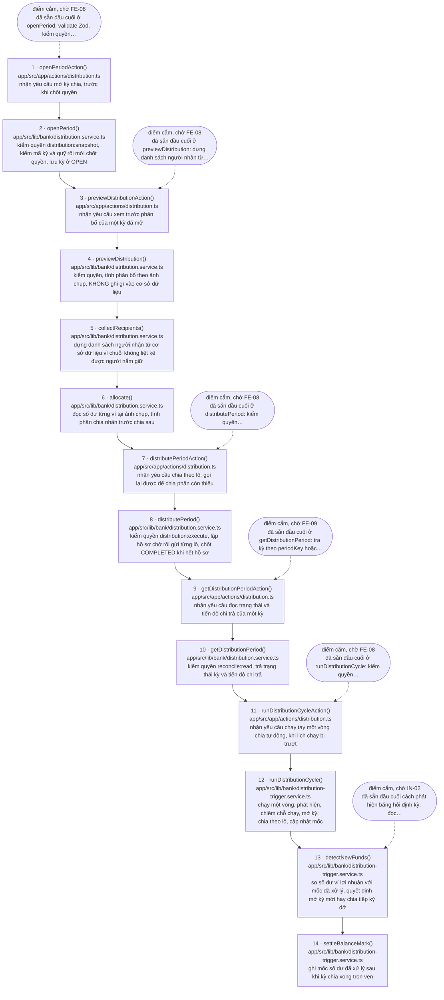

<!-- SINH TỰ ĐỘNG TỪ MARKER — ĐỪNG SỬA TAY -->

# Luồng `distribute` — Chia lợi nhuận theo sản lượng

> **Tệp này do `scripts/gen-flow-diagram.mjs` sinh ra từ marker `@flow` trong mã nguồn.**
> Sửa tay sẽ bị ghi đè ở lần sinh sau, và trong khoảng thời gian trước đó thì sơ đồ nói một
> đằng còn mã làm một nẻo. Muốn đổi nội dung thì sửa marker trong mã rồi sinh lại.
>
> - Sinh lại: `node scripts/gen-flow-diagram.mjs distribute`
> - Kiểm tệp này còn khớp marker hay không: `node scripts/gen-flow-diagram.mjs distribute --check`
> - Quy ước marker: `.kiro/steering/make-control.md` mục 4

**14 bước**, gắn ở 3 tệp:

- `app/src/app/actions/distribution.ts`
- `app/src/lib/bank/distribution.service.ts`
- `app/src/lib/bank/distribution-trigger.service.ts`

## Sơ đồ

## Bảng bước

| Bước | Tệp | Hàm | Việc |
|---|---|---|---|
| 1 | `app/src/app/actions/distribution.ts:32` | `openPeriodAction()` | nhận yêu cầu mở kỳ chia, trước khi chốt quyền |
| 2 | `app/src/lib/bank/distribution.service.ts:369` | `openPeriod()` | kiểm quyền distribution:snapshot, kiểm mã kỳ và quỹ rồi mới chốt quyền, lưu kỳ ở OPEN |
| 3 | `app/src/app/actions/distribution.ts:40` | `previewDistributionAction()` | nhận yêu cầu xem trước phân bổ của một kỳ đã mở |
| 4 | `app/src/lib/bank/distribution.service.ts:520` | `previewDistribution()` | kiểm quyền, tính phân bổ theo ảnh chụp, KHÔNG ghi gì vào cơ sở dữ liệu |
| 5 | `app/src/lib/bank/distribution.service.ts:269` | `collectRecipients()` | dựng danh sách người nhận từ cơ sở dữ liệu vì chuỗi không liệt kê được người nắm giữ |
| 6 | `app/src/lib/bank/distribution.service.ts:198` | `allocate()` | đọc số dư từng ví tại ảnh chụp, tính phần chia nhân trước chia sau |
| 7 | `app/src/app/actions/distribution.ts:48` | `distributePeriodAction()` | nhận yêu cầu chia theo lô; gọi lại được để chia phần còn thiếu |
| 8 | `app/src/lib/bank/distribution.service.ts:628` | `distributePeriod()` | kiểm quyền distribution:execute, lập hồ sơ chờ rồi gửi từng lô, chốt COMPLETED khi hết hồ sơ |
| 9 | `app/src/app/actions/distribution.ts:56` | `getDistributionPeriodAction()` | nhận yêu cầu đọc trạng thái và tiến độ chi trả của một kỳ |
| 10 | `app/src/lib/bank/distribution.service.ts:885` | `getDistributionPeriod()` | kiểm quyền reconcile:read, trả trạng thái kỳ và tiến độ chi trả |
| 11 | `app/src/app/actions/distribution.ts:78` | `runDistributionCycleAction()` | nhận yêu cầu chạy tay một vòng chia tự động, khi lịch chạy bị trượt |
| 12 | `app/src/lib/bank/distribution-trigger.service.ts:505` | `runDistributionCycle()` | chạy một vòng: phát hiện, chiếm chỗ chạy, mở kỳ, chia theo lô, cập nhật mốc |
| 13 | `app/src/lib/bank/distribution-trigger.service.ts:345` | `detectNewFunds()` | so số dư ví lợi nhuận với mốc đã xử lý, quyết định mở kỳ mới hay chia tiếp kỳ dở |
| 14 | `app/src/lib/bank/distribution-trigger.service.ts:412` | `settleBalanceMark()` | ghi mốc số dư đã xử lý sau khi kỳ chia xong trọn vẹn |

## Điểm cắm trên đường đi

Các bước dưới đây có marker chờ task khác. Trong sơ đồ chúng là ô bầu dục nối bằng
mũi tên gạch rời — chúng **không** phải bước của luồng.

| Bước | Loại | Task | Nội dung marker |
|---|---|---|---|
| 1 | điểm cắm | `FE-08` | đã sẵn đầu cuối ở `openPeriod`: validate Zod, kiểm quyền `distribution:snapshot`, kiểm mã kỳ trùng và kiểm quỹ TRƯỚC khi chạm chuỗi nên lời gọi trượt không tốn ảnh chụp, chốt quyền qua `ILedgerPort.takeSnapshot`, đọc lại số dư quỹ để chắc contract chốt đúng con số đã ghi, lưu kỳ và ghi sổ kiểm toán cả bốn kết cục. Màn chia lợi nhuận chỉ cần gọi rồi hiển thị `Result`. FE-08 PHẢI hiện `snapshotId` và `totalAmount` trả về: đó là hai con số cán bộ ngân hàng dùng để đối chiếu trước khi bấm chia |
| 3 | điểm cắm | `FE-08` | đã sẵn đầu cuối ở `previewDistribution`: dựng danh sách người nhận từ cơ sở dữ liệu, đọc số dư tại ảnh chụp, tính phần từng ví bằng ĐÚNG hàm mà lúc chia sẽ dùng, trả kèm `dust` và `dustWallet`. Hàm KHÔNG ghi một dòng nào, kể cả sổ kiểm toán, nên gọi bao nhiêu lần cũng được. FE-08 nên hiện cả ví được chia 0 thay vì lọc bỏ: vắng mặt và được chia 0 là hai thông tin khác nhau với người đối soát |
| 7 | điểm cắm | `FE-08` | đã sẵn đầu cuối ở `distributePeriod`: kiểm quyền `distribution:execute`, lập đủ hồ sơ chờ TRƯỚC khi gửi giao dịch nào, chia lô theo tham số `distribution.batch_size`, ba trạng thái hồ sơ `PENDING`/`SENT`/`PAID` nên tiến trình chết giữa đường không để lại hồ sơ trông như đã chi, một lô lỗi không dừng các lô còn lại. Gọi lại CHỈ chia cho ví chưa nhận nên bấm hai lần không ai bị trả hai lần. FE-08 nên hiện `outstanding` và `failed`: khác 0 nghĩa là còn phải bấm chia lại |
| 9 | điểm cắm | `FE-09` | đã sẵn đầu cuối ở `getDistributionPeriod`: tra kỳ theo `periodKey` hoặc `periodId`, trả trạng thái kỳ kèm số hồ sơ theo từng trạng thái, tổng đã chi và số hồ sơ còn phải chi. Kiểm quyền `reconcile:read` nên ba vai phía ngân hàng đọc được và nhà đầu tư thì không. Hàm chỉ đọc và KHÔNG ghi sổ kiểm toán, nên màn theo dõi gọi lại theo chu kỳ được mà không nhấn chìm sổ |
| 11 | điểm cắm | `FE-08` | đã sẵn đầu cuối ở `runDistributionCycle`: kiểm quyền `distribution:execute`, tự phát hiện tiền vào ví lợi nhuận, tự sinh mã kỳ, chống hai vòng chạy trùng bằng ràng buộc duy nhất của cơ sở dữ liệu, gọi lại nghiệp vụ BE-06 để mở kỳ và chia, chỉ ghi mốc số dư khi kỳ xong toàn bộ. FE-08 chỉ cần một nút "chạy ngay" rồi hiển thị `outcome` và `message`; `outcome` là `PARTIAL` nghĩa là còn phải chạy lại, `stuck` bằng true nghĩa là cần người xem |
| 13 | điểm cắm | `IN-02` | đã sẵn đầu cuối cách phát hiện bằng hỏi định kỳ: đọc `profitPoolBalance` rồi so với mốc `distribution.last_settled_balance`, có chặn ngưỡng tối thiểu và có phát hiện số dư giảm. IN-02 chỉ cần đổi NGUỒN tín hiệu sang sự kiện `Transfer` vào ví lợi nhuận do Indexer đọc được, giữ nguyên bốn nhánh quyết định và nguyên phần chia ở `runDistributionCycle`. Đổi được vì mốc số dư vẫn là thứ chốt "đã xử lý tới đâu", sự kiện chỉ thay việc hỏi định kỳ |

## Đọc sơ đồ này thế nào

- **Mũi tên liền là thứ tự nghiệp vụ, không phải cạnh gọi hàm.** Quy ước cho mỗi bước đúng
  một số nguyên liên tiếp, nên nó biểu diễn được một chuỗi thời gian chứ không biểu diễn
  được lồng nhau hay đường về. Ví dụ một hàm gọi hàm sau nó rồi nhận kết quả về thì trên sơ
  đồ chỉ thấy mũi tên đi, không thấy mũi tên về.
- **Ô bầu dục nối bằng mũi tên gạch rời không phải bước của luồng.** Đó là marker
  `@pending` / `@blocked` nằm trên đúng hàm của bước đó: một task khác còn phải gọi vào,
  hoặc còn phải xong trước.
- **Bước ở `ledger.port.ts` là cổng, không phải adapter.** Adapter thật (`mock`, `evm`,
  `stellar`) do `getLedger(chain)` chọn lúc chạy theo cấu hình, nên không cạnh gọi tĩnh
  nào nối được cổng với adapter (design.md QĐ-6). Sơ đồ dừng ở cổng là dừng ở chỗ còn nói
  thật được.
- **Nhánh phụ và nhánh song song không có trên sơ đồ.** Một chuỗi số nguyên không có chỗ
  cho hai đường vào cùng một bước, cũng không có chỗ cho nhánh chạy ngoài chuỗi. Những chỗ
  như vậy được nhắc trong nhãn của bước liên quan hoặc trong bình luận tại tệp bị bỏ ra.
