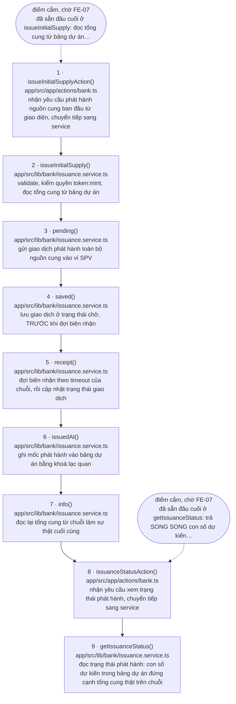

<!-- SINH TỰ ĐỘNG TỪ MARKER — ĐỪNG SỬA TAY -->

# Luồng `issue` — Ngân hàng phát hành WPT

> **Tệp này do `scripts/gen-flow-diagram.mjs` sinh ra từ marker `@flow` trong mã nguồn.**
> Sửa tay sẽ bị ghi đè ở lần sinh sau, và trong khoảng thời gian trước đó thì sơ đồ nói một
> đằng còn mã làm một nẻo. Muốn đổi nội dung thì sửa marker trong mã rồi sinh lại.
>
> - Sinh lại: `node scripts/gen-flow-diagram.mjs issue`
> - Kiểm tệp này còn khớp marker hay không: `node scripts/gen-flow-diagram.mjs issue --check`
> - Quy ước marker: `.kiro/steering/make-control.md` mục 4

**9 bước**, gắn ở 2 tệp:

- `app/src/app/actions/bank.ts`
- `app/src/lib/bank/issuance.service.ts`

## Sơ đồ

## Bảng bước

| Bước | Tệp | Hàm | Việc |
|---|---|---|---|
| 1 | `app/src/app/actions/bank.ts:37` | `issueInitialSupplyAction()` | nhận yêu cầu phát hành nguồn cung ban đầu từ giao diện, chuyển tiếp sang service |
| 2 | `app/src/lib/bank/issuance.service.ts:71` | `issueInitialSupply()` | validate, kiểm quyền token:mint, đọc tổng cung từ bảng dự án |
| 3 | `app/src/lib/bank/issuance.service.ts:120` | `pending()` | gửi giao dịch phát hành toàn bộ nguồn cung vào ví SPV |
| 4 | `app/src/lib/bank/issuance.service.ts:123` | `saved()` | lưu giao dịch ở trạng thái chờ, TRƯỚC khi đợi biên nhận |
| 5 | `app/src/lib/bank/issuance.service.ts:137` | `receipt()` | đợi biên nhận theo timeout của chuỗi, rồi cập nhật trạng thái giao dịch |
| 6 | `app/src/lib/bank/issuance.service.ts:155` | `issuedAt()` | ghi mốc phát hành vào bảng dự án bằng khoá lạc quan |
| 7 | `app/src/lib/bank/issuance.service.ts:183` | `info()` | đọc lại tổng cung từ chuỗi làm sự thật cuối cùng |
| 8 | `app/src/app/actions/bank.ts:45` | `issuanceStatusAction()` | nhận yêu cầu xem trạng thái phát hành, chuyển tiếp sang service |
| 9 | `app/src/lib/bank/issuance.service.ts:231` | `getIssuanceStatus()` | đọc trạng thái phát hành: con số dự kiến trong bảng dự án đứng cạnh tổng cung thật trên chuỗi |

## Điểm cắm trên đường đi

Các bước dưới đây có marker chờ task khác. Trong sơ đồ chúng là ô bầu dục nối bằng
mũi tên gạch rời — chúng **không** phải bước của luồng.

| Bước | Loại | Task | Nội dung marker |
|---|---|---|---|
| 1 | điểm cắm | `FE-07` | đã sẵn đầu cuối ở `issueInitialSupply`: đọc tổng cung từ bảng dự án (KHÔNG nhận từ input, nên màn hình không có ô số lượng và không được thêm), kiểm quyền `token:mint`, chặn phát hành lần hai ở CẢ cơ sở dữ liệu lẫn chuỗi, lưu giao dịch chờ trước khi đợi biên nhận, ghi mốc phát hành bằng khoá lạc quan, đọc lại tổng cung từ chuỗi. Màn phát hành chỉ cần ô ví SPV và một nút |
| 8 | điểm cắm | `FE-07` | đã sẵn đầu cuối ở `getIssuanceStatus`: trả SONG SONG con số dự kiến trong bảng dự án và tổng cung thật trên chuỗi, kèm mốc phát hành và ví SPV. Hai con số lệch nhau là tín hiệu cần đối soát, nên màn hình phải hiện cả hai chứ đừng chọn một |

## Đọc sơ đồ này thế nào

- **Mũi tên liền là thứ tự nghiệp vụ, không phải cạnh gọi hàm.** Quy ước cho mỗi bước đúng
  một số nguyên liên tiếp, nên nó biểu diễn được một chuỗi thời gian chứ không biểu diễn
  được lồng nhau hay đường về. Ví dụ một hàm gọi hàm sau nó rồi nhận kết quả về thì trên sơ
  đồ chỉ thấy mũi tên đi, không thấy mũi tên về.
- **Ô bầu dục nối bằng mũi tên gạch rời không phải bước của luồng.** Đó là marker
  `@pending` / `@blocked` nằm trên đúng hàm của bước đó: một task khác còn phải gọi vào,
  hoặc còn phải xong trước.
- **Bước ở `ledger.port.ts` là cổng, không phải adapter.** Adapter thật (`mock`, `evm`,
  `stellar`) do `getLedger(chain)` chọn lúc chạy theo cấu hình, nên không cạnh gọi tĩnh
  nào nối được cổng với adapter (design.md QĐ-6). Sơ đồ dừng ở cổng là dừng ở chỗ còn nói
  thật được.
- **Nhánh phụ và nhánh song song không có trên sơ đồ.** Một chuỗi số nguyên không có chỗ
  cho hai đường vào cùng một bước, cũng không có chỗ cho nhánh chạy ngoài chuỗi. Những chỗ
  như vậy được nhắc trong nhãn của bước liên quan hoặc trong bình luận tại tệp bị bỏ ra.
