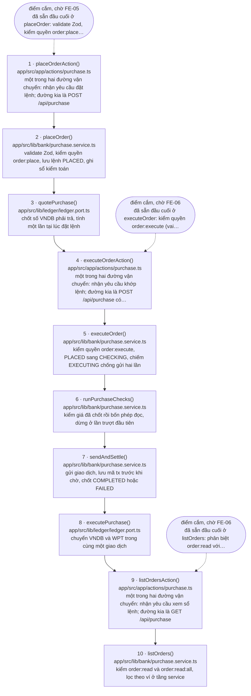

<!-- SINH TỰ ĐỘNG TỪ MARKER — ĐỪNG SỬA TAY -->

# Luồng `purchase` — Nhà đầu tư mua WPT

> **Tệp này do `scripts/gen-flow-diagram.mjs` sinh ra từ marker `@flow` trong mã nguồn.**
> Sửa tay sẽ bị ghi đè ở lần sinh sau, và trong khoảng thời gian trước đó thì sơ đồ nói một
> đằng còn mã làm một nẻo. Muốn đổi nội dung thì sửa marker trong mã rồi sinh lại.
>
> - Sinh lại: `node scripts/gen-flow-diagram.mjs purchase`
> - Kiểm tệp này còn khớp marker hay không: `node scripts/gen-flow-diagram.mjs purchase --check`
> - Quy ước marker: `.kiro/steering/make-control.md` mục 4

**10 bước**, gắn ở 3 tệp:

- `app/src/app/actions/purchase.ts`
- `app/src/lib/bank/purchase.service.ts`
- `app/src/lib/ledger/ledger.port.ts`

## Sơ đồ

## Bảng bước

| Bước | Tệp | Hàm | Việc |
|---|---|---|---|
| 1 | `app/src/app/actions/purchase.ts:27` | `placeOrderAction()` | một trong hai đường vận chuyển: nhận yêu cầu đặt lệnh; đường kia là POST /api/purchase |
| 2 | `app/src/lib/bank/purchase.service.ts:95` | `placeOrder()` | validate Zod, kiểm quyền order:place, lưu lệnh PLACED, ghi sổ kiểm toán |
| 3 | `app/src/lib/ledger/ledger.port.ts:115` | `quotePurchase()` | chốt số VNDB phải trả, tính một lần tại lúc đặt lệnh |
| 4 | `app/src/app/actions/purchase.ts:35` | `executeOrderAction()` | một trong hai đường vận chuyển: nhận yêu cầu khớp lệnh; đường kia là POST /api/purchase có orderId |
| 5 | `app/src/lib/bank/purchase.service.ts:278` | `executeOrder()` | kiểm quyền order:execute, PLACED sang CHECKING, chiếm EXECUTING chống gửi hai lần |
| 6 | `app/src/lib/bank/purchase.service.ts:165` | `runPurchaseChecks()` | kiểm giá đã chốt rồi bốn phép đọc, dừng ở lần trượt đầu tiên |
| 7 | `app/src/lib/bank/purchase.service.ts:383` | `sendAndSettle()` | gửi giao dịch, lưu mã tx trước khi chờ, chốt COMPLETED hoặc FAILED |
| 8 | `app/src/lib/ledger/ledger.port.ts:129` | `executePurchase()` | chuyển VNDB và WPT trong cùng một giao dịch |
| 9 | `app/src/app/actions/purchase.ts:43` | `listOrdersAction()` | một trong hai đường vận chuyển: nhận yêu cầu xem sổ lệnh; đường kia là GET /api/purchase |
| 10 | `app/src/lib/bank/purchase.service.ts:512` | `listOrders()` | kiểm order:read và order:read:all, lọc theo ví ở tầng service |

## Điểm cắm trên đường đi

Các bước dưới đây có marker chờ task khác. Trong sơ đồ chúng là ô bầu dục nối bằng
mũi tên gạch rời — chúng **không** phải bước của luồng.

| Bước | Loại | Task | Nội dung marker |
|---|---|---|---|
| 1 | điểm cắm | `FE-05` | đã sẵn đầu cuối ở `placeOrder`: validate Zod, kiểm quyền `order:place` (vai INVESTOR), CHỐT số VNDB tại thời điểm đặt, lưu lệnh `PLACED`, ghi sổ kiểm toán. Màn mua WPT chỉ cần gọi và hiển thị `Result` |
| 4 | điểm cắm | `FE-06` | đã sẵn đầu cuối ở `executeOrder`: kiểm quyền `order:execute` (vai BANK_ADMIN), bốn phép đọc trước khi gửi, khoá lạc quan chống gửi hai lần, đọc lại số dư từ chuỗi sau biên nhận |
| 9 | điểm cắm | `FE-06` | đã sẵn đầu cuối ở `listOrders`: phân biệt `order:read` với `order:read:all`, nên "vai nào xem được sổ lệnh nào" là việc của RBAC chứ không phải của màn hình |

## Đọc sơ đồ này thế nào

- **Mũi tên liền là thứ tự nghiệp vụ, không phải cạnh gọi hàm.** Quy ước cho mỗi bước đúng
  một số nguyên liên tiếp, nên nó biểu diễn được một chuỗi thời gian chứ không biểu diễn
  được lồng nhau hay đường về. Ví dụ một hàm gọi hàm sau nó rồi nhận kết quả về thì trên sơ
  đồ chỉ thấy mũi tên đi, không thấy mũi tên về.
- **Ô bầu dục nối bằng mũi tên gạch rời không phải bước của luồng.** Đó là marker
  `@pending` / `@blocked` nằm trên đúng hàm của bước đó: một task khác còn phải gọi vào,
  hoặc còn phải xong trước.
- **Bước ở `ledger.port.ts` là cổng, không phải adapter.** Adapter thật (`mock`, `evm`,
  `stellar`) do `getLedger(chain)` chọn lúc chạy theo cấu hình, nên không cạnh gọi tĩnh
  nào nối được cổng với adapter (design.md QĐ-6). Sơ đồ dừng ở cổng là dừng ở chỗ còn nói
  thật được.
- **Nhánh phụ và nhánh song song không có trên sơ đồ.** Một chuỗi số nguyên không có chỗ
  cho hai đường vào cùng một bước, cũng không có chỗ cho nhánh chạy ngoài chuỗi. Những chỗ
  như vậy được nhắc trong nhãn của bước liên quan hoặc trong bình luận tại tệp bị bỏ ra.
